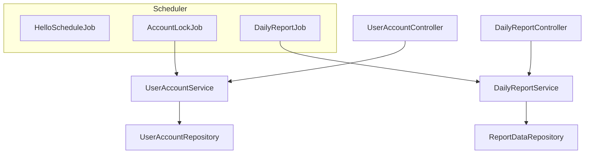
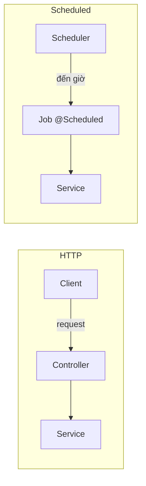
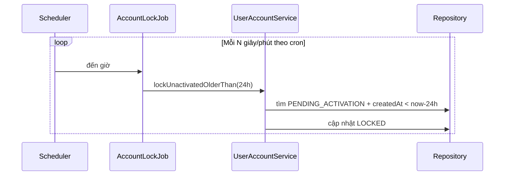
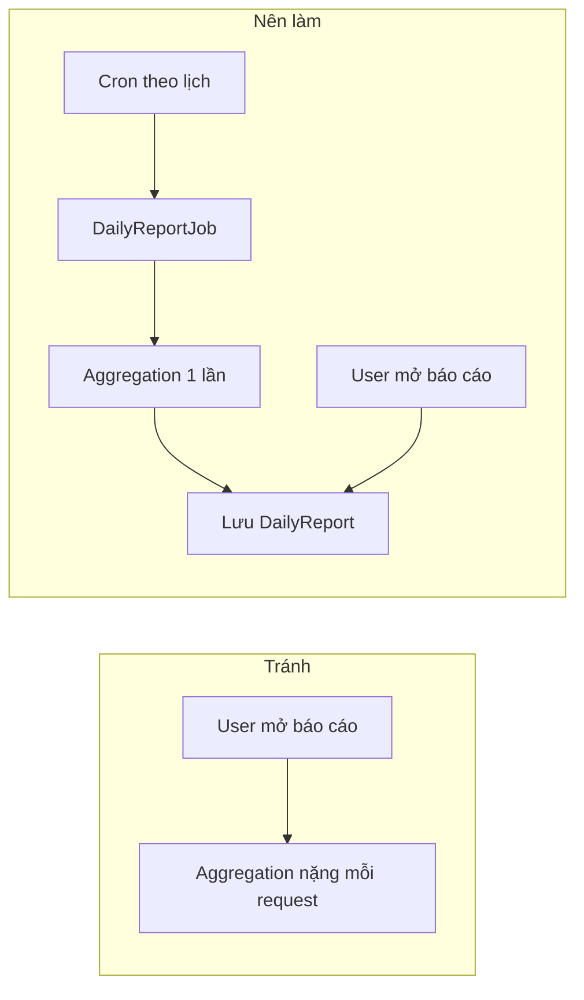

# Phụ lục 1: Spring Boot Scheduled — Lập lịch tác vụ định kỳ

## Mục tiêu bài học

Sau phụ lục này, học viên có thể:

- Giải thích **tác vụ định kỳ (scheduled task)** khác gì request HTTP — ai kích hoạt, khi nào chạy
- Bật scheduling bằng `@EnableScheduling` và viết job đầu tiên với `@Scheduled`
- Phân biệt `**fixedRate**`, `**fixedDelay**`, `**initialDelay**` và biết chọn cái nào
- Viết **cron expression** cơ bản (có giây — chuẩn Spring) và đặt `zone` phù hợp
- Áp dụng 2 tình huống thực tế:
  1. **Khóa tài khoản chưa kích hoạt sau 24 giờ**
  2. **Sinh báo cáo mỗi ngày** (xử lý data lớn — không nên tính realtime mỗi request)
- Tách **Job (mỏng)** và **Service (logic nghiệp vụ)** — dễ đọc, dễ test
- Cấu hình lịch qua `application.properties`; tắt scheduling khi test
- Nhận biết giới hạn mức cơ bản: **1 thread mặc định**, job chồng chéo, nhiều instance (chỉ đọc hiểu)

> **Không nằm trong phạm vi phụ lục này:** Quartz đầy đủ; distributed lock (ShedLock) chi tiết; Kubernetes CronJob từng bước; message queue (Kafka/Rabbit) để thay scheduled job.

## Điều kiện tiên quyết

- **Module 2 — Bài 4**: Spring Boot project, `@Component` / `@Service`, `application.properties`
- **Module 2 — Bài 5+**: `@RestController` / Service layer (Controller → Service)
- *(Khuyến khích)* **[Module 4 — Bài 4 Auth](./java_m4_bai4_Authentication_Authorization.md)**: gắn ví dụ khóa tài khoản với flow đăng ký + kích hoạt
- JDK 17+, Spring Boot 3.x
- **Không cần** dependency mới — `spring-boot-starter-web` đã đủ cho `@Scheduled`

> **Demo chuẩn:** `[demo-phuluc1-scheduled](../../demo-phuluc1-scheduled)` — in-memory (không Mongo), đủ Hello job + 2 ví dụ nghiệp vụ + unit test Service.  
> Chi tiết chạy app / API: [README](../../demo-phuluc1-scheduled/README.md).

> **Vai trò phụ lục:** Kỹ năng **bổ trợ backend** (job nền), dùng được trong Final Project / microservice nhỏ. Không thay các bài chính Module 4 (REST, Auth, Docker…).

### Thời lượng gợi ý


| Phần                                   | Thời gian |
| -------------------------------------- | --------- |
| Khái niệm + Hello Scheduled §1–2       | ~20 phút  |
| `fixedRate` / `fixedDelay` / cron §3–4 | ~25 phút  |
| Ví dụ 1 — khóa tài khoản 24h §5        | ~25 phút  |
| Ví dụ 2 — báo cáo mỗi ngày §6          | ~25 phút  |
| Properties + lỗi thường gặp §7–8       | ~15 phút  |
| Nâng cao đọc hiểu + bài tập            | ~15 phút  |


## Nội dung (làm theo thứ tự)


| #       | Chủ đề                             | Việc HV làm (tóm tắt)                                          | Kết quả kiểm tra                      |
| ------- | ---------------------------------- | -------------------------------------------------------------- | ------------------------------------- |
| 1       | Scheduled vs HTTP + 2 ví dụ        | Đọc / thảo luận                                                | Nói được ai kích hoạt job             |
| 2       | `@EnableScheduling` + Hello job    | **Sửa** Application · **Thêm** `HelloScheduleJob` · properties | Console in mỗi ~10s                   |
| 3       | `fixedRate` / `fixedDelay`         | **Bật** `RateDelayCompareJob` (optional)                       | Phân biệt được 2 kiểu                 |
| 4       | Cron 6 field + `zone`              | Đọc cheat sheet · sửa cron trên properties                     | Viết cron mỗi 15 phút / 2:00          |
| 5       | Ví dụ 1 — khóa account 24h         | **Thêm** package `account/`* · seed · Job                      | `stale@` → `LOCKED`                   |
| 6       | Ví dụ 2 — báo cáo ngày             | **Thêm** package `report/`* · API đọc snapshot                 | GET chỉ đọc, không aggregate          |
| 7       | Properties + tắt schedule khi test | **Cập nhật** `application*.properties`                         | Đổi lịch không sửa code               |
| 8       | Lỗi thường gặp                     | Đọc bảng                                                       | Tự xử lý khi job không chạy           |
| 9       | Nâng cao (đọc hiểu)                | Optional `SchedulingConfig`                                    | Biết rủi ro 1 thread / multi-instance |
| Phụ lục | Bài tập · Checklist · Liên kết     | —                                                              | —                                     |


---

## Kiến trúc lab (demo chuẩn)

```
src/main/java/vn/demo/
├── DemoPhuluc1ScheduledApplication.java   ← @EnableScheduling
├── config/
│   ├── DataSeeder.java                    ← seed account + orders
│   └── SchedulingConfig.java              ← §9.1 optional
├── schedule/
│   ├── HelloScheduleJob.java              ← §2
│   └── RateDelayCompareJob.java           ← §3 (tắt mặc định)
├── account/                               ← §5 ví dụ 1
│   ├── model/UserAccount.java
│   ├── repository/UserAccountRepository.java
│   ├── repository/InMemoryUserAccountRepository.java
│   ├── service/UserAccountService.java      ★ logic
│   ├── schedule/AccountLockJob.java         ★ job mỏng
│   └── controller/UserAccountController.java
├── report/                                ← §6 ví dụ 2
│   ├── model/DailyReport.java
│   ├── model/OrderRecord.java
│   ├── repository/...
│   ├── service/DailyReportService.java      ★ precompute
│   ├── schedule/DailyReportJob.java
│   └── controller/DailyReportController.java
└── exception/...
```

> Demo dùng **in-memory** để tập trung Scheduled. Production có thể đổi Repository sang JPA/Mongo mà **không đổi** Job/Service signature.




---

## 1. Scheduled task là gì?

### 1.1. So với HTTP request


|                   | HTTP request                            | Scheduled task                           |
| ----------------- | --------------------------------------- | ---------------------------------------- |
| **Ai kích hoạt?** | Client (trình duyệt, Postman, app khác) | **Đồng hồ trong app** (Spring Scheduler) |
| **Khi nào chạy?** | Khi có request                          | Theo lịch đã cấu hình                    |
| **Ví dụ**         | `GET /api/accounts`                     | Mỗi 30 giây quét user chưa kích hoạt     |


> **Ẩn dụ:** HTTP = khách bấm chuông cửa → bạn mở cửa làm việc. Scheduled = **báo thức** — đến giờ tự làm, dù không ai gọi API.




### 1.2. Hai ví dụ thực tế dùng trong phụ lục này


| #     | Tình huống                                                           | Vì sao dùng Scheduled?                                             |
| ----- | -------------------------------------------------------------------- | ------------------------------------------------------------------ |
| **1** | User đăng ký nhưng **không kích hoạt trong 24 giờ** → khóa tài khoản | Hết hạn theo thời gian — không chờ user hay admin bấm nút          |
| **2** | **Sinh báo cáo mỗi ngày** trên **lượng data lớn**                    | Aggregation nặng — **không nên** chạy lại mỗi lần mở trang báo cáo |


**Phân biệt nhanh hai ví dụ** (học viên dễ lẫn):


|                    | Ví dụ 1 — Khóa account                       | Ví dụ 2 — Báo cáo ngày                |
| ------------------ | -------------------------------------------- | ------------------------------------- |
| Mục tiêu           | **Sửa trạng thái** từng bản ghi đủ điều kiện | **Tổng hợp / lưu sẵn** kết quả nặng   |
| Tần suất điển hình | Nhiều lần/ngày (quét định kỳ)                | Thường **1 lần/ngày** (vd. 2:00 sáng) |
| Output             | `status = LOCKED`                            | Snapshot `DailyReport`                |
| Điểm then chốt     | Quét theo `createdAt` + `Duration` 24h       | **Precompute** → UI/API chỉ đọc       |


> **Lưu ý wording (ví dụ 2):** Không nói “**không thể** cập nhật realtime”. Realtime *làm được*, nhưng với data lớn thì **đắt và chậm**. Ta **chấp nhận dữ liệu trễ có kiểm soát** (báo cáo chốt mỗi đêm) để hệ thống ổn định.

**Việc HV làm ở §1:** Không code — nắm bảng so sánh và 2 ví dụ trước khi gõ `@Scheduled`.

---

## 2. Hello Scheduled

### Việc học viên làm


| Bước | Hành động                                           | File                                     |
| ---- | --------------------------------------------------- | ---------------------------------------- |
| 2.1  | **Cập nhật** Application — thêm `@EnableScheduling` | `DemoPhuluc1ScheduledApplication.java`   |
| 2.2  | **Thêm** class Job Hello                            | `schedule/HelloScheduleJob.java`         |
| 2.3  | **Thêm** properties nhịp tick                       | `application.properties` → `app.hello.`* |
| 2.4  | Chạy app — xem console                              | `./mvnw spring-boot:run`                 |


### Bước 2.1 — Bật scheduling

```java
package vn.demo;

import org.springframework.boot.SpringApplication;
import org.springframework.boot.autoconfigure.SpringBootApplication;
import org.springframework.scheduling.annotation.EnableScheduling;

@SpringBootApplication
@EnableScheduling   // ← bắt buộc; thiếu thì @Scheduled không chạy
public class DemoPhuluc1ScheduledApplication {

    public static void main(String[] args) {
        SpringApplication.run(DemoPhuluc1ScheduledApplication.class, args);
    }
}
```

### Bước 2.2 — Job đầu tiên (chỉ log)

```java
package vn.demo.schedule;

import java.time.Instant;

import org.springframework.boot.autoconfigure.condition.ConditionalOnProperty;
import org.springframework.scheduling.annotation.Scheduled;
import org.springframework.stereotype.Component;

import lombok.extern.slf4j.Slf4j;

@Slf4j
@Component
@ConditionalOnProperty(name = "app.hello.enabled", havingValue = "true", matchIfMissing = true)
public class HelloScheduleJob {

    /** fixedRate = khoảng cách từ lúc BẮT ĐẦU lần trước (ms). */
    @Scheduled(fixedRateString = "${app.hello.fixed-rate-ms:10000}")
    public void tick() {
        log.info("[HelloScheduleJob] Scheduler đang chạy lúc {}", Instant.now());
    }
}
```

### Bước 2.3 — Properties

```properties
app.hello.enabled=true
app.hello.fixed-rate-ms=10000
```

**Chạy app → console** in mỗi ~10 giây. **Không cần** Postman.

### Quy tắc vàng (mức cơ bản)


| Quy tắc                | Chi tiết                                  |
| ---------------------- | ----------------------------------------- |
| Có `@EnableScheduling` | Thiếu → job **không** chạy                |
| Class là Spring bean   | `@Component` hoặc `@Service`              |
| Method `public void`   | Mức cơ bản: **không tham số**             |
| Job mỏng — Service dày | Job chỉ gọi Service + log (áp dụng từ §5) |


---

## 3. `fixedRate`, `fixedDelay`, `initialDelay`

### Việc học viên làm


| Bước | Hành động                     | File                                                             |
| ---- | ----------------------------- | ---------------------------------------------------------------- |
| 3.1  | Đọc bảng so sánh dưới đây     | —                                                                |
| 3.2  | *(Optional)* Bật demo so sánh | `app.rate-delay-demo.enabled=true` · class `RateDelayCompareJob` |
| 3.3  | Quan sát log START/END        | Console                                                          |


| Thuộc tính         | Ý nghĩa                                                 | Ví dụ nhớ                                |
| ------------------ | ------------------------------------------------------- | ---------------------------------------- |
| `**fixedRate**`    | Lặp theo khoảng cố định kể từ lúc **bắt đầu** lần trước | Chuông báo mỗi 5 phút                    |
| `**fixedDelay**`   | Chờ thêm một khoảng **sau khi kết thúc** lần trước      | Làm xong → nghỉ 5 phút → làm tiếp        |
| `**initialDelay**` | Chờ trước **lần chạy đầu**                              | App vừa start → đợi 30 giây rồi mới tick |


```java
// Cứ 5 giây tính từ lúc START
@Scheduled(fixedRate = 5_000)
public void everyFiveSecondsFromStart() { }

// Xong rồi mới đếm 5 giây
@Scheduled(fixedDelay = 5_000)
public void afterPreviousFinished() { }

// Lần đầu chờ 20 giây, sau đó mỗi 60 giây
@Scheduled(fixedRate = 60_000, initialDelay = 20_000)
public void warmUpThenRun() { }
```

**Gợi ý chọn nhanh:**


| Nhu cầu                                        | Nên dùng                                              |
| ---------------------------------------------- | ----------------------------------------------------- |
| Quét nhanh, job ngắn (vd. khóa account)        | `fixedRate` / `fixedDelay` hoặc cron `0 */15 * * * *` |
| Job có thể chạy lâu, muốn tránh xếp chồng ngay | Ưu tiên `fixedDelay` (+ §9 nếu cần)                   |
| Theo giờ hành chính / nửa đêm                  | **cron** (§4)                                         |


> Demo: class `vn.demo.schedule.RateDelayCompareJob` — mặc định **tắt**. Khi giảng §3, đặt `app.rate-delay-demo.enabled=true` (và có thể tắt `app.hello.enabled=false` cho đỡ ồn).

---

## 4. Cron expression cơ bản

### Việc học viên làm


| Bước | Hành động                                                          |
| ---- | ------------------------------------------------------------------ |
| 4.1  | Nhớ Spring cron = **6 field** (có **giây** ở đầu)                  |
| 4.2  | Thuộc cheat sheet dưới đây                                         |
| 4.3  | Biết thêm `zone = "Asia/Ho_Chi_Minh"` khi cron theo giờ trong ngày |


### 4.1. Cấu trúc Spring (6 field)

```text
giây  phút  giờ  ngày-trong-tháng  tháng  thứ-trong-tuần
```

> **Hay nhầm:** Cron Linux thường **5 field**. Spring dùng **6 field**.

### 4.2. Cheat sheet


| Cron                | Nghĩa                     |
| ------------------- | ------------------------- |
| `0 */5 * * * *`     | Mỗi 5 phút (tại giây 0)   |
| `0 */15 * * * *`    | Mỗi 15 phút               |
| `0/30 * * * * *`    | Mỗi 30 giây (lab ví dụ 1) |
| `0 0 * * * *`       | Đầu mỗi giờ               |
| `0 0 2 * * *`       | **2:00 sáng** mỗi ngày    |
| `0 0 8 * * MON-FRI` | 8:00 sáng, Thứ 2 → Thứ 6  |


```java
@Scheduled(cron = "0 */15 * * * *")
public void everyFifteenMinutes() { }

@Scheduled(cron = "0 0 2 * * *", zone = "Asia/Ho_Chi_Minh")
public void atTwoAmVietnam() { }
```

> Mặc định timezone theo **JVM**. Lab / cloud có thể lệch → luôn nhắc `zone` khi cron theo giờ trong ngày.

---

## 5. Ví dụ 1 — Khóa tài khoản chưa kích hoạt sau 24 giờ

### Việc học viên làm (thứ tự tạo file)


| Bước | Hành động                                     | File / ghi chú                                            |
| ---- | --------------------------------------------- | --------------------------------------------------------- |
| 5.1  | Hiểu nghiệp vụ + sequence                     | Không code                                                |
| 5.2  | **Thêm** model                                | `account/model/UserAccount.java`                          |
| 5.3  | **Thêm** repository (interface + in-memory)   | `UserAccountRepository` · `InMemoryUserAccountRepository` |
| 5.4  | **Thêm** Service — `lockUnactivatedOlderThan` | `UserAccountService.java` ★                               |
| 5.5  | **Thêm** Job mỏng + `@Value` giờ khóa         | `AccountLockJob.java`                                     |
| 5.6  | **Thêm** REST quan sát / kích hoạt            | `UserAccountController.java`                              |
| 5.7  | **Cập nhật** seed 3 user                      | `DataSeeder.java`                                         |
| 5.8  | **Cập nhật** properties cron lab              | `app.account.lock-cron=0/30 * * * * `*                    |
| 5.9  | Chạy app → `GET /api/accounts`                | `stale@` phải thành `LOCKED` trong ~30s                   |


### 5.1. Nghiệp vụ

1. User **đăng ký** → `status = PENDING_ACTIVATION`, lưu `createdAt`
2. User bấm link kích hoạt trong hạn → `status = ACTIVATED`
3. Nếu sau **24 giờ** vẫn `PENDING_ACTIVATION` → job đổi thành `LOCKED`

> **Không** tạo lịch riêng “đúng 24h sau từng user”. `@Scheduled` chạy **định kỳ**; mỗi lần chạy **quét** các bản ghi đủ điều kiện.




### 5.2. Model

```java
package vn.demo.account.model;

import java.time.Instant;
import lombok.*;

@Getter @Setter @ToString @NoArgsConstructor @AllArgsConstructor
public class UserAccount {
    private String id;
    private String email;
    /** PENDING_ACTIVATION | ACTIVATED | LOCKED */
    private String status;
    private Instant createdAt;
    private Instant activatedAt;
    private Instant updatedAt;
}
```

### 5.3. Repository — method cốt lõi

```java
List<UserAccount> findByStatusAndCreatedAtBefore(String status, Instant before);
```

> Demo implement bằng `ConcurrentHashMap` (`InMemoryUserAccountRepository`). Production: Spring Data JPA/Mongo với cùng tên method (hoặc `@Query`).

### 5.4. Service — logic nghiệp vụ

```java
public int lockUnactivatedOlderThan(Duration maxAge) {
    // 1) Mốc: PENDING tạo trước mốc này = quá hạn
    Instant cutoff = Instant.now().minus(maxAge);

    // 2) Query đúng nghiệp vụ
    List<UserAccount> stale = repository
            .findByStatusAndCreatedAtBefore("PENDING_ACTIVATION", cutoff);
    if (stale.isEmpty()) {
        return 0;
    }

    // 3) Đổi status → LOCKED (giữ bản ghi để audit)
    Instant now = Instant.now();
    for (UserAccount user : stale) {
        user.setStatus("LOCKED");
        user.setUpdatedAt(now);
    }
    repository.saveAll(stale);
    return stale.size();
}
```

> **24 giờ = `Duration`**, không phải “qua ngày lịch”. Đăng ký 23:00 → khóa sau 23:00 hôm sau (đủ 24h).

### 5.5. Job — mỏng + config

```java
@Slf4j
@Component
@RequiredArgsConstructor
public class AccountLockJob {

    private final UserAccountService userAccountService;

    @Value("${app.account.lock-after-hours:24}")
    private long lockAfterHours;

    @Scheduled(cron = "${app.account.lock-cron:0 */15 * * * *}")
    public void lockStaleAccounts() {
        int locked = userAccountService.lockUnactivatedOlderThan(Duration.ofHours(lockAfterHours));
        if (locked > 0) {
            log.info("[AccountLockJob] Đã khóa {} tài khoản quá {}h", locked, lockAfterHours);
        }
    }
}
```

### 5.6. Seed (DataSeeder) — để lab thấy kết quả nhanh


| Email            | Status lúc seed      | `createdAt` | Kỳ vọng sau job |
| ---------------- | -------------------- | ----------- | --------------- |
| `stale@demo.vn`  | `PENDING_ACTIVATION` | now − 25h   | → `LOCKED`      |
| `fresh@demo.vn`  | `PENDING_ACTIVATION` | now − 1h    | giữ `PENDING`   |
| `active@demo.vn` | `ACTIVATED`          | —           | job bỏ qua      |


```properties
# Lab: mỗi 30 giây. Production: 0 */15 * * * *
app.account.lock-cron=0/30 * * * * *
app.account.lock-after-hours=24
app.account.seed-on-startup=true
```

**Kiểm tra:** `curl http://localhost:8080/api/accounts` — sau ~30s, `stale@demo.vn` phải `LOCKED`.

---

## 6. Ví dụ 2 — Sinh báo cáo mỗi ngày (data lớn)

### Việc học viên làm (thứ tự tạo file)


| Bước | Hành động                                                          | File / ghi chú                |
| ---- | ------------------------------------------------------------------ | ----------------------------- |
| 6.1  | Hiểu precompute vs aggregation mỗi request                         | Không code                    |
| 6.2  | **Thêm** `DailyReport` + `OrderRecord`                             | `report/model/`*              |
| 6.3  | **Thêm** repository in-memory                                      | `ReportDataRepository` + impl |
| 6.4  | **Thêm** Service `generateFor` / `generateYesterday` / `getByDate` | `DailyReportService.java` ★   |
| 6.5  | **Thêm** Job cron + `zone`                                         | `DailyReportJob.java`         |
| 6.6  | **Thêm** REST: GET đọc · POST generate (lab)                       | `DailyReportController.java`  |
| 6.7  | **Cập nhật** seed orders ngày hôm qua                              | `DataSeeder.java`             |
| 6.8  | **Cập nhật** properties                                            | `app.report.daily-cron`       |
| 6.9  | `POST /api/reports/daily/generate` rồi `GET .../by-date`           | Snapshot có số liệu           |


### 6.1. Vấn đề


| Cách                                                        | Hệ quả                                               |
| ----------------------------------------------------------- | ---------------------------------------------------- |
| **Sai:** mỗi lần mở trang → aggregation toàn bộ             | Chậm, tốn CPU/DB khi data lớn                        |
| **Đúng:** job tính sẵn → lưu **snapshot** → API chỉ **đọc** | Nhanh; chấp nhận số liệu “chốt đến hết ngày hôm qua” |





### 6.2. Snapshot

```java
package vn.demo.report.model;

@Getter @Setter @NoArgsConstructor @AllArgsConstructor
public class DailyReport {
    private String id;
    private LocalDate reportDate;
    private long orderCount;
    private BigDecimal totalRevenue;
    private Instant generatedAt;
}
```

### 6.3–6.4. Service — tính + lưu + đọc

```java
public DailyReport generateFor(LocalDate reportDate) {
    // 1) Aggregation từ data thô (chỗ “nặng”)
    long orderCount = reportDataRepository.countOrdersOn(reportDate);
    BigDecimal revenue = reportDataRepository.sumRevenueOn(reportDate);

    // 2) Lấy snapshot cũ nếu có — idempotent
    DailyReport report = reportDataRepository.findReportByDate(reportDate)
            .orElseGet(DailyReport::new);

    // 3) Ghi kết quả đã tính sẵn
    report.setReportDate(reportDate);
    report.setOrderCount(orderCount);
    report.setTotalRevenue(revenue);
    report.setGeneratedAt(Instant.now());
    return reportDataRepository.saveReport(report);
}

public DailyReport generateYesterday() {
    LocalDate yesterday = LocalDate.now(ZoneId.of("Asia/Ho_Chi_Minh")).minusDays(1);
    return generateFor(yesterday);
}

/** API gọi — KHÔNG aggregation tại đây. */
public DailyReport getByDate(LocalDate reportDate) { /* đọc snapshot hoặc 404 */ }
```

### 6.5. Job

```java
@Scheduled(cron = "${app.report.daily-cron:0 0 2 * * *}", zone = "Asia/Ho_Chi_Minh")
public void generateDailyReport() {
    DailyReport report = dailyReportService.generateYesterday();
    log.info("[DailyReportJob] date={}, orders={}, revenue={}",
            report.getReportDate(), report.getOrderCount(), report.getTotalRevenue());
}
```

```properties
# Lab: mỗi 2 phút. Production: 0 0 2 * * *
app.report.daily-cron=0 */2 * * * *
app.report.zone=Asia/Ho_Chi_Minh
app.report.seed-on-startup=true
```

### 6.6. API


| Method | URL                                          | Việc được làm                  |
| ------ | -------------------------------------------- | ------------------------------ |
| `GET`  | `/api/reports/daily`                         | Liệt kê snapshot               |
| `GET`  | `/api/reports/daily/by-date?date=yyyy-MM-dd` | **Chỉ đọc** snapshot           |
| `POST` | `/api/reports/daily/generate`                | Lab: chạy ngay logic giống Job |


**Câu chốt:** Scheduled = **bếp nấu sẵn**; HTTP chỉ **bưng món đã nấu**.

---

## 7. Cấu hình lịch qua `application.properties`

### Việc học viên làm


| Bước | Hành động                                                                |
| ---- | ------------------------------------------------------------------------ |
| 7.1  | Gom cron / số giờ khóa vào properties (đã làm ở §5–§6)                   |
| 7.2  | **Thêm** `src/test/resources/application-test.properties` tắt scheduling |
| 7.3  | *(Optional)* Unit test Service bằng Mockito — không cần Scheduler        |


```properties
# --- application.properties (lab) ---
app.account.lock-cron=0/30 * * * * *
app.account.lock-after-hours=24
app.report.daily-cron=0 */2 * * * *
app.report.zone=Asia/Ho_Chi_Minh
```

```properties
# --- application-test.properties ---
spring.task.scheduling.enabled=false
app.hello.enabled=false
app.account.seed-on-startup=false
app.report.seed-on-startup=false
```

> Demo có sẵn `UserAccountServiceTest` — dùng in-memory repository, gọi thẳng `lockUnactivatedOlderThan` (**không** cần Scheduler, **không** bắt buộc Mockito). Muốn luyện Mockito: xem Module 3 Bài 8.

---

## 8. Lỗi thường gặp


| Triệu chứng             | Nguyên nhân                                             | Cách xử lý                                     |
| ----------------------- | ------------------------------------------------------- | ---------------------------------------------- |
| Job không chạy          | Thiếu `@EnableScheduling`                               | Thêm trên Application                          |
| Job không chạy          | Class không phải bean / bị `@ConditionalOnProperty` tắt | Kiểm tra `@Component` + properties `enabled`   |
| Cron “sai giờ”          | Nhầm 5 field (Unix) vs **6 field** (Spring)             | Nhớ có **giây** ở đầu                          |
| Cron lệch múi giờ       | JVM không phải giờ VN                                   | `zone = "Asia/Ho_Chi_Minh"`                    |
| Hiểu nhầm ví dụ 1       | Muốn “hẹn đúng 24h từng user”                           | Quét định kỳ + `createdAt < now - 24h`         |
| Hiểu nhầm ví dụ 2       | “Realtime là không làm được”                            | Realtime *làm được* nhưng **đắt** → precompute |
| Logic nằm hết trong Job | Khó test                                                | Đưa xuống **Service**                          |
| Test bị nhiễu           | Job chạy khi test                                       | `spring.task.scheduling.enabled=false`         |


---

## 9. Nâng cao (đọc hiểu — không bắt buộc lab đủ)

### Việc học viên làm


| Bước | Hành động                                                                     |
| ---- | ----------------------------------------------------------------------------- |
| 9.1  | Đọc ý “1 thread mặc định”                                                     |
| 9.2  | *(Optional)* Bật `app.scheduling.pool.enabled=true` → dùng `SchedulingConfig` |
| 9.3  | Đọc rủi ro multi-instance (ShedLock / CronJob K8s — chỉ biết tên)             |


### 9.1. Thread pool

Nhiều `@Scheduled` **chia sẻ 1 thread** → job A chậm làm job B trễ.

Demo: `SchedulingConfig` (dùng `ThreadPoolTaskScheduler`, pool size 3) — bật bằng:

```properties
app.scheduling.pool.enabled=true
```

> **Không** gắn thêm `@EnableScheduling` trên `SchedulingConfig` — đã có trên Application.

### 9.2. Tránh chạy chồng (ý tưởng)

Khi `fixedRate` mà method chạy lâu hơn khoảng cách lịch → dùng cờ `AtomicBoolean` (bỏ qua lần chồng). Chi tiết xem code mẫu trong phiên bản trước / docs Spring — mức phụ lục chỉ cần biết rủi ro.

### 9.3. Nhiều instance


| Hướng xử lý (chỉ biết tên) | Khi nào                                         |
| -------------------------- | ----------------------------------------------- |
| 1 instance worker          | App nhỏ / lab                                   |
| **ShedLock** / khóa DB     | Nhiều instance, vẫn Spring Scheduled            |
| **CronJob** Kubernetes     | Job tách khỏi web app (Module 4 — Docker/Cloud) |


> Final Project 1 instance: **chưa bắt buộc** ShedLock.

---

## Tóm tắt


| Khái niệm                          | Ý chính                                      |
| ---------------------------------- | -------------------------------------------- |
| Scheduled vs HTTP                  | Báo thức trong app vs client gọi API         |
| `@EnableScheduling` + `@Scheduled` | Bật + khai báo lịch                          |
| `fixedRate` / `fixedDelay`         | Theo khoảng; Delay chờ **sau khi xong**      |
| Cron (6 field)                     | Lịch theo giờ/ngày; nhớ `zone`               |
| Ví dụ 1                            | Quét `PENDING_ACTIVATION` quá 24h → `LOCKED` |
| Ví dụ 2                            | Job tính báo cáo → snapshot → API đọc        |
| Job vs Service                     | Job mỏng; logic ở Service                    |
| Nâng cao                           | Thread pool, chống chồng, multi-instance     |


---

## Phụ lục

### Bài tập

1. **Hello job:** `@Scheduled(fixedRate = 15_000)` — log `"tick"` (đã có trong demo — thử đổi ms).
2. **Cron:** Đổi `app.account.lock-cron` sang mỗi 1 phút (`0 * * * * `*). Giải thích field giây.
3. **Ví dụ 1:** Giải thích vì sao `fresh@demo.vn` không bị khóa; thử `POST /api/accounts/{id}/activate` với `fresh@` trước khi hết hạn.
4. **Ví dụ 2:** Gọi `POST /api/reports/daily/generate` rồi `GET /api/reports/daily/by-date?date=...` — khẳng định GET **không** gọi aggregation.
5. **Properties:** Đổi `lock-after-hours` / cron — restart app, không sửa Java.
6. **(Nâng cao):** Viết thêm test cho `activate` (status khác PENDING → exception). Tuỳ chọn dùng Mockito như Module 3 Bài 8.
7. **(Nâng cao — đọc hiểu):** 3 instance app → job khóa chạy mấy lần? Tên hướng xử lý?

### Checklist trước khi hoàn thành

- [ ] Giải thích được Scheduled khác HTTP
- [ ] Có `@EnableScheduling` và thấy log Hello / AccountLock / DailyReport
- [ ] Phân biệt `fixedRate` vs `fixedDelay`
- [ ] Viết đúng cron **6 field**; biết `zone = "Asia/Ho_Chi_Minh"`
- [ ] Ví dụ 1: quét định kỳ + `Duration` + đổi status (theo bước §5)
- [ ] Ví dụ 2: precompute → snapshot; API đọc thôi
- [ ] Job không chứa business logic dài
- [ ] Cron / tham số qua `application.properties`
- [ ] Test tắt scheduling (`application-test.properties`)
- [ ] Đã chạy được demo `[demo-phuluc1-scheduled](../../demo-phuluc1-scheduled)`

### Câu hỏi ôn tập

1. Vì sao ví dụ khóa account **không** nên tạo một `@Scheduled` riêng cho từng user?
2. `fixedRate = 5000` khác `fixedDelay = 5000` chỗ nào?
3. Cron `0 0 2 * * *` chạy lúc nào? Vì sao nên thêm `zone`?
4. Với báo cáo data lớn, tại sao vẫn “realtime được” nhưng ta vẫn chọn Scheduled?
5. Job và Service nên phân chia trách nhiệm thế nào?

Đáp án gợi ý (câu 1–5)

1. Scheduler không gắn 1 timer/user; restart app sẽ lệch. Cách đúng: job chạy định kỳ, query mọi bản ghi đủ điều kiện thời gian.
2. `fixedRate` đo từ lúc **bắt đầu** lần trước; `fixedDelay` đo từ lúc **kết thúc** lần trước.
3. 02:00:00 mỗi ngày (giây=0, phút=0, giờ=2). `zone` khớp giờ Việt Nam, không phụ thuộc timezone JVM.
4. Realtime kỹ thuật làm được nhưng tốn tài nguyên / chậm khi data lớn → chấp nhận độ trễ có kiểm soát.
5. Job: kích hoạt theo lịch + log. Service: nghiệp vụ (query, cập nhật status, aggregation, lưu snapshot).


### Liên kết tham khảo

- [Spring Framework — Task Execution and Scheduling](https://docs.spring.io/spring-framework/reference/integration/scheduling.html)
- [Spring Boot — Task Execution and Scheduling](https://docs.spring.io/spring-boot/reference/features/task-execution-and-scheduling.html)
- [Cron expression (Spring)](https://docs.spring.io/spring-framework/reference/integration/scheduling.html#scheduling-cron-expression)
- **Demo chuẩn:** `[demo-phuluc1-scheduled](../../demo-phuluc1-scheduled)` · [README](../../demo-phuluc1-scheduled/README.md)
- Module 2 — Bài 4: Spring Boot cơ bản (`java_m2_bai4_SpringBoot.md`)
- [Module 4 — Bài 4 Auth](./java_m4_bai4_Authentication_Authorization.md)
- Module 4 — Bài 10 Final Project (`syllabus/pdf/java_m4_bai10_Final_Project.pdf`)

