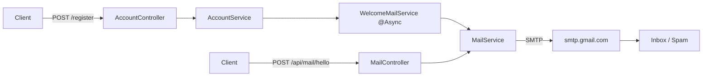
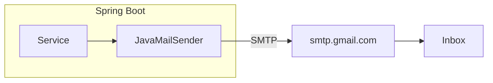
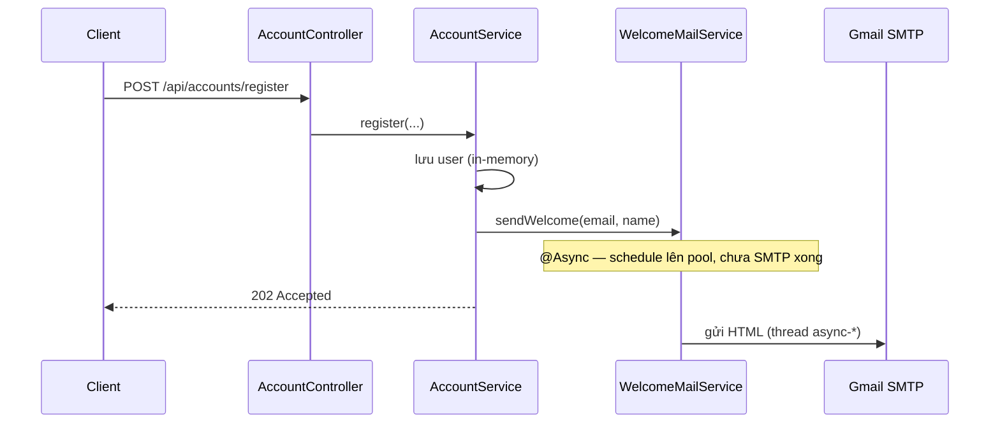

# Phụ lục 2: Spring Boot Email — Gửi email với Gmail

## Mục tiêu bài học

Sau phụ lục này, học viên có thể:

- Giải thích **gửi email từ backend** khác gì request HTTP — ai kích hoạt, SMTP làm gì
- Thêm dependency `spring-boot-starter-mail` và cấu hình **Gmail SMTP** (App Password)
- Gửi email **text** và **HTML** bằng `JavaMailSender` / `MimeMessageHelper`
- Viết **MailService** (hạ tầng) tách khỏi nghiệp vụ; gọi từ Controller / Service khác
- Áp dụng tình huống thực tế: **email chào mừng sau đăng ký** + **`@Async`** (không chặn HTTP)
- Nhận biết lỗi thường gặp (sai App Password, Spam, thiếu config) và cách xử lý mức lab

> **Không nằm trong phạm vi phụ lục này:** Template engine đầy đủ (Thymeleaf mail); hàng đợi (Kafka/Rabbit) gửi mail hàng loạt; tracking mở/đọc email; SES/SendGrid SDK chuyên sâu.

## Điều kiện tiên quyết

- **Module 2 — Bài 4**: Spring Boot project, `@Service`, `application.properties`
- **Module 2 — Bài 5+**: Controller → Service
- *(Khuyến khích)* **Module 4 — Bài 1**: `@Async` — đã thấy email giả lập; phụ lục này gửi **SMTP thật**
- *(Khuyến khích)* **Phụ lục 1 — Scheduled**: kết hợp job + gửi mail nhắc
- JDK 17+, Spring Boot 3.x
- Tài khoản **Gmail** + **xác minh 2 bước (2FA)** để tạo **App Password**

> **Demo chuẩn:** [`demo-phuluc2-email`](../../demo-phuluc2-email) — in-memory (không Mongo), đủ Hello text/HTML + đăng ký + welcome `@Async` + unit test Mockito.  
> Chi tiết chạy app / API: [README](../../demo-phuluc2-email/README.md).

> **Vai trò phụ lục:** Kỹ năng **bổ trợ backend** (thông báo qua email), dùng được trong Final Project (xác nhận đăng ký, quên mật khẩu, thông báo đơn hàng). Không thay các bài chính Module 4.

### Thời lượng gợi ý


| Phần                                      | Thời gian |
| ----------------------------------------- | --------- |
| Khái niệm + SMTP §1                       | ~15 phút  |
| Dependency + App Password + properties §2 | ~20 phút  |
| Hello text §3                             | ~20 phút  |
| HTML §4                                   | ~15 phút  |
| Welcome đăng ký + `@Async` §5             | ~25 phút  |
| Lỗi thường gặp + bài tập §6–7             | ~15 phút  |


## Nội dung (làm theo thứ tự)


| #       | Chủ đề                          | Việc HV làm (tóm tắt)                                              | Kết quả kiểm tra                 |
| ------- | ------------------------------- | ------------------------------------------------------------------ | -------------------------------- |
| 1       | Email vs HTTP + SMTP            | Đọc / thảo luận                                                    | Nói được SMTP / App Password     |
| 2       | Dependency + Gmail SMTP         | **Tạo** App Password · **Thêm** starter-mail · **Cập nhật** properties | App start; điền `spring.mail.*` OK |
| 3       | Hello — gửi text                | **Thêm** `MailService` · `MailController`                          | Nhận mail text trong Inbox/Spam  |
| 4       | Gửi HTML                        | **Thêm** `sendHtml` · API `hello-html`                             | Mail có in đậm / tiếng Việt      |
| 5       | Welcome sau đăng ký + `@Async`  | **Thêm** package `account/`* · `WelcomeMailService` · `AsyncConfig` | `POST /register` → `202` + mail |
| 6       | Lỗi thường gặp                  | Đọc bảng                                                           | Tự sửa khi gửi thất bại          |
| 7       | Nâng cao (đọc hiểu)             | Optional                                                           | Biết Thymeleaf / queue tên gì    |
| Phụ lục | Bài tập · Checklist · Liên kết  | —                                                                  | —                                |


---

## Kiến trúc lab (demo chuẩn)

```
src/main/java/vn/demo/
├── DemoPhuluc2EmailApplication.java   ← @EnableAsync ★
├── config/
│   └── AsyncConfig.java               ← §5.4 pool async-*
├── mail/
│   ├── MailService.java               ← §3–4 text + HTML ★
│   ├── WelcomeMailService.java        ← §5 @Async welcome ★
│   └── controller/MailController.java ← lab thử gửi
├── account/                           ← §5
│   ├── model/UserAccount.java
│   ├── dto/RegisterRequest.java
│   ├── dto/RegisterResponse.java
│   ├── repository/UserAccountRepository.java
│   ├── repository/InMemoryUserAccountRepository.java
│   ├── service/AccountService.java      ★ register + gọi welcome
│   └── controller/AccountController.java
└── exception/
    ├── ConflictException.java
    ├── ResourceNotFoundException.java
    └── RestExceptionHandler.java
```

> Demo dùng **in-memory** để tập trung SMTP. Production đổi Repository sang JPA/Mongo mà **không đổi** chữ ký `AccountService` / `MailService`.




---

## 1. Gửi email từ Spring Boot là gì?

### 1.1. So với HTTP request


|                   | HTTP request                         | Gửi email                                      |
| ----------------- | ------------------------------------ | ---------------------------------------------- |
| **Ai kích hoạt?** | Client gọi API                       | **Code backend** (sau đăng ký, job, admin…)    |
| **Đích đến?**     | Client nhận JSON                     | **Hộp thư** người dùng (qua SMTP)              |
| **Ví dụ**         | `POST /api/accounts/register` → `202` | Sau đăng ký → gửi “Chào mừng …” tới email user |


> **Ẩn dụ:** HTTP = khách gọi điện hỏi cửa hàng. Email = cửa hàng **gửi thư** tới nhà khách — thư đi qua bưu điện (SMTP), không phải trả lời ngay trên cuộc gọi.




### 1.2. SMTP là gì? (mức cần nhớ)


| Thuật ngữ               | Ý nghĩa ngắn                                                         |
| ----------------------- | -------------------------------------------------------------------- |
| **SMTP**                | Giao thức **gửi** email (app → máy chủ thư)                          |
| **Host**                | Địa chỉ máy chủ — Gmail: `smtp.gmail.com`                            |
| **Port**                | Cổng SMTP — lab Gmail dùng `587` + STARTTLS                          |
| **Username / Password** | Email Gmail + **App Password** (không phải mật khẩu đăng nhập)       |


> Lab **không** cần tự dựng mail server. Phụ lục này dùng **Gmail SMTP** + **App Password**.

**Việc HV làm ở §1:** Không code — nắm bảng so sánh và SMTP trước khi thêm dependency.

---

## 2. Dependency + cấu hình Gmail SMTP

### Việc học viên làm


| Bước | Hành động                                                         | File / ghi chú                                      |
| ---- | ----------------------------------------------------------------- | --------------------------------------------------- |
| 2.1  | Bật 2FA + tạo **App Password** Gmail                              | Trình duyệt Google Account                          |
| 2.2  | **Thêm** dependency `spring-boot-starter-mail` (+ validation)     | [`pom.xml`](../../demo-phuluc2-email/java-springboot-phuluc2/pom.xml) |
| 2.3  | **Cập nhật** `spring.mail.*` + `app.mail.from` (điền App Password) | `application.properties`                           |
| 2.4  | Chạy app                                                          | `./mvnw spring-boot:run`                            |


### Bước 2.1 — Tạo Gmail App Password (bắt buộc)

Gmail **không** cho app dùng mật khẩu đăng nhập thường. Phải dùng **App Password**.


| # | Việc làm |
| - | -------- |
| 1 | Đăng nhập [Google Account](https://myaccount.google.com/) bằng Gmail sẽ dùng để gửi |
| 2 | Bật **Xác minh 2 bước (2-Step Verification)** nếu chưa bật |
| 3 | Vào [App passwords](https://myaccount.google.com/apppasswords) (hoặc tìm “Mật khẩu ứng dụng”) |
| 4 | Chọn app: **Mail** · thiết bị: **Other** (đặt tên `SpringBoot Lab`) → **Generate** |
| 5 | Google hiện **16 ký tự** (vd. `abcd efgh ijkl mnop`) — **copy lại**, chỉ hiện 1 lần |
| 6 | Dùng 16 ký tự này làm `spring.mail.password` (có thể bỏ khoảng trắng) |


> **Không dùng** mật khẩu Gmail bình thường → sẽ `Authentication failed`.  
> Tài khoản Google Workspace / trường học đôi khi **chặn** App Password — khi đó hỏi admin hoặc dùng tài khoản Gmail cá nhân cho lab.

### Bước 2.2 — Dependency

Trong [`pom.xml`](../../demo-phuluc2-email/java-springboot-phuluc2/pom.xml):

```xml
<!-- ★ Phụ lục 2: JavaMailSender + auto-config spring.mail.* -->
<dependency>
    <groupId>org.springframework.boot</groupId>
    <artifactId>spring-boot-starter-mail</artifactId>
</dependency>
<!-- Validate RegisterRequest (@Email, @NotBlank) — dùng từ §5 -->
<dependency>
    <groupId>org.springframework.boot</groupId>
    <artifactId>spring-boot-starter-validation</artifactId>
</dependency>
```

> Spring Boot tự tạo bean `JavaMailSender` khi có đủ `spring.mail.host` (+ auth).

### Bước 2.3 — Properties (Gmail)

Demo chuẩn ([`application.properties`](../../demo-phuluc2-email/java-springboot-phuluc2/src/main/resources/application.properties)) — **điền trực tiếp** username + App Password:

```properties
spring.mail.host=smtp.gmail.com
spring.mail.port=587
spring.mail.username=ban@gmail.com
spring.mail.password=abcdefghijklmnop
spring.mail.properties.mail.smtp.auth=true
spring.mail.properties.mail.smtp.starttls.enable=true

# From phải trùng (hoặc alias của) tài khoản Gmail đang SMTP
app.mail.from=ban@gmail.com
```


| Thuộc tính      | Giá trị lab                                                         |
| --------------- | ------------------------------------------------------------------- |
| `host`          | `smtp.gmail.com`                                                    |
| `port`          | `587` (STARTTLS) — phổ biến nhất cho lab                            |
| `username`      | Địa chỉ Gmail đầy đủ (`ban@gmail.com`)                              |
| `password`      | **App Password** 16 ký tự (không phải mật khẩu đăng nhập)           |
| `app.mail.from` | Cùng email Gmail (hoặc alias đã cấu hình trên Gmail)                |


**Tuỳ chọn port 465 (SSL):** nếu mạng chặn 587:

```properties
spring.mail.port=465
spring.mail.properties.mail.smtp.ssl.enable=true
```

### Bước 2.4 — Chạy app

```bash
cd demo-phuluc2-email/java-springboot-phuluc2
./mvnw spring-boot:run
```

> Lab: điền App Password vào `application.properties` là đủ. (Tách secret / profile `local` có thể bổ sung sau — không bắt buộc ở phụ lục này.)

---

## 3. Hello Email — gửi text

### Việc học viên làm


| Bước | Hành động                              | File                                                                 |
| ---- | -------------------------------------- | -------------------------------------------------------------------- |
| 3.1  | **Thêm** `MailService` + `sendText`    | [`mail/MailService.java`](../../demo-phuluc2-email/java-springboot-phuluc2/src/main/java/vn/demo/mail/MailService.java) |
| 3.2  | **Thêm** API thử gửi                   | [`mail/controller/MailController.java`](../../demo-phuluc2-email/java-springboot-phuluc2/src/main/java/vn/demo/mail/controller/MailController.java) |
| 3.3  | Gọi API → mở hộp thư người nhận        | Inbox / Spam                                                         |


### Bước 3.1 — MailService

```java
@Slf4j
@Service
@RequiredArgsConstructor
public class MailService {

    private final JavaMailSender mailSender;

    @Value("${app.mail.from}")
    private String from;

    /** Gửi email text thuần (syllabus §3). */
    public void sendText(String to, String subject, String body) {
        // 1) Tạo message text
        SimpleMailMessage message = new SimpleMailMessage();
        message.setFrom(from);
        message.setTo(to);
        message.setSubject(subject);
        message.setText(body);

        // 2) Gửi qua SMTP (đồng bộ — có thể mất vài giây)
        mailSender.send(message);
        log.info("[MailService] Đã gửi text tới {}", to);
    }
}
```

### Bước 3.2 — API thử (lab)

```java
@RestController
@RequestMapping("/api/mail")
@RequiredArgsConstructor
public class MailController {

    private final MailService mailService;

    @PostMapping("/hello")
    public ResponseEntity<Map<String, String>> hello(@RequestParam String to) {
        mailService.sendText(to, "Hello từ Spring Boot",
                "Đây là email text đầu tiên (Phụ lục 2).");
        return ResponseEntity.ok(Map.of(
                "message", "Đã gửi text — kiểm tra Inbox/Spam của " + to));
    }
}
```

**Kiểm tra:**

```bash
curl -s -X POST "http://localhost:8080/api/mail/hello?to=nguoinhan@gmail.com"
```

→ mở Gmail (Inbox / **Spam**) của người nhận → thấy thư từ `ban@gmail.com`.

> Lần đầu gửi sang địa chỉ lạ, thư có thể vào **Spam**. Request này **đồng bộ** — client chờ SMTP xong (so với §5 `@Async`).

### Quy tắc vàng (mức cơ bản)


| Quy tắc                              | Chi tiết                                            |
| ------------------------------------ | --------------------------------------------------- |
| Có `spring-boot-starter-mail`        | Thiếu → không có `JavaMailSender`                   |
| Đủ `spring.mail.host` + App Password | Sai/thiếu → `Authentication failed`                 |
| `from` trùng Gmail gửi               | Đừng đặt `noreply@demo.vn` nếu chưa verify domain   |
| Logic gửi nằm ở **Service**          | Controller chỉ gọi Service                          |


---

## 4. Gửi email HTML

### Việc học viên làm


| Bước | Hành động                                         | File / ghi chú        |
| ---- | ------------------------------------------------- | --------------------- |
| 4.1  | Đọc khác biệt text vs HTML                        | Bảng dưới             |
| 4.2  | **Thêm** method `sendHtml` vào `MailService`      | Cùng class §3         |
| 4.3  | **Thêm** `POST /api/mail/hello-html`              | `MailController`      |
| 4.4  | Gọi API → xác nhận HTML + tiếng Việt              | Inbox / Spam          |


| Kiểu | Class / helper                        | Khi nào dùng                    |
| ---- | ------------------------------------- | ------------------------------- |
| Text | `SimpleMailMessage`                   | Lab, thông báo ngắn             |
| HTML | `MimeMessage` + `MimeMessageHelper`   | Chào mừng, có link, in đậm      |


```java
public void sendHtml(String to, String subject, String htmlBody) throws MessagingException {
    // 1) Tạo MimeMessage (hỗ trợ HTML / multipart)
    MimeMessage message = mailSender.createMimeMessage();
    MimeMessageHelper helper = new MimeMessageHelper(message, true, "UTF-8");

    // 2) Điền From / To / Subject / Body HTML
    helper.setFrom(from);
    helper.setTo(to);
    helper.setSubject(subject);
    helper.setText(htmlBody, true); // true = HTML

    // 3) Gửi qua SMTP
    mailSender.send(message);
    log.info("[MailService] Đã gửi HTML tới {}", to);
}
```

**Kiến thức mới — `MimeMessageHelper`:**

- `setText(html, true)` — tham số `true` = nội dung **HTML** (không phải text thuần)
- Charset **`UTF-8`** — bắt buộc để tiếng Việt không lỗi font
- `multipart = true` — sẵn sàng đính kèm sau này (nâng cao §7)

**Kiểm tra:**

```bash
curl -s -X POST "http://localhost:8080/api/mail/hello-html?to=nguoinhan@gmail.com"
```

---

## 5. Ví dụ thực tế — Email chào mừng sau đăng ký

### Việc học viên làm (thứ tự tạo file)


| Bước | Hành động                                              | File / ghi chú                                                                 |
| ---- | ------------------------------------------------------ | ------------------------------------------------------------------------------ |
| 5.1  | Hiểu luồng đăng ký → gửi mail nền                      | Không code                                                                     |
| 5.2  | **Thêm** model + repository in-memory                  | `account/model/`* · `account/repository/`*                                     |
| 5.3  | **Thêm** DTO `RegisterRequest` / `RegisterResponse`    | `account/dto/`*                                                                |
| 5.4  | **Thêm** `WelcomeMailService` + `@Async`               | [`WelcomeMailService.java`](../../demo-phuluc2-email/java-springboot-phuluc2/src/main/java/vn/demo/mail/WelcomeMailService.java) |
| 5.5  | **Thêm** `AccountService.register`                     | [`AccountService.java`](../../demo-phuluc2-email/java-springboot-phuluc2/src/main/java/vn/demo/account/service/AccountService.java) |
| 5.6  | **Thêm** `AccountController` → `202 Accepted`          | `POST /api/accounts/register`                                                  |
| 5.7  | **Cập nhật** Application — `@EnableAsync`              | [`DemoPhuluc2EmailApplication.java`](../../demo-phuluc2-email/java-springboot-phuluc2/src/main/java/vn/demo/DemoPhuluc2EmailApplication.java) |
| 5.8  | **Thêm** `AsyncConfig` (pool `async-*`)                | [`config/AsyncConfig.java`](../../demo-phuluc2-email/java-springboot-phuluc2/src/main/java/vn/demo/config/AsyncConfig.java) |
| 5.9  | Chạy `POST /register` → xem log `async-*` + Inbox      | So sánh tốc độ với `/api/mail/hello`                                           |


### 5.1. Nghiệp vụ

1. User **đăng ký** (email + tên + mật khẩu) → lưu tài khoản in-memory
2. Backend **gửi email chào** HTML (link kích hoạt giả lập) trên thread **`@Async`**
3. Client nhận **`202 Accepted` ngay** — **không** chờ SMTP xong




### 5.2–5.3. Model / Repository / DTO (tóm tắt)

- `UserAccount`: `id`, `email`, `displayName`, `passwordHash`, `createdAt`
- `UserAccountRepository` + `InMemoryUserAccountRepository` (`ConcurrentHashMap`)
- `RegisterRequest`: `@Email`, `@NotBlank`, `@Size` — validate ở Controller (`@Valid`)
- Trùng email → `ConflictException` → HTTP **409**

### 5.4. WelcomeMailService (`@Async`)

```java
@Slf4j
@Service
@RequiredArgsConstructor
public class WelcomeMailService {

    private final MailService mailService;

    @Async
    public void sendWelcome(String to, String displayName) {
        // 1) Log thread — phải khác http-nio-* nếu @Async hoạt động
        log.info("[{}] Bắt đầu gửi welcome tới {}", Thread.currentThread().getName(), to);

        // 2) Ghép HTML ngắn
        String html = """
            <h2>Xin chào %s!</h2>
            <p>Cảm ơn bạn đã đăng ký. Chúc bạn học vui với Spring Boot Email.</p>
            <p><a href="https://demo.vn/activate">Kích hoạt tài khoản</a></p>
            """.formatted(displayName);

        // 3) Gửi; lỗi chỉ log (không ném ra HTTP vì đã async)
        try {
            mailService.sendHtml(to, "Chào mừng đến Demo Phụ lục 2", html);
        } catch (Exception ex) {
            log.error("[WelcomeMail] Gửi thất bại tới {}: {}", to, ex.getMessage());
        }
    }
}
```

**Kiến thức mới — `@Async`:**

- Chỉ có hiệu lực khi gọi **qua Spring bean** (inject từ `AccountService`)
- Gọi `this.sendWelcome(...)` trong cùng class → **không** async
- Cần `@EnableAsync` trên Application + (khuyến khích) `AsyncConfig` với prefix `async-`

### 5.5. AccountService — gọi welcome sau khi lưu

```java
public RegisterResponse register(RegisterRequest request) {
    // 1) Chống trùng email
    // 2) Tạo + lưu UserAccount
    // 3) Gửi mail chào — @Async: trả về ngay
    welcomeMailService.sendWelcome(saved.getEmail(), saved.getDisplayName());
    // 4) Return DTO (Controller bọc 202)
    return new RegisterResponse(...);
}
```

### 5.6–5.8. Controller + EnableAsync + AsyncConfig

```java
@PostMapping("/register")
public ResponseEntity<RegisterResponse> register(@Valid @RequestBody RegisterRequest request) {
    return ResponseEntity.status(HttpStatus.ACCEPTED).body(accountService.register(request));
}
```

```java
@SpringBootApplication
@EnableAsync   // ← bắt buộc; thiếu thì @Async không chạy
public class DemoPhuluc2EmailApplication { ... }
```

**Kiểm tra:**

```bash
curl -s -X POST http://localhost:8080/api/accounts/register \
  -H "Content-Type: application/json" \
  -d '{"email":"nguoinhan@gmail.com","displayName":"Khoa","password":"secret1"}'
```

→ HTTP **202** gần như ngay; console có thread `async-*`; vài giây sau có mail chào.

> **Câu chốt:** Đăng ký = nghiệp vụ chính (HTTP). Gửi mail = việc phụ — **không chặn** user (`@Async`). So sánh với `POST /api/mail/hello` (đồng bộ, chờ SMTP).

---

## 6. Lỗi thường gặp


| Triệu chứng                      | Nguyên nhân                                      | Cách xử lý                                           |
| -------------------------------- | ------------------------------------------------ | ---------------------------------------------------- |
| `Could not connect to SMTP host` | Sai `host` / `port` / firewall                   | Đúng `smtp.gmail.com` + `587`; thử port `465`        |
| `Authentication failed`          | Dùng mật khẩu đăng nhập / App Password sai       | Bật 2FA → tạo lại **App Password** 16 ký tự          |
| Không thấy mục App passwords     | Chưa bật xác minh 2 bước                         | Bật 2FA trước, rồi vào lại App passwords             |
| Bean `JavaMailSender` không có   | Thiếu starter-mail hoặc thiếu host               | Thêm dependency + `spring.mail.host`                 |
| `from` bị từ chối / lỗi gửi      | `app.mail.from` khác tài khoản Gmail             | Đặt `from` = đúng `spring.mail.username`             |
| Tiếng Việt lỗi font              | Không set UTF-8                                  | `MimeMessageHelper(..., "UTF-8")`                    |
| `@Async` vẫn chậm HTTP           | Thiếu `@EnableAsync` / gọi `this.` cùng class    | Thêm `@EnableAsync`; gọi qua bean inject             |
| Mail “biến mất”                  | Vào Spam / Promotions                            | Kiểm tra Spam; gửi thử tới chính Gmail của bạn       |
| Exception nuốt im                | `catch` trống                                    | Ít nhất `log.error`                                  |


---

## 7. Nâng cao (đọc hiểu — không bắt buộc)

### Việc học viên làm: chỉ đọc


| Hướng                           | Khi nào nghĩ tới                                           |
| ------------------------------- | ---------------------------------------------------------- |
| **Thymeleaf / FreeMarker** mail | Template HTML dài, nhiều biến, tách file `.html`           |
| **Đính kèm file**               | `MimeMessageHelper` + `addAttachment(...)`                 |
| **Scheduled + Email**           | Nhắc user chưa kích hoạt (Phụ lục 1 + mail)                |
| **Message Queue**               | Gửi hàng loạt / retry / nhiều instance (Bài Microservices) |


> Final Project nhỏ: **MailService + Gmail SMTP** là đủ. Production lớn thường chuyển sang SendGrid / Amazon SES (quota & độ tin cậy tốt hơn Gmail cá nhân).

---

## Tóm tắt


| Khái niệm                  | Ý chính                                                                  |
| -------------------------- | ------------------------------------------------------------------------ |
| SMTP Gmail                 | `smtp.gmail.com:587` + STARTTLS                                          |
| App Password               | 16 ký tự sau khi bật 2FA — **không** dùng mật khẩu đăng nhập             |
| `spring-boot-starter-mail` | Dependency + auto-config `JavaMailSender`                                |
| Text                       | `SimpleMailMessage`                                                      |
| HTML                       | `MimeMessageHelper` + `setText(html, true)` + UTF-8                      |
| MailService                | Tầng gửi chung; nghiệp vụ gọi từ Service khác                            |
| Welcome + `@Async`         | Sau `register` → `sendWelcome`; HTTP `202`; thread `async-*`             |


---

## Phụ lục

### Bài tập

1. **App Password:** Tạo App Password; điền `spring.mail.*` trong `application.properties`; chạy app.
2. **Hello text:** `POST /api/mail/hello?to=...` — xác nhận Inbox/Spam.
3. **HTML:** `POST /api/mail/hello-html?to=...` — xác nhận in đậm + tiếng Việt.
4. **Đăng ký:** `POST /api/accounts/register` → `202` ngay; log có `async-*`; có mail chào.
5. **So sánh:** Đo thời gian response `/hello` (sync) vs `/register` (async).
6. **From:** Thử `app.mail.from` khác username — quan sát lỗi; sửa lại cho đúng.
7. **(Nâng cao):** Chạy `./mvnw test` — đọc `MailServiceTest` / `AccountServiceTest` (mock, không cần Gmail).
8. **(Nâng cao — đọc hiểu):** Kết hợp Phụ lục 1: job quét user `PENDING` → gửi email nhắc kích hoạt.

### Checklist trước khi hoàn thành

- [ ] Bật 2FA và tạo được **App Password** Gmail
- [ ] Có `spring-boot-starter-mail` + `spring.mail.host=smtp.gmail.com`
- [ ] Đã điền App Password vào `application.properties`
- [ ] Gửi được email **text** (`POST /api/mail/hello`)
- [ ] Gửi được email **HTML** UTF-8 (`POST /api/mail/hello-html`)
- [ ] `app.mail.from` trùng tài khoản Gmail gửi
- [ ] Có `MailService` tách khỏi Controller
- [ ] Đăng ký → `202` + welcome `@Async` + mail chào
- [ ] Biết xử lý `Authentication failed` / Spam / thiếu `@EnableAsync`
- [ ] Đã chạy được demo [`demo-phuluc2-email`](../../demo-phuluc2-email)

### Câu hỏi ôn tập

1. Vì sao gửi email thường **không** nên viết SMTP dài dòng trong Controller?
2. `SimpleMailMessage` khác `MimeMessageHelper` chỗ nào?
3. Vì sao Gmail bắt buộc **App Password** thay vì mật khẩu đăng nhập?
4. `POST /api/mail/hello` chậm vài giây còn `POST /api/accounts/register` trả `202` nhanh — vì sao?
5. `app.mail.from` nên đặt thế nào khi gửi qua Gmail?

Đáp án gợi ý (câu 1–5)

1. Controller chỉ nhận request/trả response; gửi mail là hạ tầng → `MailService`, dễ tái sử dụng và test (Mockito mock `JavaMailSender`).
2. `SimpleMailMessage` = text thuần; `MimeMessageHelper` = HTML, đính kèm, multipart, UTF-8.
3. Google tắt “Less secure apps”; app bên thứ ba phải dùng App Password (sau khi bật 2FA) để xác thực SMTP.
4. `/hello` gọi `send` đồng bộ trên HTTP thread; `/register` gọi `WelcomeMailService.sendWelcome` có `@Async` → SMTP chạy trên `async-*`.
5. Nên trùng `spring.mail.username` (cùng Gmail đang SMTP), tránh địa chỉ From giả / domain chưa verify.

### Liên kết tham khảo

- **Demo chuẩn:** [`demo-phuluc2-email`](../../demo-phuluc2-email) · [README](../../demo-phuluc2-email/README.md)
- [Spring Boot — Sending Email](https://docs.spring.io/spring-boot/reference/io/email.html)
- [Spring Framework — Email](https://docs.spring.io/spring-framework/reference/integration/email.html)
- [Google — Sign in with app passwords](https://support.google.com/accounts/answer/185833)
- [Tạo App Password](https://myaccount.google.com/apppasswords)
- Module 4 — Bài 1 RESTful API (`@Async` + email giả lập): `java_m4_bai1_RESTful_API.md`
- Module 4 — Phụ lục 1 Scheduled: `java_m4_phuluc1_Scheduled.md`
- Module 4 — Bài 2 Microservices (async / queue — đọc hiểu): `java_m4_bai2_Microservices.md`
