# Bài 2: Microservices — Lý thuyết & Lab Ecommerce Phase 1

> File: `5_java_m4_bai2_Microservices.md` — làm **sau Bài 4** (JWT).  
> Gồm **2 phần:** (1) Lý thuyết Microservices · (2) Lab Ecommerce Phase 1.  
> Demo: [`demo-bai2-ecommerce-ms`](../../demo-bai2-ecommerce-ms) · [README](../../demo-bai2-ecommerce-ms/README.md) · [API test](../../demo-bai2-ecommerce-ms/docs/api-test.md)  
> JDK 17+ · Spring Boot 3.x · MongoDB.

---

## Mục tiêu bài học (Phase 1)

Sau Phase 1, học viên có thể:

- Giải thích **microservice** khác monolith; nêu khi nào **nên / chưa nên** tách
- Phân loại giao tiếp **sync / async**; biết Shared DB là anti-pattern
- Phân biệt **API Gateway (biên)** với Filter trong một app
- Theo dõi request bằng **`X-Correlation-Id`** và kiểm **`/actuator/health`**
- Nhìn sơ đồ kiến trúc và giải thích **mỗi khối làm gì**, **vì sao cần**
- Nêu được hệ thống tách thành **bao nhiêu service**, chúng **phụ thuộc** nhau thế nào
- Giải thích **Database-per-service** (DB / collection thuộc ai)
- Mô tả **cấu trúc package** (convention Module 4) và chỗ gọi service khác (`RestClient`)
- Kể được **trách nhiệm + flow + API** của từng service
- Chạy demo: login → xem SP → đặt hàng → (email) qua **một cửa** API Gateway

---

# Phần 1. Lý thuyết về Microservices

> Đọc phần này **trước** khi mở code lab. Mỗi ý gắn ví dụ ecommerce Phase 1 cho dễ hình dung.

## 1. Microservices là gì? Khi nào dùng?

### Định nghĩa (nói đơn giản)

Một **microservice** = một ứng dụng **nhỏ, chạy riêng**, phụ trách **một phần nghiệp vụ rõ** (Auth, Product, Order…).  
Có thể **code / deploy / scale** độc lập — không phải chỉ “chia package trong một JAR”.

```text
Monolith:      [ Auth + Product + Order + DB ]     ← 1 process, 1 deploy
Modular:       [ Auth | Product | Order ] + 1 DB   ← 1 process, module rõ
Microservices: [Auth] [Product] [Order] … + DB riêng ← nhiều process
```

> **Ẩn dụ lab:** food court — mỗi quán (Auth, Product, Order, Notify) nấu riêng; **lễ tân** = API Gateway. Khách chỉ nói với lễ tân, không xông vào bếp.

### Lợi ích (khi làm đúng)

| Lợi ích | Ví dụ gắn lab |
| ------- | ------------- |
| Deploy độc lập | Sửa Notify / SMTP không bắt redeploy Auth |
| Scale chọn lọc | Flash sale → scale Product, chưa cần scale Auth |
| Team / domain tách | Người làm catalog khác người làm đặt hàng |
| Cô lập lỗi *(nếu có chịu lỗi)* | Notify chậm ≠ treo checkout *nếu* có timeout / không chờ mail |

> Câu “một service chết thì app không sập” **chỉ đúng khi** đã thiết kế chịu lỗi — Phase 1 còn đơn giản (Order vẫn gọi Notify sync).

### Chi phí

Nhiều process · log khó lần · consistency khó hơn một `@Transactional` · latency mạng · bảo mật nhiều cửa hơn.

### Khi nào **chưa** nên microservices?

- Team nhỏ, domain còn thay đổi liên tục  
- Chưa có CI/CD / theo dõi log cơ bản  
- Traffic thấp — monolith / modular monolith đủ  
- Tách sớm không rõ ranh giới → **distributed monolith** (nhiều service nhưng vẫn dính chặt)

> **Quy tắc thực tế:** ưu tiên modular monolith trước; tách khi có áp lực scale / team / deploy độc lập thật.  
> **Lab này** cố ý tách sẵn 5 service để HV **nhìn hình dạng** MS — không phải khuyến khích mọi app nhỏ đều MS ngay.

---

## 2. Giao tiếp sync / async

Service không share DB → phải **nói chuyện** với nhau.

| Loại | Cách | Khi hợp | Trong lab Phase 1 |
| ---- | ---- | ------- | ----------------- |
| **Sync** | REST/HTTP (`RestClient`) | Cần kết quả **ngay** | Order → Product lấy giá; Order → Notify |
| **Async** | Kafka / queue / event | Việc có thể trễ; 1 sự kiện → nhiều bên | **Chưa** — để Phase 2 |
| **Anti-pattern** | Shared database | — | Không dùng: mỗi service DB riêng |

> `@Async` (Bài 1 / PL1) = thread **trong một** app — **không** thay Kafka giữa các service.

### Shared DB — không phải “giao tiếp chuẩn”

```text
❌  Order và Product cùng đọc/ghi một DB products+orders

✅  Order → order_db
    Product → product_db
    Cần giá? → Order gọi HTTP Product API
```

### Chọn sync hay async? (câu hỏi nhanh)

| Câu hỏi | Hướng |
| ------- | ----- |
| UI cần mã đơn / giá **ngay**? | Sync |
| Gửi mail / báo cáo có thể trễ vài giây? | Async (Phase 2) |
| 1 sự kiện kích nhiều subscriber? | Pub/Sub |

```text
Người dùng bấm "Đặt hàng" → cần mã đơn ngay
  → Phase 1: Order lưu order_db + gọi Notify HTTP (sync, dễ hiểu)

Nếu Notify tắt: đơn có thể đã CONFIRMED, email không gửi
  → hạn chế sync → Phase 2: Kafka / Outbox
```

---

## 3. API Gateway

**API Gateway** = **một cửa** phía client (giống lễ tân / reverse proxy cho API).

| Việc Gateway làm (lab) | Việc Gateway **không** làm |
| ---------------------- | -------------------------- |
| Route path → đúng service | Logic đặt hàng / catalog / gửi mail |
| CORS · verify JWT · Correlation Id | Thay thế Auth (Auth vẫn phát JWT) |
| Forward request | Route Notify ra Internet |

```text
Client ──► Gateway :8080
              ├── /api/auth/**      → Auth :8081
              ├── /api/products/**  → Product :8082
              └── /api/orders/**    → Order :8083
                   (Notify :8084 chỉ Order gọi nội bộ — không qua Gateway)
```

### Gateway vs Filter trong một app

| | API Gateway | Filter / Interceptor |
| - | ----------- | -------------------- |
| Vị trí | **Biên** — trước nhiều service | **Trong** một process |
| Ví dụ lab | Spring Cloud Gateway | `CorrelationIdFilter`, `GatewayUserFilter` (Order) |

### JWT ở đâu? (lab Phase 1)

| Chỗ | Việc |
| --- | ---- |
| **Auth** | **Ký / phát** JWT khi login |
| **Gateway** | **Verify** → gắn `X-User-Id`, `X-User-Email`, `X-User-Roles` |
| **Order** | Đọc header — **không** cần jjwt |

> Thêm service sau (Cart, Payment…): **không copy** code JWT — tin header từ Gateway (+ mạng nội bộ).

### “Đăng ký” service — Phase 1 dùng URL tĩnh

Chưa Eureka. Gateway và Order biết địa chỉ qua `application.properties`:

```properties
# Gateway route tới Product
spring.cloud.gateway.routes[1].uri=http://localhost:8082

# Order gọi Product / Notify
app.services.product.url=http://localhost:8082
app.services.notification.url=http://localhost:8084
```

---

## 4. Correlation ID & Health

### Vì sao cần Correlation Id?

Một lần đặt hàng đi qua **nhiều console**: Gateway → Order → Product → Notify.  
Không có id chung → không lần được “request này” trên log.

| Chỗ | Việc trong lab |
| --- | -------------- |
| Gateway | **Luôn sinh** `X-Correlation-Id` (không tin header từ client) |
| Mỗi service | Filter → MDC `cid` → log `[cid=…]` |
| Order `RestClient` | Forward cùng header xuống Product & Notify |

```properties
logging.pattern.console=%d{HH:mm:ss.SSS} [%thread] %-5level %logger{36} [cid=%X{cid}] - %msg%n
```

**Thử:** đặt hàng qua `:8080` (không gửi correlation từ client). Copy `X-Correlation-Id` trên **response**, tìm cùng UUID trên log Gateway / Order / Product.

### Health

```text
GET http://localhost:8080/actuator/health   # Gateway
GET http://localhost:8081/actuator/health   # Auth
… 8082 Product · 8083 Order · 8084 Notify
```

Trước khi debug “đặt hàng lỗi”, hỏi: Product / Notify còn `UP` không?

---

## 5. Roadmap: Phase 1 và Phase 2 làm gì?

Trước khi vào lab, HV cần biết **Phase này đứng ở đâu** trên lộ trình — tránh kỳ vọng “đã đủ production”.

| | **Phase 1** (bài này / lab hiện tại) | **Phase 2** (sau — chưa code trong khóa này) |
| - | ----------------------------------- | --------------------------------------------- |
| **Mục tiêu sư phạm** | Nhìn rõ **nhiều process**, một Gateway, DB riêng, gọi nhau bằng **HTTP** | Hiểu **bất đồng bộ**: sự kiện, giảm phụ thuộc sync |
| **Giao tiếp chính** | REST + `RestClient` (Order→Product, Order→Notify) | Thêm **Kafka** (hoặc MQ): Order publish → Notify consume |
| **Sau đặt hàng** | Order **HTTP sync** gọi Notify → SMTP | Order lưu đơn + **publish event**; Notify lắng nghe; **Outbox** (ý tưởng) |
| **Đăng ký service** | URL trong `application.properties` | Có thể nâng **Service Discovery** (Eureka…) |
| **Chưa có** | Docker, Saga, Payment, Inventory | Vẫn có thể chưa đủ Payment/Saga (thường Phase 3+) |

```text
Phase 1  →  “Hình dạng” MS: Gateway · Auth · Product · Order · Notify · DB-per-service
Phase 2  →  “Nới lỏng sync”: Kafka · Notification event · Outbox / retry bền hơn
Phase 3+ →  Inventory · Payment · Saga · Redis · Docker/K8s …
```

> **Phase 1 cố ý đơn giản** để vững nền. Phase 2 giải bài toán HV sẽ thấy trong lab: *Notify tắt thì đơn đã lưu nhưng email không gửi*.

---

# Phần 2. Lab Ecommerce Phase 1

## 1. Mục tiêu lab

Giúp HV **hiểu trên code chạy được** (không chỉ slide):

- Microservices architecture · API Gateway · JWT · HTTP gọi giữa service  
- MongoDB · Database-per-service · luồng đặt hàng · Email sau đặt hàng  
- Validation · Exception handling · Logging · Correlation Id · Health  

> Demo: [`demo-bai2-ecommerce-ms`](../../demo-bai2-ecommerce-ms).  
> File này gồm **Phần 1 — lý thuyết** + **Phần 2 — lab Phase 1**.

### 1.1. Phạm vi lab Phase 1

| **Có trong lab Phase 1** | **Chưa làm** (Phase 2+ hoặc ngoài phạm vi) |
| ------------------------ | ------------------------------------------ |
| 5 process Spring Boot độc lập | Docker / Kubernetes |
| API Gateway + JWT ở biên | Eureka / Service Discovery |
| HTTP `RestClient` giữa service | Kafka / event-driven / Outbox |
| MongoDB theo từng service | Saga · Payment · Inventory |
| Email sau đặt hàng (HTTP sync; có thể tắt SMTP) | Redis, search nâng cao |

### 1.2. Công nghệ dùng trong lab

| Vai trò | Công nghệ |
| ------- | --------- |
| Language | Java 17 |
| Framework | Spring Boot 3.x |
| Build | Maven (mỗi service một `pom.xml`) |
| DB | MongoDB + Spring Data MongoDB |
| Security | Spring Security + JWT (jjwt) |
| Gateway | Spring Cloud Gateway |
| Gọi HTTP | Spring `RestClient` |
| Email | Spring Mail |

Chạy trực tiếp bằng IDE / `mvn spring-boot:run` — không bắt buộc Docker.

## 2. Kiến trúc tổng thể — nhìn một trang

Sau Phần 1 (§1–§5), nhìn **toàn cảnh lab**: client chỉ biết một cửa; phía sau là nhiều service và database riêng.

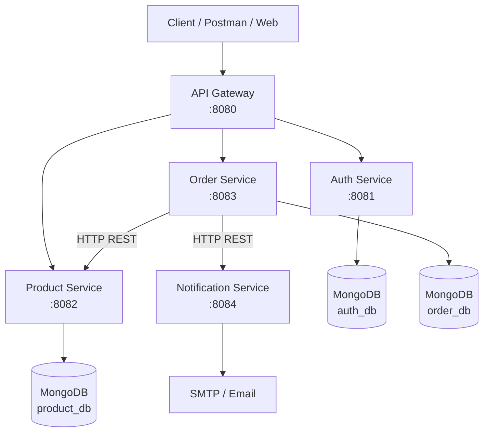

### 2.1. Mỗi khối làm gì? Vì sao phải có?

| Khối | Làm gì? | Vì sao cần? |
| ---- | ------- | ----------- |
| **Client** | Gọi API (Postman / web) | Người dùng / HV thử luồng nghiệp vụ |
| **API Gateway** | Một URL `:8080`; route path → đúng service; kiểm JWT (request bảo vệ); gắn Correlation Id | Client không nhớ 4 port; chỗ tập trung policy biên; service nội bộ bớt lộ ra ngoài |
| **Auth** | Đăng ký / đăng nhập; **phát hành JWT**; refresh / logout | Tách danh tính & mật khẩu khỏi Order/Product — không share bảng `users` |
| **Product** | Catalog: xem / CRUD sản phẩm | Catalog độc lập; Order **không** giữ master giá |
| **Order** | Tạo đơn, xem đơn; gọi Product lấy giá; gọi Notify gửi mail | Trái tim nghiệp vụ “đặt hàng”; chỗ thấy rõ gọi service khác bằng HTTP |
| **Notification** | Nhận lệnh “order success” → gửi email | Order không cần biết SMTP; tách side-effect thông báo |
| **auth_db / product_db / order_db** | Mỗi service một database | Database-per-service — đổi schema Product không đụng Order |
| **SMTP** | Gửi mail thật (lab có thể tắt và chỉ log) | Hoàn thiện trải nghiệm “đặt hàng xong có thư” |

### 2.2. Nguyên tắc vận hành (học thuộc)

1. Client **chỉ** gọi API Gateway — không gọi thẳng `:8081`–`:8084` khi làm đúng luồng.  
2. Service **không** đọc/ghi database của service khác.  
3. Cần dữ liệu bên kia → gọi **HTTP API**, không `SELECT` chui.  
4. Notification **không** public qua Gateway — chỉ Order gọi nội bộ.  
5. Phase 1 **không** Eureka / Kafka — URL cấu hình trong properties (đủ để học).

---

## 3. Phân tách hệ thống

### 3.1. Có bao nhiêu service?

**5 project Maven độc lập** (không bắt buộc multi-module parent):

```text
demo-bai2-ecommerce-ms/          (thứ tự ≈ triển khai code §4)
├── auth-service/          :8081
├── product-service/       :8082
├── api-gateway/           :8080
├── notification-service/  :8084
└── order-service/         :8083
```

| Service | Port | Có DB? |
| ------- | ---- | ------ |
| api-gateway | 8080 | Không |
| auth-service | 8081 | Có — `auth_db` |
| product-service | 8082 | Có — `product_db` |
| order-service | 8083 | Có — `order_db` |
| notification-service | 8084 | Không (chỉ SMTP) |

### 3.2. Dependency giữa các service

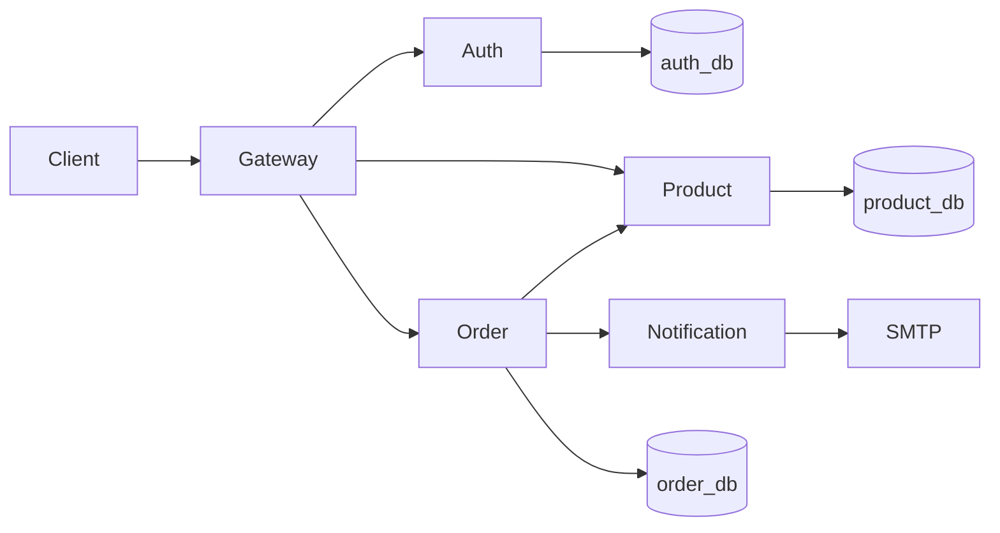

```text
api-gateway
 ├── auth-service      (route /api/auth/**)
 ├── product-service   (route /api/products/**)
 └── order-service     (route /api/orders/**)

order-service
 ├── product-service        (RestClient — lấy giá/tên)
 └── notification-service  (RestClient — báo đặt hàng thành công)
```

**Không được** tạo phụ thuộc ngược (tránh vòng / rối ownership):

```text
notification-service → order-service   ❌
product-service      → order-service   ❌
auth-service         → order-service   ❌
```

### 3.3. Database & collection

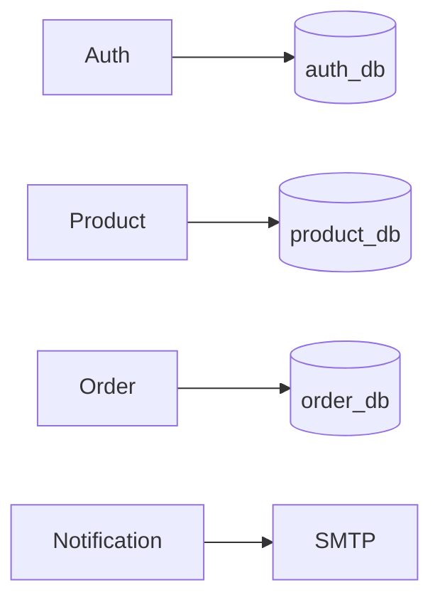

| Service | Database | Collection chính | Ghi chú |
| ------- | -------- | ---------------- | ------- |
| Auth | `auth_db` | `users`, `refresh_tokens` | Password BCrypt; không lưu access token |
| Product | `product_db` | `products`, `categories` | Master catalog & giá |
| Order | `order_db` | `orders` | `items` **embedded** trong order (snapshot) |
| Notify | — | — | Không Mongo Phase 1 |

> **Sai:** Order mở `product_db` đọc giá.  
> **Đúng:** Order gọi `GET /api/products/{id}` rồi lưu **snapshot** tên/giá vào đơn.

### 3.4. Cấu trúc package (convention Module 4)

> Giống [Bài 1](./1_java_m4_bai1_RESTful_API.md) / [Bài 4](./4_java_m4_bai4_Authentication_Authorization.md):  
> package gốc `vn.demo` · **Controller → Service → Repository** · DTO ở biên · không lộ document Mongo ra API.

**Nguyên tắc:** mỗi service là một app Spring Boot riêng; HV mở đúng folder là thấy đúng vai trò (auth / product / order…).

#### Bảng package dùng chung (service có Mongo)

| Package | Vai trò | Ví dụ class |
| ------- | ------- | ----------- |
| `controller/` | HTTP API | `AuthController`, `OrderController` |
| `service/` | Nghiệp vụ | `AuthService`, `OrderService` |
| `repository/` | Truy cập Mongo | `UserRepository`, `OrderRepository` |
| `document/` (hoặc `model/`) | Entity Mongo | `User`, `Order`, `Product` |
| `dto/request/` · `dto/response/` | Request/Response API | `LoginRequest`, `OrderResponse` |
| `config/` | Security, seeder, properties | `SecurityConfig`, `DataSeeder` |
| `exception/` | `@RestControllerAdvice` | `GlobalExceptionHandler` |
| `filter/` | Correlation Id (MDC) | `CorrelationIdFilter` |
| `security/` | Tin header Gateway (Order) | `GatewayUserFilter`, `GatewayUserPrincipal` |
| `client/` | **Chỉ Order** — gọi HTTP ra ngoài | `ProductClient`, `NotificationClient` |

#### Cây thư mục demo (rút gọn)

```text
demo-bai2-ecommerce-ms/
├── auth-service/src/main/java/vn/demo/          ← bước 1 (§5.1)
│   ├── AuthServiceApplication.java
│   ├── controller/AuthController.java
│   ├── service/AuthService.java · JwtService.java
│   ├── document/User.java · RefreshToken.java
│   ├── repository/
│   ├── dto/request/ · dto/response/
│   ├── config/SecurityConfig.java · DataSeeder.java
│   ├── filter/CorrelationIdFilter.java
│   └── exception/
│
├── product-service/src/main/java/vn/demo/       ← bước 2 (§5.2)
│   ├── ProductServiceApplication.java
│   ├── controller/ProductController.java
│   ├── service/ProductService.java
│   ├── document/Product.java · Category.java
│   ├── repository/ · dto/ · config/DataSeeder.java
│   ├── filter/ · exception/
│
├── api-gateway/src/main/java/vn/demo/           ← bước 3 (§5.3)
│   ├── ApiGatewayApplication.java
│   ├── filter/
│   │   ├── CorrelationIdGatewayFilter.java
│   │   └── JwtAuthGatewayFilter.java      ← verify JWT ở biên
│   └── service/JwtService.java            ← parse/verify token
│
├── notification-service/src/main/java/vn/demo/  ← bước 4 (§5.4)
│   ├── NotificationServiceApplication.java
│   ├── controller/NotificationController.java   ← /internal/...
│   ├── service/NotificationService.java · EmailService.java
│   ├── dto/ · filter/ · exception/
│   └── (không repository Mongo · không package config/)
│
└── order-service/src/main/java/vn/demo/         ← bước 5 (§5.5)
    ├── OrderServiceApplication.java
    ├── controller/OrderController.java
    ├── service/OrderService.java
    ├── client/                         ← ★ gọi service khác
    │   ├── ProductClient.java
    │   └── NotificationClient.java
    ├── document/Order.java · OrderItem.java
    ├── security/GatewayUserFilter.java   ← tin X-User-* từ Gateway
    ├── repository/ · dto/ · config/
    ├── filter/ · exception/
```

> **Xem code:** [`demo-bai2-ecommerce-ms`](../../demo-bai2-ecommerce-ms) — mỗi service một module Maven.  
> Thứ tự thư mục trên = **thứ tự triển khai (§4)**. Order có thêm `client/`; Gateway chỉ có `filter/` (+ `JwtService` verify).

#### Luồng class khi gọi nội bộ vs gọi service khác

```text
Trong một service (vd. Product):
  Controller → Service → Repository → Mongo

Order gọi Product / Notify:
  OrderController → OrderService → ProductClient / NotificationClient
                                      ↓ RestClient (HTTP)
                                 Product / Notification Service
```

### 3.5. Gọi qua service khác như thế nào?

| Từ → Đến | Cách | URL cấu hình (ví dụ) |
| -------- | ---- | -------------------- |
| Client → mọi API public | Qua Gateway `:8080` | — |
| Gateway → Auth/Product/Order | Forward HTTP theo path | `http://localhost:8081` … |
| Order → Product | `RestClient` sync | `app.services.product.url=http://localhost:8082` |
| Order → Notify | `RestClient` sync | `app.services.notification.url=http://localhost:8084` |

```text
Order Service
      │  RestClient
      ▼
Product Service ──► product_db
```

Không hard-code `localhost:8082` trong Java — để trong `application.properties`.

---

## 4. Thứ tự triển khai các service

> Phân biệt hai thứ tự: **code / dựng service** (học & làm lab) và **start process** (khi chạy E2E).

### 4.1. Tóm tắt mục đích từng service

| Service | Port | Mục đích (một câu) |
| ------- | ---- | ------------------ |
| **auth-service** | 8081 | Quản lý user + **phát hành JWT** (login / refresh) |
| **product-service** | 8082 | Catalog sản phẩm; cung cấp giá/tên để Order snapshot |
| **api-gateway** | 8080 | **Một cửa** client: route + verify JWT + Correlation Id |
| **notification-service** | 8084 | Nhận lệnh nội bộ → gửi email xác nhận đơn |
| **order-service** | 8083 | Tạo/xem đơn; gọi Product + Notify bằng HTTP |

### 4.2. Thứ tự code / dựng lab (làm trước → sau)

```text
1. Auth  →  2. Product  →  3. Gateway  →  4. Notify  →  5. Order  →  6. E2E
```

| Bước | Service | Vì sao làm lúc này? |
| ---- | ------- | ------------------- |
| 1 | **Auth** | Độc lập (chỉ Mongo `auth_db`). Có JWT sớm → mọi API bảo vệ sau này đều test được. Không phụ thuộc service khác. |
| 2 | **Product** | Độc lập (`product_db`). Catalog + `GET by id` sẵn sàng trước khi Order cần snapshot. |
| 3 | **Gateway** | Đã có đích Auth + Product để cấu hình route. Học sớm JWT ở **biên** (401 khi thiếu token) trước khi viết Order. |
| 4 | **Notify** | Nhỏ, không Mongo. Order sẽ gọi HTTP — nên có endpoint `/internal/...` (hoặc stub) trước khi hoàn thiện Create Order. |
| 5 | **Order** | **Phụ thuộc nhiều nhất:** tin `X-User-*` từ Gateway · `ProductClient` · `NotificationClient`. Làm sau cùng trong nhóm service. |
| 6 | **E2E** | Login → products → create order qua `:8080`; kiểm snapshot + mail/log + cùng Correlation Id. |

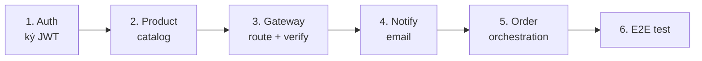

**Nguyên tắc:** dựng service **ít phụ thuộc trước**; service **gọi nhiều bên khác** (Order) làm sau.  
**Đọc tiếp:** chi tiết từng service theo đúng thứ tự này ở **§5.1 → §5.5**.

### 4.3. Thứ tự start process (khi chạy hệ thống)

Khác thứ tự code một chút — ưu tiên **dependency runtime**:

```text
MongoDB → Auth → Product → Notification → Order → Gateway
```

| Bước | Process | Lý do |
| ---- | ------- | ----- |
| 0 | **MongoDB** | Auth / Product / Order cần DB trước khi boot xong |
| 1 | **Auth** | Gateway route auth; login lấy token |
| 2 | **Product** | Order gọi Product khi tạo đơn |
| 3 | **Notification** | Order gọi Notify sau khi lưu đơn — nên `UP` trước Order |
| 4 | **Order** | Cần Product + Notify đã lắng nghe port |
| 5 | **Gateway** | Cuối cùng: client chỉ gọi `:8080` khi các service phía sau đã sẵn sàng |

> Gateway start sớm vẫn được (route fail → 502), nhưng lab nên start Gateway **sau** để giảm nhiễu khi debug.

Chi tiết lệnh: [README demo](../../demo-bai2-ecommerce-ms/README.md) · [API test](../../demo-bai2-ecommerce-ms/docs/api-test.md).

---

## 5. Chi tiết từng thành phần

> Trình bày **đúng thứ tự triển khai (§4)**: Auth → Product → Gateway → Notify → Order.
> Mỗi mục có **sơ đồ thứ tự file** (làm trước → sau). Ký hiệu: **Thêm** = tạo mới · **Sửa** = chỉnh file đã có.

### 5.1. Auth Service

#### Trách nhiệm

- Quản lý user (email, mật khẩu hash, role)  
- Register / Login / Logout / Refresh  
- **Phát hành** access token + refresh token  
- **Không** chứa logic đặt hàng hay catalog  

#### Vì sao tách Auth?

Order/Product không cần biết cách hash password; đổi cơ chế login không đụng Order.

#### Database

| Collection | Dùng để |
| ---------- | ------- |
| `users` | Tài khoản, roles (`ROLE_USER`, `ROLE_ADMIN`), status |
| `refresh_tokens` | Refresh dài hạn; revoke khi logout |

Không lưu access token trong Mongo. Password: **BCrypt**, không plain text.

#### API (qua Gateway: `/api/auth/...`)

| Method & path | Dùng để làm gì? |
| ------------- | ---------------- |
| `POST /api/auth/register` | Tạo tài khoản mới |
| `POST /api/auth/login` | Xác thực → trả access + refresh token |
| `POST /api/auth/refresh` | Đổi access token mới khi hết hạn ngắn |
| `POST /api/auth/logout` | Thu hồi refresh token |

#### Flow: Login

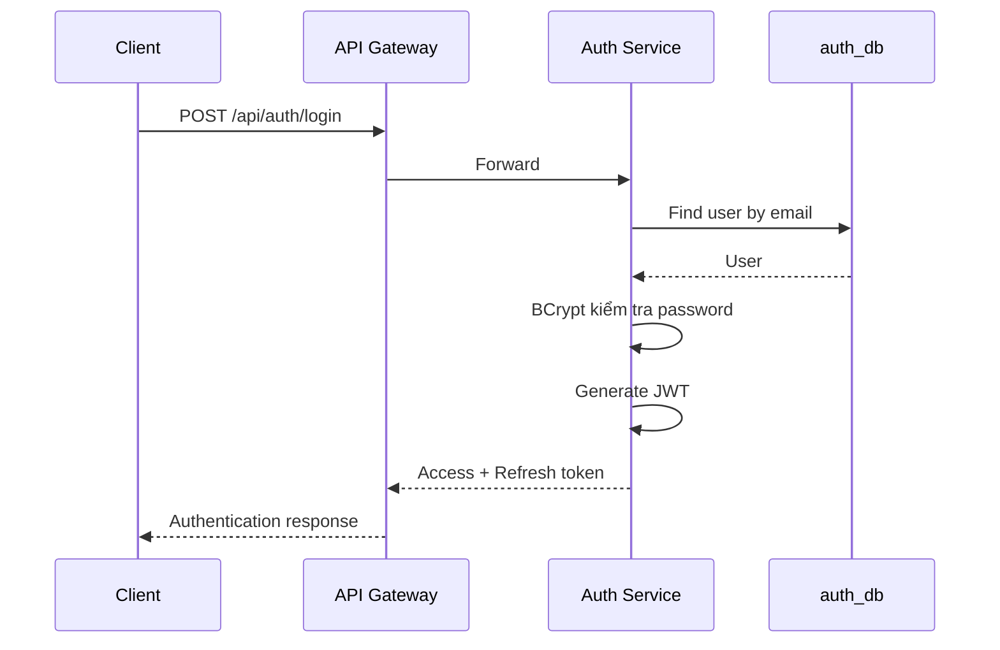

#### JWT (access) mang gì?

```json
{
  "sub": "user-001",
  "email": "user@example.com",
  "roles": ["ROLE_USER"],
  "iat": ...,
  "exp": ...
}
```

Lab: access ~15 phút · refresh ~7 ngày.

#### Thứ tự code — Auth Service

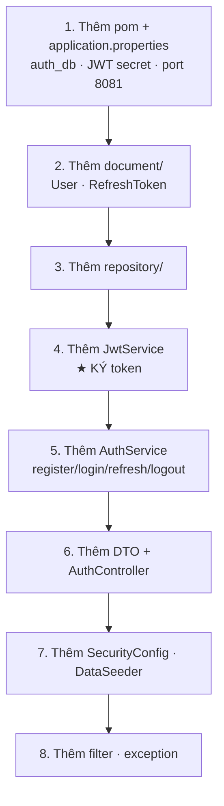

| Bước | Thêm / Sửa | File | Việc |
| ---- | ---------- | ---- | ---- |
| A1 | **Thêm** | `pom.xml`, `application.properties` | Web, Security, Mongo, jjwt; URI `auth_db`; `app.jwt.secret` |
| A2 | **Thêm** | `document/User.java`, `RefreshToken.java` | Entity Mongo |
| A3 | **Thêm** | `repository/` | Spring Data Mongo |
| A4 | **Thêm** | `service/JwtService.java` | **Ký** access token (claims: sub, email, roles, exp) |
| A5 | **Thêm** | `service/AuthService.java` | BCrypt, login, refresh, logout |
| A6 | **Thêm** | `dto/…`, `controller/AuthController.java` | API `/api/auth/**` |
| A7 | **Thêm** | `config/SecurityConfig.java`, `DataSeeder.java` | Public auth endpoints; seed user/admin |
| A8 | **Thêm** | `filter/CorrelationIdFilter.java`, `exception/` | Log `[cid=]` · lỗi thống nhất |

Seed demo: `user@example.com` / `user123` · `admin@example.com` / `admin123`.

**Kiểm nhanh:** `POST :8081/api/auth/login` → có `accessToken` (sau khi có Gateway thì gọi qua `:8080`).

---

### 5.2. Product Service

#### Trách nhiệm

- Quản lý category & product  
- Cho client **xem** catalog (public)  
- Cho **ADMIN** tạo / sửa / xóa sản phẩm  
- Cung cấp API `getById` để **Order** lấy giá/tên (snapshot)  

#### Vì sao tách Product?

Giá và catalog thay đổi độc lập đơn hàng; Order chỉ **chụp ảnh** giá tại lúc đặt.

#### Database

| Collection | Dùng để |
| ---------- | ------- |
| `categories` | Nhóm sản phẩm |
| `products` | Tên, mô tả, giá, `categoryId`, `status` (ACTIVE…) |

#### API (qua Gateway: `/api/products/...`)

| Method & path | Ai gọi? | Dùng để làm gì? |
| ------------- | ------- | ---------------- |
| `GET /api/products` | Mọi client | Liệt kê / tìm SP |
| `GET /api/products/{id}` | Client hoặc **Order** (RestClient) | Chi tiết một SP (có giá) |
| `POST /api/products` | ADMIN | Thêm SP |
| `PUT /api/products/{id}` | ADMIN | Cập nhật SP |
| `DELETE /api/products/{id}` | ADMIN | Xóa SP |

```text
GET  /api/products/**     → PUBLIC
POST/PUT/DELETE           → ROLE_ADMIN (Gateway kiểm)
```

#### Flow: Client xem danh sách SP

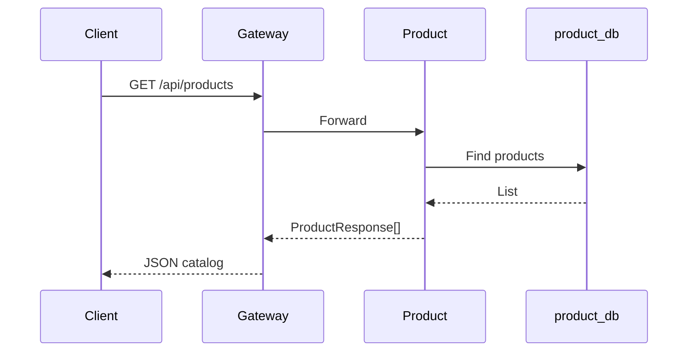

#### Thứ tự code — Product Service

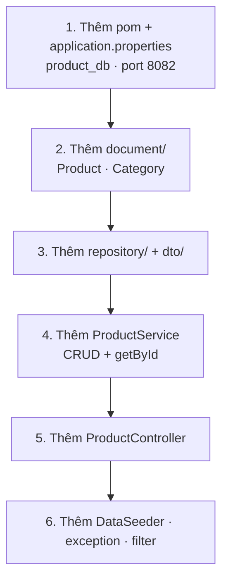

| Bước | Thêm / Sửa | File | Việc |
| ---- | ---------- | ---- | ---- |
| P1 | **Thêm** | `pom.xml`, `application.properties` | Web, Mongo; URI `product_db` |
| P2 | **Thêm** | `document/Product.java`, `Category.java` | Entity |
| P3 | **Thêm** | `repository/`, `dto/request/`, `dto/response/` | API không lộ document |
| P4 | **Thêm** | `service/ProductService.java` | CRUD; `getById` (Order sẽ gọi) |
| P5 | **Thêm** | `controller/ProductController.java` | `GET` public; ghi cần ADMIN (Gateway) |
| P6 | **Thêm** | `config/DataSeeder.java`, `exception/`, `filter/` | Seed vài SP; lỗi + correlation |

**Kiểm nhanh:** `GET :8082/api/products` và `GET …/api/products/{id}` trả giá — Order sẽ dựa vào đây.

---

### 5.3. API Gateway

#### Trách nhiệm

- Nhận mọi request từ client  
- **Route** theo path tới đúng service  
- **CORS** (lab)  
- **Verify JWT** với các API bảo vệ; gắn identity xuống dưới (`X-User-Id`, …)  
- **Sinh** **`X-Correlation-Id`** (không tin header client)  
- **Không** viết nghiệp vụ Order / Product / Email  

#### Vì sao tách Gateway?

Một cửa cho client; dễ thêm rate-limit / TLS sau này; service phía sau có thể nằm mạng nội bộ hơn.

#### Routing

| Path client | Forward tới | Mục đích |
| ----------- | ----------- | -------- |
| `/api/auth/**` | Auth `:8081` | Đăng ký / đăng nhập / refresh |
| `/api/products/**` | Product `:8082` | Catalog |
| `/api/orders/**` | Order `:8083` | Đặt hàng / xem đơn |

**Không** route `/api/notifications/**`.

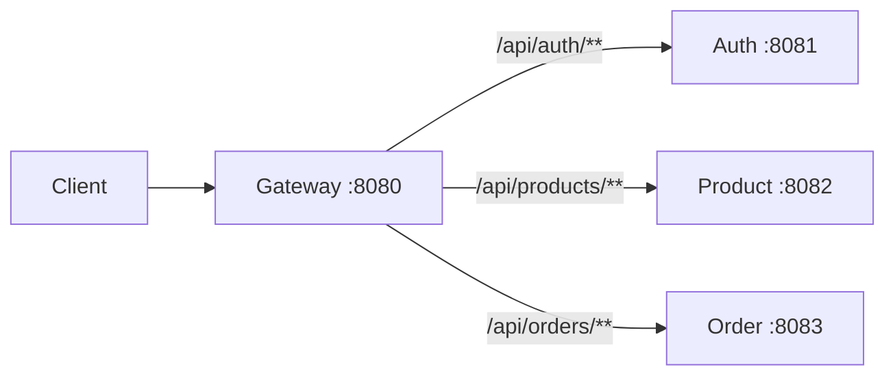

#### Flow: request có JWT (ví dụ lấy danh sách đơn)

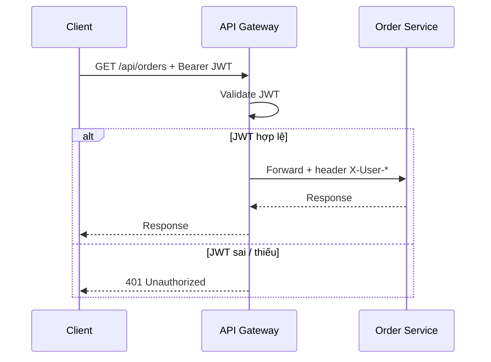

Gateway **không** gọi Auth mỗi lần chỉ để “hỏi user còn không” — tin chữ ký JWT (cùng secret với Auth).

#### Thứ tự code — API Gateway

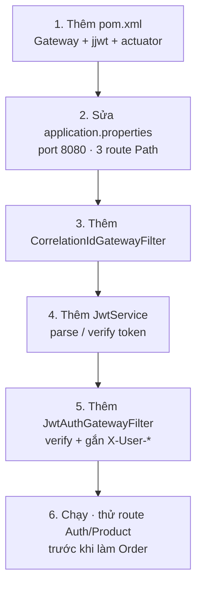

| Bước | Thêm / Sửa | File | Việc |
| ---- | ---------- | ---- | ---- |
| G1 | **Thêm** | `api-gateway/pom.xml` | Dependency Spring Cloud Gateway, jjwt, actuator |
| G2 | **Sửa** | `application.properties` | `server.port=8080` · route `/api/auth/**`, `/api/products/**`, `/api/orders/**` |
| G3 | **Thêm** | `filter/CorrelationIdGatewayFilter.java` | Luôn sinh `X-Correlation-Id` (gỡ header client) |
| G4 | **Thêm** | `service/JwtService.java` | Verify chữ ký JWT (cùng secret Auth) |
| G5 | **Thêm** | `filter/JwtAuthGatewayFilter.java` | Bảo vệ path cần JWT; gắn `X-User-*`; gỡ `Authorization` khi forward |
| G6 | Kiểm | Postman / curl | Login qua `:8080` → token; GET products; GET orders không token → 401 |

> Nên code Gateway **sau Auth + Product** (đã có đích route), **trước Order** (để test JWT biên sớm).

---

### 5.4. Notification Service

#### Trách nhiệm

- Nhận request nội bộ “đặt hàng thành công”  
- Soạn nội dung email  
- Gửi qua SMTP (hoặc **skip** nếu lab tắt mail)  
- **Không** lưu lịch sử Mongo Phase 1 · **không** Kafka  

#### Vì sao tách Notify?

Order không cần dependency SMTP; sau này dễ chuyển sang queue mà không phình Order.

#### API (internal — không qua Gateway)

| Method & path | Ai gọi? | Dùng để làm gì? |
| ------------- | ------- | ---------------- |
| `POST /internal/notifications/order-success` | **Chỉ Order** | Kích hoạt gửi email xác nhận đơn |

Ví dụ body:

```json
{
  "orderId": "order-001",
  "email": "user@example.com",
  "customerName": "Nguyen Van A",
  "totalAmount": 59980000
}
```

#### Flow: Gửi email

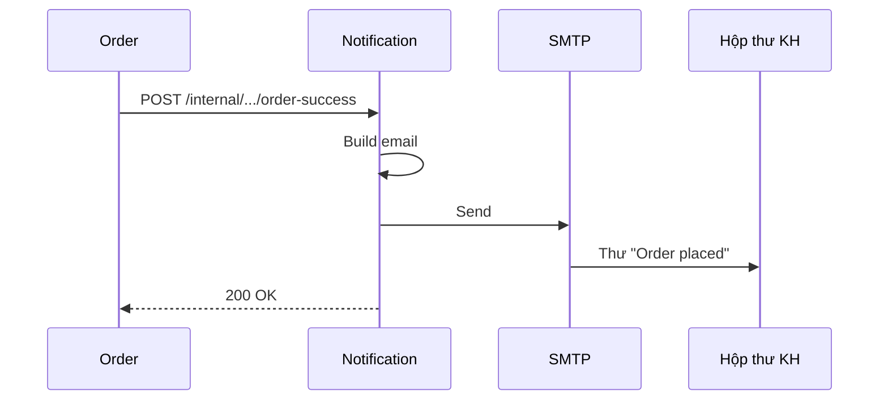

#### Lưu ý giảng (rất quan trọng)

Phase 1 gọi Notify bằng **HTTP sync** cho dễ hiểu:

```text
Order ──HTTP──► Notification ──► SMTP
```

```text
Nếu Notification tắt:
  Đơn có thể đã lưu thành công
  nhưng email không gửi được
```

→ Không có distributed transaction. Đây là cầu nối sang Phase 2 (Kafka / Outbox / retry).

#### Thứ tự code — Notification Service

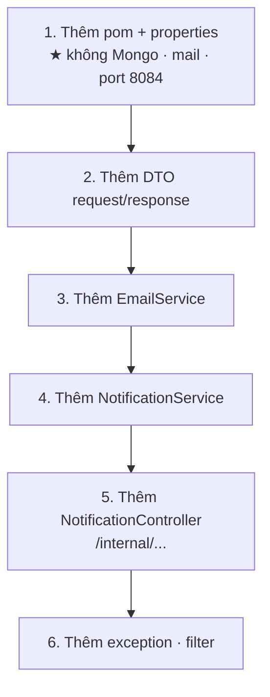

| Bước | Thêm / Sửa | File | Việc |
| ---- | ---------- | ---- | ---- |
| N1 | **Thêm** | `pom.xml`, `application.properties` | Web, Mail; **không** mongodb; `app.mail.enabled=false` (lab) |
| N2 | **Thêm** | `dto/request/…`, `dto/response/…` | Body order-success |
| N3 | **Thêm** | `service/EmailService.java` | Gửi SMTP hoặc log skip |
| N4 | **Thêm** | `service/NotificationService.java` | Build nội dung thư |
| N5 | **Thêm** | `controller/NotificationController.java` | `POST /internal/notifications/order-success` |
| N6 | **Thêm** | `exception/`, `filter/` | Lỗi + correlation |

**Kiểm nhanh:** gọi thẳng `:8084` từ Order (hoặc curl nội bộ) — **không** thêm route Gateway.

---
### 5.5. Order Service

#### Trách nhiệm

- Tạo đơn hàng từ giỏ tối giản (`productId` + `quantity`)  
- Lấy identity từ Gateway (`X-User-*`) — **không** tin `userId` client gửi  
- Gọi Product → **snapshot** tên/giá → tính tổng → lưu `order_db`  
- Gọi Notification sau khi lưu thành công  
- Cho user xem “đơn của tôi” / chi tiết đơn  

#### Vì sao tách Order?

Đơn là nghiệp vụ riêng (trạng thái, lịch sử giá lúc mua); không nhét vào Auth hay Product.

#### Database

| Collection | Dùng để |
| ---------- | ------- |
| `orders` | Đơn + mảng `items` embedded (snapshot) |

Status Phase 1: `PENDING` → `CONFIRMED` khi tạo thành công (có thể có `CANCELLED` mở rộng).

#### API (qua Gateway: `/api/orders/...` — cần JWT)

| Method & path | Dùng để làm gì? |
| ------------- | ---------------- |
| `POST /api/orders` | Đặt hàng mới → **201** |
| `GET /api/orders` | Danh sách đơn của user đang login |
| `GET /api/orders/{id}` | Chi tiết một đơn (chỉ đơn của chính mình) |

**Body tạo đơn (client chỉ được gửi):**

```json
{
  "items": [
    { "productId": "…", "quantity": 2 }
  ]
}
```

Không gửi `userId` / `price` / `totalAmount` từ client.

#### Flow: Create Order (luồng quan trọng nhất Phase 1)

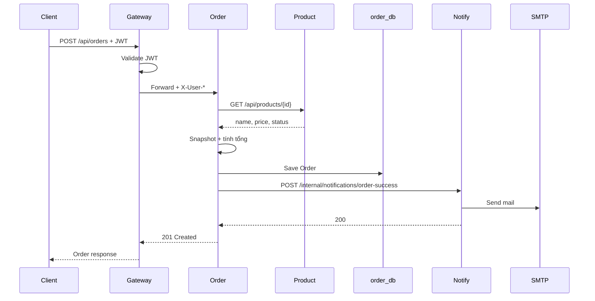

#### Product Snapshot — rule nghiệp vụ

```text
Client chỉ biết: productId + quantity
Order hỏi Product: productName + price
Order lưu vào đơn: snapshot (giá lúc mua)
```

```text
❌ Order đọc product_db
✅ Order → HTTP → Product Service → product_db
```

#### Gọi service khác (trong code)

| Client class | Gọi | Việc |
| ------------ | --- | ---- |
| `ProductClient` | `GET /api/products/{id}` | Lấy thông tin để snapshot |
| `NotificationClient` | `POST /internal/notifications/order-success` | Báo gửi email |

#### Thứ tự code — Order Service

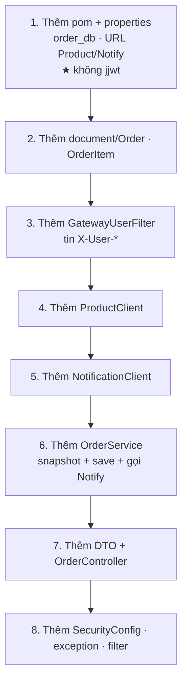

| Bước | Thêm / Sửa | File | Việc |
| ---- | ---------- | ---- | ---- |
| O1 | **Thêm** | `pom.xml`, `application.properties` | Web, Security, Mongo, **không** jjwt; `app.services.product.url` · `notification.url` |
| O2 | **Thêm** | `document/Order.java`, `OrderItem.java`, `repository/` | Items embedded snapshot |
| O3 | **Thêm** | `security/GatewayUserFilter.java`, `GatewayUserPrincipal.java` | Đọc `X-User-*` từ Gateway |
| O4 | **Thêm** | `client/ProductClient.java` | `RestClient` → GET product |
| O5 | **Thêm** | `client/NotificationClient.java` | `RestClient` → Notify internal |
| O6 | **Thêm** | `service/OrderService.java` | Validate · snapshot · save · gọi Notify |
| O7 | **Thêm** | `dto/…`, `controller/OrderController.java` | `POST/GET /api/orders` |
| O8 | **Thêm** | `config/SecurityConfig.java`, `exception/`, `filter/` | Trust Gateway identity; correlation |

> Code Order **sau** Product (và nên có Notify stub hoặc service thật). Test Create Order qua Gateway `:8080` + Bearer token.

---

## 6. API nhìn từ phía Client (tóm tắt)

Mọi URL dưới đây gọi qua **`http://localhost:8080`**.

### 6.1. Auth

| API | Việc |
| --- | ---- |
| `POST /api/auth/register` | Đăng ký |
| `POST /api/auth/login` | Đăng nhập lấy JWT |
| `POST /api/auth/refresh` | Gia hạn access token |
| `POST /api/auth/logout` | Đăng xuất (revoke refresh) |

### 6.2. Product

| API | Việc |
| --- | ---- |
| `GET /api/products` | Xem catalog |
| `GET /api/products/{id}` | Chi tiết SP |
| `POST/PUT/DELETE /api/products...` | ADMIN quản lý catalog |

### 6.3. Order

| API | Việc |
| --- | ---- |
| `POST /api/orders` | Đặt hàng (Bearer bắt buộc) |
| `GET /api/orders` | Đơn của tôi |
| `GET /api/orders/{id}` | Chi tiết đơn |

### 6.4. Internal (không gọi từ Postman qua Gateway)

| API | Việc |
| --- | ---- |
| `POST /internal/notifications/order-success` | Order → Notify |

---

## 7. Domain đơn giản

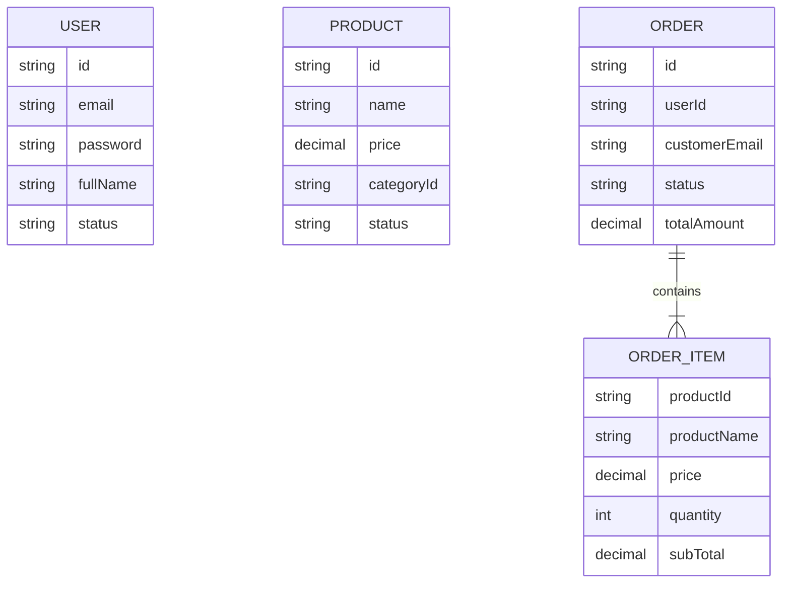

`ORDER_ITEM` nằm **trong** document Order (embedded) — không collection riêng Phase 1.

---

## 8. Quan sát hệ thống khi chạy

> Ôn nhanh khi lab — lý thuyết đầy đủ ở **Phần 1 · §4**.

### 8.1. Correlation Id

Một request xuyên Gateway → Order → Product/Notify cần **một id chung** trên log:

```text
Header: X-Correlation-Id
Log:    [cid=...]
```

Gateway **luôn sinh** UUID (không tin client); Order forward khi gọi RestClient. Client đọc id trên **response**.

### 8.2. Health

```text
GET http://localhost:8080/actuator/health
GET http://localhost:8081/actuator/health
… 8082 · 8083 · 8084
```

Trước khi debug “đặt hàng lỗi”, hỏi: Product / Notify còn `UP` không?

### 8.3. Validation & lỗi (ý)

- DTO + `@Valid` — không tin dữ liệu client  
- `@RestControllerAdvice` — response lỗi thống nhất  
- `401` JWT · `403` không đủ role · `404` không tìm thấy · `201` tạo đơn thành công  

---

## 9. Thứ tự học / làm lab gợi ý

| Bước | Tập trung | Kiểm tra nhanh |
| ---- | --------- | -------------- |
| 0 | Đọc **Phần 1** (§1–§5) | Nêu được MS / sync / Gateway / cid · biết Phase 1 vs 2 |
| 1 | Hiểu sơ đồ Phần 2 §2–§3 + **§4** thứ tự triển khai | Nêu được từng khối · vì sao Auth trước, Order sau |
| 2 | **Code Auth** (§5.1 · A1–A8) | Login có `accessToken` |
| 3 | **Code Product** (§5.2 · P1–P6) | GET list + getById có giá |
| 4 | **Code Gateway** (§5.3 · G1–G6) | Route + JWT; orders không token → 401 |
| 5 | **Code Notify** (§5.4 · N1–N6) rồi **Order** (§5.5 · O1–O8) | Create order 201; snapshot trong DB |
| 6 | E2E qua `:8080` | Login → products → order · cùng `cid` trên log |

---

## 10. Checklist học viên

- [ ] Giải thích MS vs monolith + khi nào chưa nên tách  
- [ ] Phân biệt sync / async + ví dụ Order→Product / Notify  
- [ ] Gateway (biên) vs Filter (trong process)  
- [ ] Vẽ lại kiến trúc và giải thích từng khối  
- [ ] Nêu dependency: Gateway→? Order→?  
- [ ] Nêu DB/collection từng service  
- [ ] Giải thích **thứ tự triển khai** (§4): code vs start process  
- [ ] Phân biệt API public (Gateway) vs internal (Notify)  
- [ ] Giải thích snapshot: vì sao không tin giá từ client  
- [ ] Giải thích JWT: ai **ký**, ai **verify**, Order lấy identity thế nào  
- [ ] Theo thứ tự file khi code từng service (bảng Thêm/Sửa)  
- [ ] Chạy E2E login → products → order 201  
- [ ] Cùng `X-Correlation-Id` trên ≥ 2 log · biết Health  
- [ ] Biết hạn chế: Notify down ≠ rollback đơn  

---

## 11. Sau Phase 1

Xem lại bảng **Roadmap (Phần 1 · §5)**. Tóm tắt tiếp:

```text
Phase 2  →  Kafka · event · Outbox (gỡ phụ thuộc HTTP sync Notify)
Phase 3  →  Inventory · Payment · Saga
Phase 4  →  Redis · Search · Observability sâu
Phase 5  →  Docker · Kubernetes · deploy gần production
```

Lab khóa này **dừng ở Phase 1** — đủ để vững nền trước khi thêm độ phức tạp.

---

## Phụ lục — Liên kết

| Tài liệu | Nội dung |
| -------- | -------- |
| [`demo-bai2-ecommerce-ms`](../../demo-bai2-ecommerce-ms) | Code lab Phase 1 |
| [Bài 4 Auth](./4_java_m4_bai4_Authentication_Authorization.md) | JWT / Security nền |
| [Bài 1 REST](./1_java_m4_bai1_RESTful_API.md) | REST / DTO / validation |
| [PL2 Email](./3_java_m4_phuluc2_Email.md) | Cấu hình SMTP |
