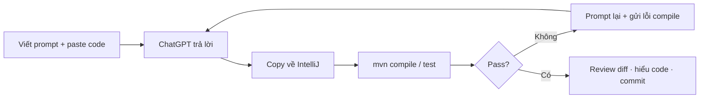

# Bài 5: AI — Prompt Engineering cho lập trình viên Java

> File: `5_java_m4_bai5_AI_Prompt_Engineering.md`  
> PDF gốc (tham khảo lịch sử): [`java_m4_bai5_AI_Prompt_Engineering.pdf`](../pdf/java_m4_bai5_AI_Prompt_Engineering.pdf)

> **Công cụ bắt buộc:** **ChatGPT (free)** hoặc chatbot miễn phí tương đương ([Gemini](https://gemini.google.com), [Claude.ai](https://claude.ai) free tier).  
> **Không bắt buộc** mua license Cursor / Copilot — workflow bài này: **prompt → copy output → paste vào IntelliJ → compile / test**.

---

## Mục tiêu bài học

Sau bài này, học viên có thể:

- Giải thích **Prompt** và **Prompt Engineering**; phân biệt các loại prompt (Instruction, Role-based, Few-shot, Zero-shot, Chain-of-Thought…)
- Viết prompt theo công thức **`[Nhiệm vụ] + Bối cảnh + [Định dạng/ràng buộc]`** — áp dụng được trên **ChatGPT free**
- **Đánh giá và cải tiến** prompt mơ hồ; nhận biết lỗi thường gặp (ảo giác, thiếu context, thiên vị…)
- Dùng AI như **pair programmer**: mở rộng code đã có, annotate Swagger, phân tích bug, gợi ý test — **không** thay thế kiến thức M3/M4
- Làm lab trên **Mini Project M3 Bài 10** (hoặc project đang làm): lập chuỗi prompt thực tế, verify output bằng `./mvnw test`
- Tuân thủ **quy tắc an toàn**: không paste secret; luôn review diff trước khi merge

> **Không nằm trong phạm vi:** Fine-tuning LLM; RAG/vector DB chi tiết; Graph-of-Thought (GoT); tích hợp OpenAI API vào Spring Boot; thay thế hoàn toàn Unit Test / Code Review của team.

---

## Điều kiện tiên quyết

- Đã làm (hoặc đang làm) **[Mini Project M3 Bài 10](../../../t3h-ltv-java-module-3/syllabus/module-3/java_m3_bai10_Mini_Project.md)** — biết cấu trúc `MovieModel`, Security, dashboard admin
- Ôn nhanh nếu cần:
  - [M3 Bài 3](../../../t3h-ltv-java-module-3/syllabus/module-3/java_m3_bai3_MongoDB_Spring_1.md) — Model, Repository, Service, REST
  - [M3 Bài 8](../../../t3h-ltv-java-module-3/syllabus/module-3/java_m3_bai8_Unit_Testing.md) — JUnit, Mockito, `@ParameterizedTest`
  - [M4 Bài 1 §5](./1_java_m4_bai1_RESTful_API.md) — springdoc / Swagger UI *(chỉ annotate, không học lại từ đầu)*
- Tài khoản **ChatGPT free** (hoặc Gemini / Claude free) + trình duyệt
- IntelliJ IDEA (hoặc VS Code) + JDK 17 + Maven — **copy code AI về project và chạy test**

```text
# Không thêm dependency Maven cho bài này.
# AI là công cụ ngoài IDE — không "cài" vào pom.xml.
```

### Thời lượng gợi ý

| Phần | Thời gian |
|------|-----------|
| §0 Bridge M3/M4 + công cụ free | ~10 phút |
| §1–2 Nền tảng Prompt Engineering | ~25 phút |
| §3 Cấu trúc + cải tiến prompt | ~20 phút |
| §4 Prompt nâng cao (rút gọn) | ~15 phút |
| §5 Lỗi phổ biến + quy tắc an toàn | ~10 phút |
| §6 Workflow + 3 ví dụ Java | ~35 phút |
| §7 Lab Mini Project + checklist | ~40 phút |

> **Thứ tự giảng gợi ý:** §0 → §1–3 (lý thuyết + thảo luận cải tiến prompt) → §5 quy tắc an toàn **trước khi** §6 ví dụ Java → §7 lab cá nhân/nhóm.

---

## Nội dung (làm theo thứ tự)

| # | Chủ đề | Việc HV làm | Kết quả kiểm tra |
|---|--------|-------------|------------------|
| 0 | Bridge M3/M4 + công cụ | Đọc bảng; mở ChatGPT free | Biết phần nào **ôn link**, không dạy lại |
| 1 | Prompt là gì? | Thảo luận | Nói được vai trò prompt với AI |
| 2 | Các loại prompt | Phân loại ví dụ | Nhận diện Instruction / Role / CoT / Few-shot |
| 3 | Cấu trúc + cải tiến | Sửa 3 prompt mơ hồ | Prompt mới có đủ nhiệm vụ + context + format |
| 4 | Prompt nâng cao | Đọc + thảo luận 1 ví dụ | Hiểu CoT, Self-ask, Step-back *(không bắt buộc ToT)* |
| 5 | Lỗi + an toàn | Đọc checklist | Không paste secret; biết ảo giác |
| 6 | 3 ví dụ Java trên ChatGPT | Làm lần lượt §6.1–6.3 | Copy về IDE; compile / test pass |
| 7 | Lab chuỗi prompt | 5 prompt trên Mini Project | Nộp prompt + screenshot + kết quả test |
| Phụ lục | Template prompt · liên kết | Copy template | Tái sử dụng sau khóa học |

---

## 0. Bridge Module 3/4 — hôm nay không giảng lại

| Kiến thức kỹ thuật | Đã học ở | Bài 5 làm gì |
|--------------------|----------|--------------|
| `MovieModel`, `@Document`, Lombok | [M3 Bài 3 §4](../../../t3h-ltv-java-module-3/syllabus/module-3/java_m3_bai3_MongoDB_Spring_1.md) | Prompt **mở rộng** model — không sinh CRUD từ zero |
| App phim, `mymoviedb`, Thymeleaf | [M3 Bài 7](../../../t3h-ltv-java-module-3/syllabus/module-3/java_m3_bai7_Database_Query_To_FrontEnd.md) | Context khi prompt liên quan UI public |
| Aggregation dashboard D1–D6 | [M3 Bài 6](../../../t3h-ltv-java-module-3/syllabus/module-3/java_m3_bai6_Query_Optimization.md) · [M3 Bài 10 §5](../../../t3h-ltv-java-module-3/syllabus/module-3/java_m3_bai10_Mini_Project.md) | Prompt viết / review pipeline |
| Unit test, Mockito, `@ParameterizedTest` | [M3 Bài 8 §4–6](../../../t3h-ltv-java-module-3/syllabus/module-3/java_m3_bai8_Unit_Testing.md) | Prompt sinh test **theo pattern đã học** |
| Spring Security, BCrypt, form login | [M3 Bài 10 §4](../../../t3h-ltv-java-module-3/syllabus/module-3/java_m3_bai10_Mini_Project.md) | Prompt **review** `SecurityConfig` — không generate auth từ đầu |
| springdoc, `@Operation`, Swagger UI | [M4 Bài 1 §5](./1_java_m4_bai1_RESTful_API.md) | Prompt **annotate** endpoint — link ôn tập |
| JWT + Permission | [M4 Bài 4](./4_java_m4_bai4_Authentication_Authorization.md) | Chỉ nhắc nếu HV mở rộng sang REST API có token |
| Docker deploy | [M4 Bài 7](./6_java_m4_bai7_Docker.md) | Prompt review `Dockerfile` / Compose *(tuỳ chọn)* |

**Hôm nay học mới:** kỹ năng viết prompt; workflow AI-assisted trên ChatGPT free; verify output; lab chuỗi prompt trên project thật.

---

## 0.1. Công cụ — ChatGPT free (không cần license trả phí)

| Công cụ | Chi phí | Phù hợp bài này |
|---------|---------|-----------------|
| [ChatGPT](https://chat.openai.com) | **Free tier** | ✅ Chính — copy/paste code |
| [Google Gemini](https://gemini.google.com) | Free | ✅ Thay thế khi hết quota ChatGPT |
| [Claude.ai](https://claude.ai) | Free tier | ✅ Thay thế |
| GitHub Copilot | Free cho sinh viên (.edu) | Tuỳ chọn — cần xác minh |
| Cursor / Copilot trả phí | Trả phí | **Không bắt buộc** — chỉ nhanh hơn vì đọc file trong IDE |

**Workflow chuẩn (mọi HV):**



> **Lưu ý free tier:** có giới hạn số tin nhắn / model — chia nhỏ prompt; paste **đúng file** cần sửa, không dump cả project.

---

## 1. Prompt và Prompt Engineering

**Prompt** là thông tin đầu vào bạn gửi cho mô hình AI (ChatGPT, Gemini…). Ví dụ:

- Một câu hỏi: *"Thủ đô của Pháp tên gì?"*
- Một mệnh lệnh: *"Viết khổ thơ lục bát 4 dòng về mùa thu"*
- Một hướng dẫn có ngữ cảnh: *"Bạn là giáo viên sinh học cấp 2. Giải thích quang hợp cho học sinh 12 tuổi"*

**Prompt Engineering** là kỹ năng thiết kế prompt **rõ ràng, có context, có ràng buộc đầu ra** để AI trả lời hữu ích hơn — thường cần **lặp** (iterative refinement), vì lần đầu AI có thể chưa đúng.

| Đặc điểm prompt tốt | Ý nghĩa |
|---------------------|---------|
| Yêu cầu rõ ràng | AI biết **làm gì**, không đoán |
| Ngữ cảnh / vai trò | Stack, đối tượng đọc, file đang sửa |
| Định dạng đầu ra | JSON, bullet, chỉ code, tiếng Việt… |
| Ràng buộc kỹ thuật | Java 17, Spring Boot 3, không đổi package |

---

## 2. Các loại prompt

| Phân loại | Định nghĩa | Ví dụ (dev Java) |
|-----------|------------|------------------|
| **Instruction** | Nói AI cần làm gì | *"Tóm tắt class `MovieService` thành 5 bullet"* |
| **Informational** | Hỏi kiến thức | *"Khác nhau `@Controller` và `@RestController`?"* |
| **Conversational** | Hội thoại qua lại | *"Giải thích đoạn này" → *"Vậy sửa thế nào?"* |
| **Role-based** | Gán vai trò | *"Bạn là senior Java, review SecurityConfig sau"* |
| **Few-shot** | Cho vài ví dụ mẫu | *"Comment PR mẫu 1… mẫu 2… Review diff sau"* |
| **Zero-shot** | Không ví dụ | *"Phân loại log này: bug hay config?"* |
| **Chain-of-Thought (CoT)** | Yêu cầu suy luận từng bước | *"Tìm lỗi off-by-one **theo từng bước**, rồi mới sửa"* |

> Trong lab Java, **Role-based + Instruction + ràng buộc format** là combo dùng nhiều nhất.

---

## 3. Cấu trúc cơ bản và cải tiến prompt

### 3.1. Công thức

```text
[Nhiệm vụ / hướng dẫn] + [Bối cảnh] + [Định dạng / ràng buộc]
```

**Ví dụ (sinh học — minh hoạ công thức):**

> *"Bạn là giáo viên cấp 2. Hãy giải thích quang hợp cho trẻ 10 tuổi bằng **3 gạch đầu dòng**, từ ngữ đơn giản."*

| Thành phần | Trong ví dụ |
|------------|-------------|
| Nhiệm vụ | Giải thích quang hợp |
| Bối cảnh | GV cấp 2, học sinh 10 tuổi |
| Định dạng | 3 bullet, từ đơn giản |

**Ví dụ (Java — dùng trong lab):**

```text
Bạn là senior Java developer (Spring Boot 3, Java 17, MongoDB).

Bối cảnh: Mini Project Movie Portal — file MovieModel.java (dán bên dưới).
Đã học @Document + Lombok ở Module 3 Bài 3.

Nhiệm vụ: Thêm field dateAddedAt (LocalDate) và durationMinutes (Integer).
Giữ nguyên convention hiện tại (@Document collection "mymoviedb").

Đầu ra: CHỈ trả file Java hoàn chỉnh, không giải thích dài.

[Dán code MovieModel.java]
```

### 3.2. Tiêu chí đánh giá prompt

| Tiêu chí | Prompt yếu | Prompt tốt hơn |
|----------|------------|----------------|
| Rõ ràng | *"Miêu tả con chó"* | *"Miêu tả 10 câu chó Phú Quốc 3 tuổi, tập trung ngoại hình"* |
| Ràng buộc | *"Tóm tắt bài viết"* | *"Tóm tắt 5 bullet, mỗi bullet ≤ 12 từ"* |
| Đủ context | *"Giải thích Java"* | *"Giải thích Java cho SV năm nhất, so với Python 1 đoạn"* |
| Khách quan | *"Tại sao Java tốt nhất?"* | *"So sánh điểm mạnh/yếu Java vs PHP cho web"* |

### 3.3. Thực hành nhanh — cải tiến prompt (thảo luận nhóm)

HV cải tiến các prompt sau (giáo viên chốt 1–2 mẫu tốt):

| Prompt gốc (mơ hồ) | Hướng cải tiến |
|---------------------|----------------|
| *"Kể về Thế chiến II"* | Thêm độ dài, góc nhìn, đối tượng đọc |
| *"Viết email cho sếp"* | Loại email, lý do, 4 đoạn, giọng điệu |
| *"Giải thích trọng lực"* | Độ tuổi, ví dụ đời sống, độ dài |
| *"Máy tính không khởi động"* | OS, triệu chứng, đã thử gì, muốn checklist |
| *"Đầu tư cổ phiếu nào?"* | Mức rủi ro, horizon, **disclaimer không phải tư vấn tài chính** |

---

## 4. Prompt nâng cao (rút gọn — đọc hiểu)

> PDF gốc có thêm ToT, Multi-role, Self-consistency… Bài lab **không bắt buộc** implement — chỉ cần **hiểu ý tưởng** và biết khi nào hữu ích.

| Kỹ thuật | Ý tưởng | Ví dụ dev |
|----------|---------|-----------|
| **Chain-of-Thought** | Bắt AI suy luận từng bước trước khi kết luận | Debug: *"Liệt kê từng dòng loop, chỉ ra index sai, rồi mới sửa"* |
| **Self-ask** | Chia câu hỏi lớn thành câu phụ | *"Trước khi thêm metric D3 dashboard, liệt kê field MongoDB cần có"* |
| **Step-back** | Hỏi tổng quát trước, thu hẹp sau | *"Liệt kê yếu tố tối ưu query Mongo" → *"Áp dụng cho aggregation D2 trong Bài 10"* |
| **Multi-role** | AI đóng nhiều vai | *"Vai reviewer: chỉ ra lỗi SecurityConfig. Vai HV: hỏi lại nếu chưa hiểu"* |

**Lưu ý Self-consistency:** AI **không tự “bỏ phiếu” nội bộ**. Muốn độ tin cậy cao hơn: gọi **2–3 lần** prompt tương tự hoặc tự so sánh câu trả lời — vẫn **phải test trên máy**.

---

## 5. Lỗi phổ biến và quy tắc an toàn

### 5.1. Bảng lỗi prompt

| Loại lỗi | Ví dụ | Cách khắc phục |
|----------|-------|----------------|
| Mơ hồ | *"Giải thích về AI"* | Thêm vai trò, đối tượng, phạm vi |
| Quá phức tạp | *"Vừa hài vừa nghiêm túc vừa ngắn vừa đủ chi tiết"* | Tách yêu cầu; ưu tiên 1 mục tiêu chính |
| **Ảo giác (hallucination)** | AI bịa API / dependency không tồn tại | Verify compile; hỏi nguồn; đối chiếu doc Spring |
| Thiên vị | Mặc định CEO = nam | Yêu cầu ngôn ngữ trung lập, inclusive |
| Thiếu bối cảnh | *"Viết tóm tắt"* | Nói file, class, mục đích |
| Thiếu format | *"Cho 5 tên nước châu Âu"* | *"Trả JSON array, key `name`"* |
| Prompt quá dài | Dump cả project 50 file | Paste **file liên quan** + mô tả package |
| Quá nhiều few-shot | 10 ví dụ dài | 1–2 ví dụ đủ; phần còn lại là ràng buộc |

### 5.2. Quy tắc bắt buộc khi dùng AI trong khóa học

| ✅ Làm | ❌ Không làm |
|--------|-------------|
| Ghi rõ **Java 17, Spring Boot 3.x, package `vn.demo`** | Paste `application.properties` có password Mongo / PayPal / JWT |
| Paste **file đang sửa** + mô tả thay đổi | Gửi secret API key, token production |
| Sau output: **`./mvnw compile test`** | Commit code chưa đọc, đặc biệt Security / Payment |
| Prompt bằng **tiếng Việt** (thuật ngữ kỹ thuật giữ nguyên) | Tin 100% output không chạy thử |
| Link ôn [M3/M4](#0-bridge-module-34--hôm-nay-không-giảng-lại) khi AI sinh kiến thức đã học | Nhờ AI làm hộ **cả bài thi / đồ án** không hiểu |

---

## 6. Ba ví dụ Java trên ChatGPT free

> **Quy trình mỗi ví dụ:** copy prompt → ChatGPT → copy code về project → compile → test.  
> Project gợi ý: [`demo-bai10-mini-project`](../../../t3h-ltv-java-module-3/demo-bai10-mini-project) hoặc bản copy của HV.

### 6.1. Ví dụ 1 — Mở rộng `MovieModel` (không sinh CRUD từ đầu)

**Sai lầm thường gặp (PDF gốc):** prompt *"Generate model Movie id, name, genre, country"* → AI sinh getter/setter thủ công, thiếu `@Document`, không dùng Lombok.

**Prompt cải tiến (copy dùng ngay):**

```text
Bạn là senior Java developer — Spring Boot 3, Java 17, Spring Data MongoDB, Lombok.

Bối cảnh:
- Project: Mini Project Movie Portal (Module 3 Bài 10)
- Collection MongoDB: "mymoviedb"
- File hiện tại MovieModel.java (dán bên dưới)
- Đã học @Document, @Id, @Field — xem lại: Module 3 Bài 3

Nhiệm vụ:
- Thêm field dateAddedAt (java.time.LocalDate) và durationMinutes (Integer)
- Giữ nguyên annotation và style Lombok hiện có
- KHÔNG thêm getter/setter thủ công nếu đã có @Data

Đầu ra: CHỈ file MovieModel.java hoàn chỉnh.

[Dán code MovieModel.java]
```

**Verify:** compile OK; field mới xuất hiện trong class; không duplicate boilerplate.

**Ôn tập:** [M3 Bài 3 §4 — MovieModel](../../../t3h-ltv-java-module-3/syllabus/module-3/java_m3_bai3_MongoDB_Spring_1.md)

---

### 6.2. Ví dụ 2 — Annotate Swagger (không generate lại Controller)

**Sai lầm:** nhờ AI viết lại toàn bộ Controller + Swagger từ zero — trùng [M4 Bài 1 §5](./1_java_m4_bai1_RESTful_API.md).

**Prompt cải tiến:**

```text
Bạn là senior Java developer — Spring Boot 3, springdoc-openapi 2.x.

Bối cảnh:
- Project đã có REST CRUD hoặc admin API
- Đã cấu hình springdoc — ôn: Module 4 Bài 1 §5
- File AdminMovieController.java (hoặc MovieRestController) dán bên dưới

Nhiệm vụ:
- THÊM @Tag, @Operation, @ApiResponse cho các endpoint GET list và POST create
- KHÔNG đổi URL mapping, không đổi logic nghiệp vụ
- Dùng mô tả tiếng Việt ngắn gọn trên annotation

Đầu ra: CHỈ file Controller đã annotate.

[Dán code Controller]
```

**Verify:** `./mvnw spring-boot:run` → mở `http://localhost:8080/swagger-ui/index.html` → thấy mô tả endpoint.

**Ôn tập:** [M4 Bài 1 §5 — springdoc](./1_java_m4_bai1_RESTful_API.md)

---

### 6.3. Ví dụ 3 — Phân tích bug + sinh test xác nhận

**Code lỗi (minh hoạ):**

```java
public static double calculateAverage(int[] numbers) {
    int sum = 0;
    for (int i = 0; i <= numbers.length; i++) {  // off-by-one
        sum += numbers[i];
    }
    return sum / numbers.length;  // integer division
}
```

**Prompt (CoT + test theo M3 Bài 8):**

```text
Bạn là senior Java developer.

Bước 1 — Chain-of-Thought: phân tích từng dòng, chỉ rõ lỗi runtime và lỗi logic.
Bước 2 — Sửa hàm: xử lý mảng rỗng (ném IllegalArgumentException), chia thập phân đúng.
Bước 3 — Viết class test JUnit 5 với @ParameterizedTest + @CsvSource:
  - mảng rỗng → expect exception
  - {1,2,3} → 2.0
  - {5} → 5.0
Theo pattern Module 3 Bài 8 (AssertJ assertThat).

Đầu ra: hàm đã sửa + class CalculateAverageTest.java

[Dán code hàm lỗi]
```

**Verify:** `./mvnw test` — test pass.

**Ôn tập:** [M3 Bài 8 §3–4 — thiết kế test case](../../../t3h-ltv-java-module-3/syllabus/module-3/java_m3_bai8_Unit_Testing.md)

---

## 7. Lab — Chuỗi 5 prompt trên Mini Project

**Bối cảnh:** HV đang có (hoặc copy) [Mini Project M3 Bài 10](../../../t3h-ltv-java-module-3/demo-bai10-mini-project). Dùng **ChatGPT free** lập **5 prompt** — mỗi prompt một mục tiêu; nộp **prompt + screenshot ChatGPT + kết quả compile/test**.

| # | Mục tiêu | Gợi ý prompt (tóm tắt) | Verify | Ôn tập |
|---|----------|-------------------------|--------|--------|
| **P1** | Review / mở rộng aggregation **D2** (top genre) | *"Đọc DashboardStatsService, gợi ý pipeline $unwind listed_in cho D2"* | Dashboard D2 hiển thị đúng hoặc giải thích được pipeline | [M3 Bài 10 §5](../../../t3h-ltv-java-module-3/syllabus/module-3/java_m3_bai10_Mini_Project.md) |
| **P2** | Sinh **unit test** cho 1 method Service | *"Viết @WebMvcTest hoặc unit test Mockito cho method X"* | `./mvnw test` pass | [M3 Bài 8 §4–6](../../../t3h-ltv-java-module-3/syllabus/module-3/java_m3_bai8_Unit_Testing.md) |
| **P3** | **Annotate Swagger** 1 endpoint admin | *"Thêm @Operation cho GET /admin/movies"* | Swagger UI hiện mô tả | [M4 Bài 1 §5](./1_java_m4_bai1_RESTful_API.md) |
| **P4** | **Review SecurityConfig** (không generate mới) | *"Liệt kê rule permitAll vs authenticated; gợi ý cải thiện CSRF form comment"* | Giải thích được ai vào `/admin/**` | [M3 Bài 10 §4](../../../t3h-ltv-java-module-3/syllabus/module-3/java_m3_bai10_Mini_Project.md) |
| **P5** | **Review Dockerfile** *(tuỳ chọn nếu đã học Bài 7)* | *"Review Dockerfile multi-stage Lab 2, giải thích vì sao cần 2 stage"* | Giải thích được builder vs runtime | [M4 Bài 7 §3 Lab 2](./6_java_m4_bai7_Docker.md) |

**Deliverable nộp:**

1. File `PROMPTS.md` — 5 prompt đầy đủ (copy từ ChatGPT)
2. Screenshot 1–2 lượt hội thoại tiêu biểu
3. Ghi rõ prompt nào đã **apply code**; kết quả `mvn test`
4. Một đoạn reflection (5–10 dòng): AI sai chỗ nào? HV sửa tay chỗ nào?

> **Không dùng** đề blockchain / hệ thống quá lớn — nằm ngoài phạm vi khóa và dễ ảo tưởng “AI làm hết”.

---

## 8. Checklist cuối bài

### Kiến thức

- [ ] Giải thích được Prompt vs Prompt Engineering
- [ ] Viết prompt đủ 3 phần: nhiệm vụ + context + format
- [ ] Nhận diện được prompt mơ hồ và cải tiến được
- [ ] Biết ảo giác là gì và cách verify (compile, test, đọc doc)
- [ ] Làm lab 5 prompt trên ChatGPT **free** — không cần license IDE AI

### Kỹ năng thực hành

- [ ] Copy output AI về IntelliJ; `./mvnw compile` thành công
- [ ] Ít nhất **1** prompt dẫn tới test pass (`mvn test`)
- [ ] **Không** paste credential từ `application.properties` lên ChatGPT
- [ ] Biết link ôn M3/M4 khi AI sinh kiến thức đã học

---

## Phụ lục A — Template prompt tái sử dụng

### A.1. Mở rộng class Java có sẵn

```text
Role: Senior Java dev — Spring Boot 3, Java 17, [MongoDB/Security/...].
Context: Project [tên], file [TênFile.java] dán dưới.
Task: [một thay đổi cụ thể].
Constraints: giữ package vn.demo; giữ convention Lombok; không refactor ngoài phạm vi.
Output: CHỈ file Java hoàn chỉnh.
```

### A.2. Debug stack trace

```text
Role: Senior Java dev.
Context: Spring Boot 3 app, lỗi khi [hành động].
Task: Phân tích stack trace từng bước (CoT) → nguyên nhân gốc → fix tối thiểu.
Paste: [stack trace + đoạn code liên quan].
Output: giải thích ngắn + code sửa.
```

### A.3. Sinh test theo M3 Bài 8

```text
Role: QA-minded Java dev.
Context: Class [TênService], method [tênMethod] dán dưới.
Task: JUnit 5 + Mockito + AssertJ; happy path + 1 edge + 1 not-found (nếu có).
Pattern: giống Module 3 Bài 8 §4.
Output: file test hoàn chỉnh.
```

### A.4. Review Security (chỉ review, không viết mới)

```text
Role: Security reviewer Spring Security 6.
Context: SecurityConfig.java dán dưới — Mini Project M3 Bài 10.
Task: Liệt kê rule URL; chỉ ra rủi ro CSRF form; gợi ý sửa tối thiểu.
Output: bullet tiếng Việt; KHÔNG rewrite cả file trừ khi được yêu cầu.
```

---

## Phụ lục B — Lỗi thường gặp khi HV dùng ChatGPT

| Triệu chứng | Nguyên nhân | Cách xử lý |
|-------------|-------------|------------|
| Code dùng `javax.*` thay v `jakarta.*` | Model cũ / Boot 2 | Nhắc lại **Spring Boot 3** trong prompt |
| AI bịa dependency | Hallucination | Đối chiếu `pom.xml`; hỏi *"dependency Maven chính xác cho springdoc 2.x?"* |
| Sinh lại toàn bộ project | Prompt quá rộng | Thu hẹp: *"CHỈ sửa method X trong file Y"* |
| Getter/setter dài | Không nhắc Lombok | Thêm *"dùng @Data, không viết getter/setter thủ công"* |
| Test không compile | Sai import JUnit 5 | Paste `pom.xml` test scope + ví dụ test có sẵn từ M3 Bài 8 |
| ChatGPT hết quota | Free tier | Chuyển sang Gemini / Claude free; hoặc tiếp tục ngày hôm sau |

---

## Phụ lục C — So sánh PDF gốc vs bản Markdown này

| PDF gốc | Bản Markdown (bài này) |
|---------|-------------------------|
| Ví dụ sinh học, thơ, kinh tế | Giữ ý tưởng; **ưu tiên ví dụ Java/Spring** |
| Generate MovieModel từ đầu | **Mở rộng** model đã có + link M3 Bài 3 |
| Generate Swagger full stack | **Annotate** endpoint + link M4 Bài 1 |
| Lab blockchain toàn cầu | Lab **5 prompt** trên Mini Project M3 |
| Không nói công cụ | **ChatGPT free** là workflow chính |
| Self-consistency mơ hồ | Làm rõ: gọi nhiều lần / tự so sánh + test |

---

## Liên kết

- PDF gốc: [`java_m4_bai5_AI_Prompt_Engineering.pdf`](../pdf/java_m4_bai5_AI_Prompt_Engineering.pdf)
- Mini Project: [`demo-bai10-mini-project`](../../../t3h-ltv-java-module-3/demo-bai10-mini-project) · [syllabus Bài 10](../../../t3h-ltv-java-module-3/syllabus/module-3/java_m3_bai10_Mini_Project.md)
- [M3 Bài 3 — MongoDB Spring](../../../t3h-ltv-java-module-3/syllabus/module-3/java_m3_bai3_MongoDB_Spring_1.md)
- [M3 Bài 8 — Unit Testing](../../../t3h-ltv-java-module-3/syllabus/module-3/java_m3_bai8_Unit_Testing.md)
- [M4 Bài 1 §5 — springdoc](./1_java_m4_bai1_RESTful_API.md)
- [M4 Bài 7 — Docker](./6_java_m4_bai7_Docker.md)
- **Tiếp theo (gợi ý lộ trình M4):** [Bài 7 Docker](./6_java_m4_bai7_Docker.md) · [Bài 4 Auth](./4_java_m4_bai4_Authentication_Authorization.md)
