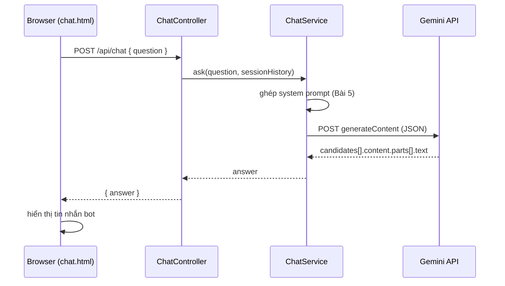

# Bài 6: AI Chatbot — Tích hợp LLM vào Spring Boot

> File: `6_java_m4_bai6_AI_Chatbot.md`  
> PDF gốc (tham khảo lịch sử): [`java_m4_bai6_AI_Chatbot.pdf`](../pdf/java_m4_bai6_AI_Chatbot.pdf)

> **Công cụ bắt buộc:** Tài khoản Google (đăng ký **Gemini API** free tier) + JDK 17 + Spring Boot 3.x + Maven.  
> **Học trước:** [M4 Bài 5 — Prompt Engineering](./5_java_m4_bai5_AI_Prompt_Engineering.md) *(system prompt, few-shot)*.  
> **Tiếp theo:** [M4 Bài 7 — Docker](./6_java_m4_bai7_Docker.md) *(containerize app chat — tuỳ chọn)*.

---

## Mục tiêu bài học

Sau bài này, học viên có thể:

- Giải thích **chatbot** và phân loại theo công nghệ (rule-based, retrieval, generative, hybrid) và theo chức năng
- So sánh **nền tảng AI** phổ biến (Gemini, OpenAI, Claude, Ollama…) — chọn được API phù hợp lab
- Đăng ký **Google Gemini API**, lưu API key an toàn bằng **biến môi trường** (không hardcode secret lên Git)
- Gọi Gemini từ Spring Boot bằng **`RestClient`** + Jackson (`JsonNode`) — đồng bộ với [M2 Bài 7](../../../t3h-ltv-java-module-2/syllabus/module-2/java_m2_bai7_SpringMVC.md)
- Xây **REST API** nhận câu hỏi (`@RequestBody` DTO) và trả câu trả lời — theo chuẩn đã học ở M3/M4
- Tạo **giao diện chat** đơn giản (HTML + `fetch`) gửi/nhận tin nhắn
- Áp dụng **system prompt** từ [Bài 5](./5_java_m4_bai5_AI_Prompt_Engineering.md) để tạo chatbot chuyên về Java
- Xử lý lỗi cơ bản: response rỗng, API key sai, rate limit

> **Không nằm trong phạm vi:** Fine-tuning LLM; RAG / vector DB chi tiết; Spring AI đầy đủ (chỉ giới thiệu ở phụ lục); streaming SSE; function calling / agent; bảo vệ endpoint bằng JWT *(lab nâng cao — link M4 Bài 4)*.

---

## Điều kiện tiên quyết

- **Bắt buộc:** [M4 Bài 5 — Prompt Engineering](./5_java_m4_bai5_AI_Prompt_Engineering.md) — biết viết system prompt (`[Nhiệm vụ] + Bối cảnh + [Định dạng]`)
- Ôn nhanh nếu cần:
  - [M2 Bài 7 §2](../../../t3h-ltv-java-module-2/syllabus/module-2/java_m2_bai7_SpringMVC.md) — `RestClient`, `JsonNode`, gọi HTTP API ngoài
  - [M3 Bài 3 §6–8](../../../t3h-ltv-java-module-3/syllabus/module-3/java_m3_bai3_MongoDB_Spring_1.md) — `@RestController`, `@Controller`, `ResponseEntity`, DTO
  - [M3 Bài 9 §6, §13](../../../t3h-ltv-java-module-3/syllabus/module-3/java_m3_bai9_Online_Payment.md) — secret trong `application.properties` → **env var**
  - [M3 Bài 9 §7](../../../t3h-ltv-java-module-3/syllabus/module-3/java_m3_bai9_Online_Payment.md) — `fetch()` JavaScript gọi REST API
  - [M4 Bài 1](./1_java_m4_bai1_RESTful_API.md) — REST design, HTTP status, `@Valid`
- Tài khoản Google + trình duyệt; **Postman** (test API key)
- JDK 17+, Spring Boot 3.x, Maven, IntelliJ IDEA

```xml
<!-- pom.xml — chỉ cần web + validation + lombok (đã quen M2/M3) -->
<dependency>
    <groupId>org.springframework.boot</groupId>
    <artifactId>spring-boot-starter-web</artifactId>
</dependency>
<dependency>
    <groupId>org.springframework.boot</groupId>
    <artifactId>spring-boot-starter-validation</artifactId>
</dependency>
<dependency>
    <groupId>org.projectlombok</groupId>
    <artifactId>lombok</artifactId>
    <optional>true</optional>
</dependency>
```

### Thời lượng gợi ý

| Phần | Thời gian |
|------|-----------|
| §0 Bridge M2/M3/M4 B5 | ~10 phút |
| §1–2 Lý thuyết chatbot + nền tảng AI | ~20 phút |
| §3 Đăng ký Gemini API + test Postman | ~25 phút |
| §4–6 Lab backend + giao diện | ~50 phút |
| §7 System prompt (áp dụng Bài 5) | ~15 phút |
| §8 Lịch sử hội thoại (session cơ bản) | ~15 phút |
| §9 Bảo mật + lỗi thường gặp | ~10 phút |
| §10 Lab thực hành + checklist | ~25 phút |

> **Thứ tự giảng gợi ý:** §0 → §1–2 (lý thuyết ngắn) → §3 (đăng ký API — HV làm song song) → §4–6 (lab code) → §7 (system prompt) → §9 (bảo mật) → §10 lab cá nhân.

---

## Nội dung (làm theo thứ tự)

| # | Chủ đề | Việc HV làm | Kết quả kiểm tra |
|---|--------|-------------|------------------|
| 0 | Bridge M2/M3/M4 | Đọc bảng | Biết phần nào **ôn link**, không dạy lại |
| 1 | Chatbot là gì? Phân loại | Thảo luận | Nói được 4 loại theo công nghệ |
| 2 | Nền tảng AI | Đọc bảng so sánh | Chọn Gemini cho lab |
| 3 | Đăng ký Gemini API | Tạo key, test curl/Postman | API trả JSON hợp lệ |
| 4 | Kiến trúc lab | Vẽ sơ đồ | Nêu được luồng Browser → Spring → Gemini |
| 5 | Backend: RestClient + Service | Code `ChatService` | Gọi Gemini từ Java thành công |
| 6 | Controller + DTO + UI | Code API + `chat.html` | Chat qua trình duyệt hoạt động |
| 7 | System prompt | Viết prompt Java assistant | Bot trả lời đúng phạm vi Java |
| 8 | Lịch sử hội thoại | Lưu `List` trong session | Bot nhớ vài lượt trước |
| 9 | Bảo mật + lỗi | Env var, xử lý lỗi API | Không commit API key |
| 10 | Lab mở rộng | Tuỳ chọn 1–2 mục | Nộp screenshot + prompt |
| Phụ lục | Spring AI, RAG, streaming | Đọc thêm | Biết hướng mở rộng production |

---

## 0. Bridge Module 2/3/4 — hôm nay không giảng lại

| Kiến thức kỹ thuật | Đã học ở | Bài 6 làm gì |
|--------------------|----------|--------------|
| `RestClient`, `JsonNode`, gọi API ngoài | [M2 Bài 7 §2](../../../t3h-ltv-java-module-2/syllabus/module-2/java_m2_bai7_SpringMVC.md) | **POST** tới Gemini — mở rộng từ GET DummyJSON |
| `@Service`, `@RequiredArgsConstructor`, Lombok | [M2 Bài 6](../../../t3h-ltv-java-module-2/syllabus/module-2/java_m2_bai6_SpringMVC.md) · [M3 Bài 3](../../../t3h-ltv-java-module-3/syllabus/module-3/java_m3_bai3_MongoDB_Spring_1.md) | `ChatService` — không dạy lại pattern |
| `@RestController`, `ResponseEntity`, DTO | [M3 Bài 3 §6](../../../t3h-ltv-java-module-3/syllabus/module-3/java_m3_bai3_MongoDB_Spring_1.md) | `ChatRequest` / `ChatResponse` record |
| `@Controller` trả view HTML | [M3 Bài 3 §8](../../../t3h-ltv-java-module-3/syllabus/module-3/java_m3_bai3_MongoDB_Spring_1.md) · [M3 Bài 4](../../../t3h-ltv-java-module-3/syllabus/module-3/java_m3_bai4_MongoDB_Spring_2.md) | `GET /ui/chat` → `chat.html` |
| `ObjectMapper`, parse JSON | [M3 Bài 4 §4](../../../t3h-ltv-java-module-3/syllabus/module-3/java_m3_bai4_MongoDB_Spring_2.md) | Build request body Gemini |
| Secret / API key → env var | [M3 Bài 9 §6, §13](../../../t3h-ltv-java-module-3/syllabus/module-3/java_m3_bai9_Online_Payment.md) | `GEMINI_API_KEY` — **không** commit |
| `fetch()` JavaScript | [M3 Bài 9 §7](../../../t3h-ltv-java-module-3/syllabus/module-3/java_m3_bai9_Online_Payment.md) | Gửi POST JSON từ UI |
| Test API bằng Postman | [M3 Bài 3](../../../t3h-ltv-java-module-3/syllabus/module-3/java_m3_bai3_MongoDB_Spring_1.md) · [M4 Bài 1](./1_java_m4_bai1_RESTful_API.md) | Test Gemini key trước khi code |
| System prompt, few-shot, role | [M4 Bài 5](./5_java_m4_bai5_AI_Prompt_Engineering.md) | **Áp dụng** — không dạy lại lý thuyết |
| JWT bảo vệ API | [M4 Bài 4](./4_java_m4_bai4_Authentication_Authorization.md) | Lab nâng cao *(tuỳ chọn)* |
| Unit test mock service | [M3 Bài 8](../../../t3h-ltv-java-module-3/syllabus/module-3/java_m3_bai8_Unit_Testing.md) | Lab nâng cao — mock `ChatService` |

**Hôm nay học mới:** tích hợp LLM API vào Spring Boot; format request/response Gemini; system prompt trong backend; chat UI end-to-end.

---

## 1. Chatbot — Giới thiệu và phân loại

### 1.1. Chatbot là gì?

**Chatbot** là chương trình mô phỏng hội thoại với người dùng qua văn bản (hoặc giọng nói), dùng **quy tắc** hoặc **AI / NLP** để hiểu yêu cầu và phản hồi tự động.

Ứng dụng thực tế: FAQ khách hàng, tra cứu đơn hàng, gợi ý sản phẩm, trợ lý nội bộ (HR, IT helpdesk).

### 1.2. Phân loại theo công nghệ

| Loại | Cách hoạt động | Ưu điểm | Nhược điểm |
|------|----------------|---------|------------|
| **Rule-based** | Quy tắc if-then cố định | Dễ triển khai, dự đoán được | Không hiểu câu ngoài kịch bản |
| **Retrieval-based** | Tìm câu trả lời gần nhất trong thư viện (embedding / keyword) | Kiểm soát nội dung | Phụ thuộc chất lượng dữ liệu |
| **Generative (LLM)** | Mô hình tạo câu trả lời mới | Linh hoạt, hiểu ngữ cảnh | Chi phí, ảo giác, cần guardrail |
| **Hybrid** | Rule xử lý tác vụ đơn giản; AI xử lý câu phức tạp | Cân bằng chi phí / chất lượng | Thiết kế phức tạp hơn |

> **Lab bài này** dùng **Generative** (Gemini API). Retrieval / RAG là hướng production phổ biến — xem [Phụ lục B](#phụ-lục-b--mở-rộng-spring-ai-streaming-rag).

### 1.3. Phân loại theo chức năng

| Chức năng | Ví dụ |
|-----------|-------|
| Hỗ trợ khách hàng | FAQ, theo dõi đơn hàng, khắc phục sự cố |
| Hỗ trợ bán hàng | Gợi ý sản phẩm, thu thập lead |
| Trợ lý giọng nói | Siri, Google Assistant |
| Chatbot nội bộ | HR, lịch họp, tra cứu tài liệu công ty |

---

## 2. Nền tảng AI — So sánh nhanh

Tham khảo thêm: [aimlapi.com/models](https://aimlapi.com/models)

| Nhà cung cấp | Ngôn ngữ SDK | Ứng dụng | Chi phí (ước lượng) | Ghi chú |
|--------------|--------------|----------|---------------------|---------|
| **Google Gemini** | Python, JS, Java, REST | Chat, đa phương thức | Free tier + trả phí | ✅ **Lab bài này** — tích hợp Google Cloud |
| **OpenAI (ChatGPT)** | Python, JS, Java, REST | Chat, image, audio | Cao | API phổ biến; cần thẻ tín dụng |
| **Anthropic (Claude)** | Python, JS, REST | Chat, context dài | Trung bình | Tốt cho tài liệu dài |
| **Cohere** | Python, JS | Chat, classification | Thấp–trung bình | Enterprise embedding |
| **Mistral** | Python, REST | Mô hình mở | Thấp | Self-host / API |
| **Ollama** | CLI, REST local | Chạy LLM trên máy | Miễn phí (local) | Học tập, không cần internet |

| Framework Java | Vai trò |
|----------------|---------|
| **Spring AI** | Abstraction chính thức của Spring cho LLM — xem [Phụ lục B](#phụ-lục-b--mở-rộng-spring-ai-streaming-rag) |
| **LangChain4j** | Agent, tool calling, RAG — phổ biến trong Java ecosystem |

> **Lab bài này** gọi **REST API trực tiếp** bằng `RestClient` để HV hiểu request/response thô — trước khi dùng framework cao hơn.

---

## 3. Đăng ký Google Gemini API

### 3.1. Các bước

1. Truy cập [Google AI Studio](https://aistudio.google.com/) hoặc [Google Cloud Console](https://console.cloud.google.com/)
2. Đăng nhập tài khoản Google
3. Tạo **project** mới (hoặc chọn project có sẵn)
4. Bật **Generative Language API** (Gemini)
5. Tạo **API key** → copy key (chỉ hiện một lần — lưu an toàn)
6. **Giới hạn key** (khuyến nghị): chỉ cho phép *Generative Language API*; giới hạn IP / referrer nếu deploy production

### 3.2. Cấu hình trong project (env var — không hardcode)

```properties
# application.properties
gemini.api-key=${GEMINI_API_KEY:}
gemini.model=gemini-2.0-flash
```

```bash
# Terminal / IntelliJ Run Configuration — KHÔNG commit giá trị thật
export GEMINI_API_KEY=AIza...your_key_here
```

> **Ôn tập:** pattern secret giống [M3 Bài 9 §13](../../../t3h-ltv-java-module-3/syllabus/module-3/java_m3_bai9_Online_Payment.md) — `PAYPAL_CLIENT_SECRET` → env var.

### 3.3. Kiểm tra API key bằng curl / Postman

> **Lưu ý:** tên model thay đổi theo thời gian — tra [Gemini models](https://ai.google.dev/gemini-api/docs/models) khi lab.

```bash
curl --location \
  'https://generativelanguage.googleapis.com/v1beta/models/gemini-2.0-flash:generateContent?key=YOUR_API_KEY' \
  --header 'Content-Type: application/json' \
  --data '{
    "contents": [
      {
        "parts": [
          { "text": "Where is Vietnam located?" }
        ]
      }
    ]
  }'
```

**JSON hợp lệ khi:** response có `candidates[0].content.parts[0].text`.

> **Sửa lỗi PDF gốc:** trường `contents` phải là **mảng** `[{ ... }]`, không phải object `{ ... }`.

---

## 4. Kiến trúc lab



| Thành phần | Trách nhiệm |
|------------|-------------|
| `chat.html` | UI nhập tin, gọi `fetch`, hiển thị hội thoại |
| `ChatController` | Nhận HTTP, validate DTO, trả JSON |
| `ChatService` | Build prompt, gọi Gemini qua `RestClient`, parse response |
| `application.properties` | Model name, placeholder API key |

**Cấu trúc package gợi ý:**

```text
src/main/java/vn/demo/
├── DemoChatbotApplication.java
├── config/
│   └── RestClientConfig.java          ← tái dùng pattern M2 B7
├── chat/
│   ├── controller/
│   │   ├── ChatApiController.java     ← @RestController
│   │   └── ChatPageController.java  ← @Controller → chat.html
│   ├── dto/
│   │   ├── ChatRequest.java
│   │   └── ChatResponse.java
│   └── service/
│       └── ChatService.java
└── resources/
    ├── application.properties
    └── templates/
        └── chat.html
```

---

## 5. Backend — RestClient + ChatService

### 5.1. RestClientConfig *(ôn M2 Bài 7)*

```java
package vn.demo.config;

import org.springframework.context.annotation.Bean;
import org.springframework.context.annotation.Configuration;
import org.springframework.web.client.RestClient;

@Configuration
public class RestClientConfig {

    @Bean
    public RestClient restClient(RestClient.Builder builder) {
        return builder.build();
    }
}
```

### 5.2. DTO — request / response

```java
package vn.demo.chat.dto;

import jakarta.validation.constraints.NotBlank;
import jakarta.validation.constraints.Size;

public record ChatRequest(
        @NotBlank @Size(max = 2000) String question
) {}
```

```java
package vn.demo.chat.dto;

public record ChatResponse(String answer) {}
```

> **Ôn tập:** dùng `@RequestBody` + `@Valid` thay vì `@RequestParam` trên URL — chuẩn REST đã học ở [M3 Bài 3](../../../t3h-ltv-java-module-3/syllabus/module-3/java_m3_bai3_MongoDB_Spring_1.md).

### 5.3. ChatService — gọi Gemini

```java
package vn.demo.chat.service;

import com.fasterxml.jackson.databind.JsonNode;
import com.fasterxml.jackson.databind.ObjectMapper;
import com.fasterxml.jackson.databind.node.ArrayNode;
import com.fasterxml.jackson.databind.node.ObjectNode;
import lombok.RequiredArgsConstructor;
import lombok.extern.slf4j.Slf4j;
import org.springframework.beans.factory.annotation.Value;
import org.springframework.http.MediaType;
import org.springframework.stereotype.Service;
import org.springframework.web.client.RestClient;
import org.springframework.web.client.RestClientResponseException;

@Slf4j
@Service
@RequiredArgsConstructor
public class ChatService {

    private static final String GEMINI_BASE =
            "https://generativelanguage.googleapis.com/v1beta/models/";

    private final RestClient restClient;
    private final ObjectMapper objectMapper;

    @Value("${gemini.api-key}")
    private String apiKey;

    @Value("${gemini.model}")
    private String model;

    /**
     * System prompt — áp dụng kỹ năng M4 Bài 5.
     * Công thức: [Nhiệm vụ] + [Bối cảnh] + [Định dạng/ràng buộc]
     */
    private static final String SYSTEM_PROMPT = """
            Bạn là trợ lý lập trình Java chuyên về Spring Boot 3 và Java 17.
            Bối cảnh: học viên khóa LTV Java — chỉ trả lời trong phạm vi Java, Spring, Maven.
            Định dạng: trả lời ngắn gọn bằng tiếng Việt; dùng markdown code block khi có ví dụ code.
            Nếu câu hỏi ngoài phạm vi Java, từ chối lịch sự và gợi ý đổi chủ đề.
            """;

    public String ask(String userQuestion) {
        if (apiKey == null || apiKey.isBlank()) {
            throw new IllegalStateException("Thiếu GEMINI_API_KEY — xem §3.2");
        }

        String url = GEMINI_BASE + model + ":generateContent?key=" + apiKey;
        String body = buildRequestBody(userQuestion);

        try {
            JsonNode response = restClient.post()
                    .uri(url)
                    .contentType(MediaType.APPLICATION_JSON)
                    .body(body)
                    .retrieve()
                    .body(JsonNode.class);

            return extractText(response);
        } catch (RestClientResponseException ex) {
            log.error("Gemini API error: status={}, body={}", ex.getStatusCode(), ex.getResponseBodyAsString());
            throw new IllegalStateException("Không gọi được Gemini API — kiểm tra key và quota");
        }
    }

    private String buildRequestBody(String userQuestion) {
        try {
            // Ghép system prompt + câu hỏi user (cách đơn giản cho lab)
            String fullPrompt = SYSTEM_PROMPT + "\n\nCâu hỏi: " + userQuestion;

            ObjectNode textPart = objectMapper.createObjectNode();
            textPart.put("text", fullPrompt);

            ArrayNode parts = objectMapper.createArrayNode();
            parts.add(textPart);

            ObjectNode content = objectMapper.createObjectNode();
            content.set("parts", parts);

            ArrayNode contents = objectMapper.createArrayNode();
            contents.add(content);

            ObjectNode root = objectMapper.createObjectNode();
            root.set("contents", contents);

            return objectMapper.writeValueAsString(root);
        } catch (Exception e) {
            throw new IllegalStateException("Không build được request JSON", e);
        }
    }

    private String extractText(JsonNode response) {
        JsonNode candidates = response.path("candidates");
        if (!candidates.isArray() || candidates.isEmpty()) {
            log.warn("Gemini response không có candidates: {}", response);
            return "AI không trả lời được — thử lại hoặc đổi câu hỏi.";
        }
        String text = candidates.get(0)
                .path("content")
                .path("parts")
                .path(0)
                .path("text")
                .asText("");
        if (text.isBlank()) {
            String reason = candidates.get(0).path("finishReason").asText("UNKNOWN");
            return "AI từ chối trả lời (finishReason=" + reason + ")";
        }
        return text;
    }
}
```

> **Khác PDF gốc:** dùng `RestClient.post()` thay `ExternalApiService.sendPostRequest()` *(method không tồn tại trong syllabus M2 B7 hiện tại)*; không `e.printStackTrace()`; không trả exception message thô cho client.

---

## 6. Controller + Giao diện chat

### 6.1. REST API

```java
package vn.demo.chat.controller;

import jakarta.validation.Valid;
import lombok.RequiredArgsConstructor;
import org.springframework.http.ResponseEntity;
import org.springframework.web.bind.annotation.*;
import vn.demo.chat.dto.ChatRequest;
import vn.demo.chat.dto.ChatResponse;
import vn.demo.chat.service.ChatService;

@RestController
@RequiredArgsConstructor
@RequestMapping("/api/chat")
public class ChatApiController {

    private final ChatService chatService;

    @PostMapping
    public ResponseEntity<ChatResponse> ask(@Valid @RequestBody ChatRequest request) {
        String answer = chatService.ask(request.question());
        return ResponseEntity.ok(new ChatResponse(answer));
    }
}
```

### 6.2. Trang chat (Thymeleaf)

```java
package vn.demo.chat.controller;

import org.springframework.stereotype.Controller;
import org.springframework.web.bind.annotation.GetMapping;

@Controller
public class ChatPageController {

    @GetMapping("/ui/chat")
    public String chatPage() {
        return "chat";
    }
}
```

**`src/main/resources/templates/chat.html`** (rút gọn — HV có thể thêm CSS):

```html
<!DOCTYPE html>
<html lang="vi">
<head>
    <meta charset="UTF-8"/>
    <title>Java Assistant Chat</title>
    <style>
        #chatBox { height: 400px; overflow-y: auto; border: 1px solid #ccc; padding: 8px; }
        .message { margin: 6px 0; padding: 6px 10px; border-radius: 8px; max-width: 80%; }
        .user { background: #dbeafe; margin-left: auto; }
        .bot  { background: #f3f4f6; }
    </style>
</head>
<body>
<h2>Java Assistant</h2>
<div id="chatBox"></div>
<input id="userInput" type="text" placeholder="Hỏi về Java, Spring Boot..." style="width: 70%"/>
<button id="sendBtn">Gửi</button>

<script>
    const chatBox = document.getElementById("chatBox");
    const input = document.getElementById("userInput");
    const sendBtn = document.getElementById("sendBtn");

    function addMessage(text, sender) {
        const msg = document.createElement("div");
        msg.classList.add("message", sender);
        msg.textContent = text;
        chatBox.appendChild(msg);
        chatBox.scrollTop = chatBox.scrollHeight;
    }

    async function sendMessage() {
        const question = input.value.trim();
        if (!question) return;

        addMessage(question, "user");
        input.value = "";
        sendBtn.disabled = true;

        try {
            const response = await fetch("/api/chat", {
                method: "POST",
                headers: { "Content-Type": "application/json" },
                body: JSON.stringify({ question })
            });

            if (!response.ok) {
                addMessage("Lỗi server (" + response.status + ")", "bot");
                return;
            }

            const data = await response.json();
            addMessage(data.answer, "bot");
        } catch (error) {
            addMessage("Không kết nối được server.", "bot");
        } finally {
            sendBtn.disabled = false;
            input.focus();
        }
    }

    sendBtn.addEventListener("click", sendMessage);
    input.addEventListener("keypress", e => {
        if (e.key === "Enter") sendMessage();
    });
</script>
</body>
</html>
```

> **Ôn tập `fetch`:** pattern tương tự [M3 Bài 9 §7](../../../t3h-ltv-java-module-3/syllabus/module-3/java_m3_bai9_Online_Payment.md) — POST JSON, xử lý `response.ok`.

### 6.3. Chạy và kiểm tra

```bash
export GEMINI_API_KEY=your_key_here
./mvnw spring-boot:run
```

1. Mở `http://localhost:8080/ui/chat`
2. Hỏi: *"Khác nhau `@Controller` và `@RestController`?"*
3. Kiểm tra bot trả lời trong phạm vi Java

---

## 7. System prompt — Áp dụng M4 Bài 5

Bài 5 dạy công thức **`[Nhiệm vụ] + Bối cảnh + [Định dạng/ràng buộc]`**. Bài 6 **áp dụng** vào `ChatService` (hoặc file `prompts/java-assistant.txt`).

### 7.1. Ví dụ system prompt tốt

```text
[Nhiệm vụ] Bạn là trợ lý lập trình Java, trả lời câu hỏi về Java 17 và Spring Boot 3.

[Bối cảnh] Học viên khóa LTV Java — đã học MongoDB (M3), REST API (M4).
Chỉ trả lời trong phạm vi Java ecosystem; không tư vấn crypto, y tế, pháp lý.

[Định dạng]
- Tiếng Việt, ngắn gọn (≤ 15 dòng trừ khi được yêu cầu code dài)
- Code dùng markdown ```java
- Nếu không chắc: nói "không chắc" và gợi ý tra doc chính thức
```

### 7.2. Few-shot (tuỳ chọn — nâng cao chất lượng)

Thêm vào prompt 1–2 ví dụ Q&A mẫu trước câu hỏi thật:

```text
Ví dụ:
Q: Lombok @Data làm gì?
A: @Data sinh getter, setter, toString, equals, hashCode — giảm boilerplate.

Q: ...
```

> **Ôn tập chi tiết:** [M4 Bài 5 §2–3](./5_java_m4_bai5_AI_Prompt_Engineering.md) — Few-shot, Role-based.

### 7.3. Thực hành nhanh

| Prompt user (mơ hồ) | Kỳ vọng sau system prompt |
|---------------------|---------------------------|
| *"Viết code"* | Hỏi lại ngữ cảnh hoặc giả định Spring Boot |
| *"Bitcoin giá bao nhiêu?"* | Từ chối — ngoài phạm vi Java |
| *"Giải thích `@Transactional`"* | Trả lời có ví dụ Java ngắn |

---

## 8. Lịch sử hội thoại (session cơ bản)

Chatbot một lượt (stateless) không nhớ câu trước. Production thường gửi **toàn bộ lịch sử** trong mỗi request.

**Lab nâng cao:** lưu `List<ChatMessage>` trong `HttpSession`:

```java
public record ChatMessage(String role, String text) {}  // role: "user" | "model"
```

```java
@PostMapping
public ResponseEntity<ChatResponse> ask(
        @Valid @RequestBody ChatRequest request,
        HttpSession session) {

    @SuppressWarnings("unchecked")
    List<ChatMessage> history = (List<ChatMessage>) session.getAttribute("chatHistory");
    if (history == null) {
        history = new ArrayList<>();
        session.setAttribute("chatHistory", history);
    }

    history.add(new ChatMessage("user", request.question()));
    String answer = chatService.askWithHistory(history);
    history.add(new ChatMessage("model", answer));

    return ResponseEntity.ok(new ChatResponse(answer));
}
```

Trong `buildRequestBody`, mỗi `ChatMessage` map thành một phần tử trong mảng `contents` (user → `role: user`, model → `role: model` theo [Gemini multi-turn](https://ai.google.dev/gemini-api/docs/text-generation#multi-turn-conversations)).

> **Giới hạn lab:** giữ ≤ 10 lượt gần nhất để tránh vượt token limit.

---

## 9. Bảo mật và xử lý lỗi

### 9.1. Checklist bảo mật

| ✅ Làm | ❌ Không làm |
|--------|-------------|
| API key trong **env var** `GEMINI_API_KEY` | Commit key vào Git / paste lên ChatGPT |
| Giới hạn API key trên Google Cloud | Dùng key production cho lab lớp |
| Validate input (`@Size`, `@NotBlank`) | Tin mọi input user — prompt injection |
| Log lỗi bằng `@Slf4j` | `e.printStackTrace()` hoặc trả stack trace cho client |
| Trả message thân thiện khi API lỗi | Trả nguyên `e.getMessage()` |

### 9.2. Lỗi thường gặp

| Triệu chứng | Nguyên nhân | Cách xử lý |
|-------------|-------------|------------|
| `400 Bad Request` từ Gemini | JSON `contents` sai format (object thay vì array) | Sửa theo §3.3 |
| `403` / `API key not valid` | Key sai hoặc chưa bật API | Kiểm tra Console + env var |
| `429 Too Many Requests` | Hết quota free tier | Đợi / đổi key / giảm request |
| Response `candidates` rỗng | Nội dung bị chặn (`SAFETY`) | Đổi câu hỏi; log `finishReason` |
| `IllegalStateException: Thiếu GEMINI_API_KEY` | Chưa set env | `export GEMINI_API_KEY=...` trước `run` |
| UI không gửi được | Dùng query param thay body | Dùng `JSON.stringify({ question })` §6.2 |
| Bot trả lời lan man / sai ngôn ngữ | System prompt yếu | Cải tiến theo [Bài 5 §3](./5_java_m4_bai5_AI_Prompt_Engineering.md) |

### 9.3. `@RestControllerAdvice` (tuỳ chọn)

```java
@ExceptionHandler(IllegalStateException.class)
public ResponseEntity<ChatResponse> handleChatError(IllegalStateException ex) {
    return ResponseEntity.status(HttpStatus.SERVICE_UNAVAILABLE)
            .body(new ChatResponse("Dịch vụ AI tạm thời không khả dụng. Thử lại sau."));
}
```

---

## 10. Lab thực hành

**Bối cảnh:** HV hoàn thành lab §4–6, sau đó chọn **ít nhất 2** mục:

| # | Mục tiêu | Gợi ý | Verify |
|---|----------|-------|--------|
| **L1** | Cải tiến **system prompt** | Thêm few-shot 2 Q&A Java; giới hạn độ dài | Bot từ chối câu ngoài Java |
| **L2** | **Lịch sử hội thoại** | Session `chatHistory` §8 | Hỏi "nó" tham chiếu câu trước |
| **L3** | **Tách prompt** ra file | `classpath:prompts/java-assistant.txt` + `@Value` | Đổi prompt không sửa Java |
| **L4** | **Unit test** mock service | Mockito mock `RestClient` hoặc `ChatService` | `./mvnw test` pass |
| **L5** | **Bảo vệ API** *(nâng cao)* | `permitAll` chỉ `/ui/chat`; `/api/chat` cần login | Link [M4 Bài 4](./4_java_m4_bai4_Authentication_Authorization.md) |

**Deliverable nộp:**

1. Screenshot giao diện chat (≥ 3 lượt hội thoại)
2. File `SYSTEM_PROMPT.md` — prompt đầy đủ + giải thích từng phần (Bài 5)
3. Ghi rõ env var đã dùng (không paste key thật)
4. *(Tuỳ chọn)* Kết quả `mvn test` nếu làm L4

---

## 11. Checklist cuối bài

### Kiến thức

- [ ] Phân loại được 4 loại chatbot theo công nghệ
- [ ] Giải thích luồng Browser → Spring → Gemini API
- [ ] Biết vì sao `contents` phải là mảng JSON
- [ ] Áp dụng system prompt theo công thức Bài 5
- [ ] Biết lưu API key bằng env var (không commit)

### Kỹ năng thực hành

- [ ] Test API key bằng curl/Postman thành công
- [ ] `ChatService` gọi Gemini qua `RestClient.post()`
- [ ] UI chat gửi POST JSON, hiển thị câu trả lời
- [ ] Xử lý được response rỗng / lỗi API cơ bản
- [ ] Hoàn thành ≥ 2 mục lab §10

---

## Phụ lục A — So sánh PDF gốc vs bản Markdown này

| PDF gốc | Bản Markdown (bài này) |
|---------|-------------------------|
| Tiêu đề slide "Bài 7" | Thống nhất **Bài 6** (trước Docker Bài 7) |
| `contents` là object | Sửa thành **mảng** — đúng Gemini API |
| `ExternalApiService.sendPostRequest()` | **`RestClient.post()`** — khớp M2 B7 hiện tại |
| `@RequestParam` trên URL | **`@RequestBody` DTO** — chuẩn REST M3/M4 |
| API key hardcode `application.properties` | **Env var** — link M3 B9 §13 |
| `e.printStackTrace()` + trả exception cho client | `@Slf4j` + message thân thiện |
| Few-shot chỉ nhắc ở slide cuối | §7 gắn chặt [Bài 5](./5_java_m4_bai5_AI_Prompt_Engineering.md) |
| Không có Bridge table | §0 link ôn M2/M3/M4 |
| Không có conversation history | §8 session cơ bản |
| Không đề cập Spring AI | Phụ lục B — đọc thêm |

---

## Phụ lục B — Mở rộng: Spring AI, Streaming, RAG

> **Đọc thêm** — không bắt buộc lab / thi.

### B.1. Spring AI (framework chính thức)

```xml
<dependency>
    <groupId>org.springframework.ai</groupId>
    <artifactId>spring-ai-starter-model-google-genai</artifactId>
    <version>1.0.0</version>  <!-- kiểm tra version mới nhất -->
</dependency>
```

```java
// Ví dụ ý tưởng — không chạy trong lab chính
ChatResponse response = chatClient.prompt()
    .system("Bạn là trợ lý Java...")
    .user(question)
    .call();
```

Tài liệu: [Spring AI Reference](https://docs.spring.io/spring-ai/reference/)

### B.2. Streaming (SSE)

Production chat thường dùng **Server-Sent Events** để hiển thị từng token — UX mượt hơn chờ full response.

### B.3. RAG (Retrieval-Augmented Generation)

Kết hợp **retrieval** (tìm tài liệu nội bộ) + **generative** (LLM tổng hợp câu trả lời):

```text
User question → Embedding → Vector DB (tìm chunk liên quan)
            → LLM (system + context chunks + question) → Answer
```

Phù hợp chatbot tra cứu tài liệu công ty / FAQ có kiểm soát nguồn.

### B.4. LangChain4j

Alternative Java: agent, tool calling, memory — [langchain4j.dev](https://docs.langchain4j.dev/)

---

## Liên kết

- PDF gốc: [`java_m4_bai6_AI_Chatbot.pdf`](../pdf/java_m4_bai6_AI_Chatbot.pdf)
- Trước đó: [M4 Bài 5 — Prompt Engineering](./5_java_m4_bai5_AI_Prompt_Engineering.md)
- Tiếp theo: [M4 Bài 7 — Docker](./6_java_m4_bai7_Docker.md)
- [M2 Bài 7 — RestClient, External API](../../../t3h-ltv-java-module-2/syllabus/module-2/java_m2_bai7_SpringMVC.md)
- [M3 Bài 3 — REST + Thymeleaf](../../../t3h-ltv-java-module-3/syllabus/module-3/java_m3_bai3_MongoDB_Spring_1.md)
- [M3 Bài 9 — Secret / env var / fetch](../../../t3h-ltv-java-module-3/syllabus/module-3/java_m3_bai9_Online_Payment.md)
- [M4 Bài 4 — JWT (lab nâng cao)](./4_java_m4_bai4_Authentication_Authorization.md)
- Gemini API docs: [ai.google.dev](https://ai.google.dev/gemini-api/docs)
