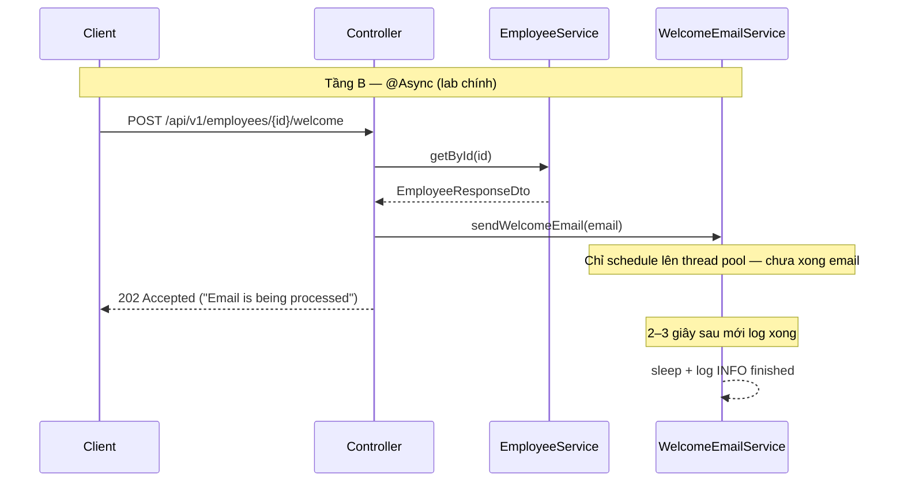

# Bài 1: Chuẩn thiết kế REST, Mapping, Background processing & OpenAPI

## Mục tiêu bài học

Sau bài này, học viên có thể:

- **Ôn nhanh** những gì đã học ở Module 3 (DTO, CRUD REST, phân trang, `@Valid`) — không học lại từ đầu
- Áp dụng **chuẩn thiết kế API**: noun/plural, nested resource, **versioning** `/v1`, phân biệt safe / idempotent, dùng đúng HTTP status (kể cả PATCH, 202)
- So sánh **MapStruct** và **ModelMapper**; dùng **MapStruct** thay `fromEntity` thủ công ở biên API
- Phân biệt rõ **3 tầng “async”**: sync request · `@Async` (xử lý nền) · job pattern (202 + theo dõi)
- Cấu hình `@EnableAsync` **+** `@Async`, trả **202 Accepted**, biết giới hạn (không nhầm message broker)
- Dùng **SLF4J** đúng **log level**; cấu hình `logging.level.`*; **không** dùng `System.out` trên server
- Viết tài liệu API bằng **springdoc OpenAPI** + Swagger UI (`@Operation`, `@ApiResponse`, `@Parameter`)

> **Không nằm trong phạm vi bài này:** Spring Security / JWT chi tiết (Module 4 bài Auth); Kafka/RabbitMQ; AsyncAPI spec; HATEOAS; contract-first OpenAPI gen code; CORS/rate-limit/ETag chi tiết (phụ lục đọc thêm).

## Điều kiện tiên quyết

- **Module 3 — [Bài 3](../../../t3h-ltv-java-module-3/syllabus/module-3/java_m3_bai3_MongoDB_Spring_1.md)**: REST CRUD, DTO, `PagedResponse`, `@Valid`, `@RestControllerAdvice` (§6–8)
- **Module 3 — [Bài 4](../../../t3h-ltv-java-module-3/syllabus/module-3/java_m3_bai4_MongoDB_Spring_2.md)**: phân trang + sắp xếp + map Model → DTO (§6–7)
- *(Khuyến khích)* **Module 3 — [Bài 6](../../../t3h-ltv-java-module-3/syllabus/module-3/java_m3_bai6_Query_Optimization.md)** §7: cursor pagination; **[Bài 8](../../../t3h-ltv-java-module-3/syllabus/module-3/java_m3_bai8_Unit_Testing.md)** §6: MockMvc theo HTTP method
- JDK 17+, Spring Boot 3.x, Maven

```xml
<!-- Web + Validation (đã quen Module 3) -->
<dependency>
    <groupId>org.springframework.boot</groupId>
    <artifactId>spring-boot-starter-web</artifactId>
</dependency>
<dependency>
    <groupId>org.springframework.boot</groupId>
    <artifactId>spring-boot-starter-validation</artifactId>
</dependency>

<!-- MỚI — MapStruct (chuẩn lab) -->
<dependency>
    <groupId>org.mapstruct</groupId>
    <artifactId>mapstruct</artifactId>
    <version>1.5.5.Final</version>
</dependency>

<!-- MỚI — ModelMapper (demo so sánh §2 — có thể gỡ sau khi chọn MapStruct) -->
<dependency>
    <groupId>org.modelmapper</groupId>
    <artifactId>modelmapper</artifactId>
    <version>3.2.1</version>
</dependency>

<!-- MỚI — OpenAPI / Swagger UI -->
<dependency>
    <groupId>org.springdoc</groupId>
    <artifactId>springdoc-openapi-starter-webmvc-ui</artifactId>
    <version>2.8.13</version>
</dependency>
```

> **Demo chuẩn:** [`demo-bai1-restful-api`](../../demo-bai1-restful-api) — in-memory Employee, đủ MapStruct + ModelMapper compare + `@Async` + logging + springdoc.  
> Chi tiết chạy app / API: [README](../../demo-bai1-restful-api/README.md).  
> PDF gốc (tham khảo lịch sử): [`java_m4_bai1_RESTful_API.pdf`](../pdf/java_m4_bai1_RESTful_API.pdf)

> **Thứ tự giảng gợi ý:** §0–1 (lý thuyết ngắn) → scaffold project + CRUD tối thiểu → §2 ModelMapper rồi MapStruct → §3 welcome-sync vs `@Async` (logging nhìn trên console luôn) → §4 chốt quy tắc log → §5 annotate Swagger + Try it out → §6 checklist.  
> Logging (§4): hệ thống hóa level + package `logging/` (filter). HV đã thấy DEBUG/INFO khi làm §2–3.

### Thời lượng gợi ý


| Phần                                                         | Thời gian   |
| ------------------------------------------------------------ | ----------- |
| Bridge Module 3 §0                                           | ~5 phút     |
| Chuẩn thiết kế API §1                                        | ~15–20 phút |
| ModelMapper (từng bước) → MapStruct (từng bước) → so sánh §2 | ~30–35 phút |
| Xử lý nền `@Async` (ẩn dụ + ví dụ) §3                        | ~25–30 phút |
| Logging (chi tiết + thực tế) §4                              | ~15 phút    |
| springdoc: CRUD + search/pagination §5                       | ~30 phút    |
| Lab tích hợp + lỗi thường gặp + checklist                    | ~15–20 phút |


## Nội dung (làm theo thứ tự)


| #       | Chủ đề                            | Việc HV làm (tóm tắt)             | Kết quả kiểm tra                                      |
| ------- | --------------------------------- | --------------------------------- | ----------------------------------------------------- |
| 0       | Bridge Module 3                   | Đọc bảng “đã biết”                | Nói được chỗ nào xem lại M3                           |
| 1       | Chuẩn thiết kế REST               | Thảo luận + sửa URL mẫu           | Viết `/api/v1/...` nhất quán; biết khi nào v2         |
| 2       | ModelMapper → MapStruct → so sánh | Làm lần lượt 2 cách map cùng DTO  | Chạy được cả 2; giải thích được vì sao chọn MapStruct |
| 3       | `@Async` (ẩn dụ + 3 tầng + lab)   | EnableAsync + email giả lập chậm  | POST 202 ngay; log email in **sau** response          |
| 4       | Logging                           | SLF4J + đổi level + case thực tế  | Biết khi nào DEBUG/INFO/WARN/ERROR                    |
| 5       | springdoc CRUD + search/page      | Annotate đủ endpoint · Try it out | UI thử được list/search/page/CRUD                     |
| 6       | Lab tích hợp                      | Gộp §2–5 trên 1 resource          | Checklist cuối bài                                    |
| Phụ lục | Bài tập · đọc thêm · liên kết     | —                                 | —                                                     |


---

## 0. Bridge Module 3 — bạn đã học, hôm nay không giảng lại


| Kỹ năng                                    | Xem lại (Module 3)                                                                                                                                                                                                     | Hôm nay chỉ…                                         |
| ------------------------------------------ | ---------------------------------------------------------------------------------------------------------------------------------------------------------------------------------------------------------------------- | ---------------------------------------------------- |
| REST CRUD + `ResponseEntity` + 201/204/404 | [Bài 3 §7](../../../t3h-ltv-java-module-3/syllabus/module-3/java_m3_bai3_MongoDB_Spring_1.md)                                                                                                                          | Ôn bảng status; thêm PATCH / 202                     |
| DTO + `fromEntity`, không lộ Model         | Bài 3 §6 · [Bài 4 §6.2](../../../t3h-ltv-java-module-3/syllabus/module-3/java_m3_bai4_MongoDB_Spring_2.md) · [Bài 7 §5.3](../../../t3h-ltv-java-module-3/syllabus/module-3/java_m3_bai7_Database_Query_To_FrontEnd.md) | Thay dần bằng MapStruct                              |
| `page` / `size` + `PagedResponse`          | Bài 3 §6.1 · Bài 4 §6                                                                                                                                                                                                  | Nhắc query param; **không** viết lại `PagedResponse` |
| Cursor pagination                          | [Bài 6 §7](../../../t3h-ltv-java-module-3/syllabus/module-3/java_m3_bai6_Query_Optimization.md)                                                                                                                        | 1 câu: offset vs cursor                              |
| `@Valid` + `@RestControllerAdvice`         | Bài 3 §8 · [Bài 8 §6.3](../../../t3h-ltv-java-module-3/syllabus/module-3/java_m3_bai8_Unit_Testing.md)                                                                                                                 | Cross-link; giữ nguyên pattern M3                    |
| Nested REST path                           | [Bài 5 §7.3](../../../t3h-ltv-java-module-3/syllabus/module-3/java_m3_bai5_Relationship_in_MongoDB.md) · [Bài 9](../../../t3h-ltv-java-module-3/syllabus/module-3/java_m3_bai9_Online_Payment.md) Payment API          | Ví dụ thật thay `/children` giả định                 |


**Hôm nay học mới:** versioning & design rules · MapStruct (vs ModelMapper) · `@Async` đúng nghĩa · Logging · springdoc.

---

## Kiến trúc lab (demo chuẩn)

> **Nguyên tắc package:** gom theo **kiến thức mới** trong bài — học viên mở đúng folder là thấy code của mục đó.

| Package | Syllabus | Nội dung |
|---------|----------|----------|
| `employee/` | §1 (+ ôn M3) | REST CRUD, DTO, phân trang, validation |
| `mapping/` | §2 | MapStruct + ModelMapper so sánh |
| `async/` | §3 | `@EnableAsync` config + `WelcomeEmailService` |
| `logging/` | §4 | Filter log request + `package-info` |
| `openapi/` | §5 | `OpenApiConfig` (springdoc) |
| `exception/` | ôn M3 | Advice + exception |
| `config/` | scaffold | `DataSeeder` |

```
src/main/java/vn/demo/
├── DemoBai1RestApplication.java          ← @EnableAsync
├── employee/                             ← §1 REST design + CRUD
│   ├── model/Employee.java
│   ├── dto/EmployeeRequestDto.java
│   ├── dto/EmployeeResponseDto.java
│   ├── dto/PagedResponse.java
│   ├── repository/...
│   ├── service/EmployeeService.java      ← dùng MapStruct từ mapping/
│   └── controller/EmployeeRestController.java
├── mapping/                              ← §2 MapStruct vs ModelMapper ★
│   ├── EmployeeMapper.java               ← MapStruct
│   ├── MapperConfig.java                 ← ModelMapper @Bean
│   ├── EmployeeModelMapperService.java
│   └── ModelMapperCompareController.java
├── async/                                ← §3 @Async ★
│   ├── AsyncConfig.java
│   └── WelcomeEmailService.java
├── logging/                              ← §4 Logging ★
│   ├── package-info.java
│   └── HttpRequestLoggingFilter.java
├── openapi/                              ← §5 springdoc ★
│   └── OpenApiConfig.java
├── exception/
│   ├── ResourceNotFoundException.java
│   ├── ConflictException.java
│   └── RestExceptionHandler.java
└── config/
    └── DataSeeder.java
```

> **Xem code:** [`demo-bai1-restful-api/java-springboot-bai1`](../../demo-bai1-restful-api/java-springboot-bai1)

### Scaffold nhanh — việc học viên làm trước §2

| Bước | Hành động | File |
|------|-----------|------|
| S0.1 | **Tạo** Spring Boot 3 project (Web + Validation) hoặc copy cấu trúc demo | `pom.xml` |
| S0.2 | **Thêm** dependency MapStruct, ModelMapper, springdoc (+ compiler plugin) | `pom.xml` — xem đầu bài |
| S0.3 | **Thêm** `Employee` model + 2 DTO + `PagedResponse` | `employee/model`, `employee/dto` |
| S0.4 | **Thêm** `EmployeeRepository` + `InMemoryEmployeeRepository` | `employee/repository` |
| S0.5 | **Thêm** exception + `RestExceptionHandler` (ôn M3) | `exception/` |
| S0.6 | **Thêm** `DataSeeder` + `application.properties` | `config/`, `resources/` |
| S0.7 | **Thêm** `EmployeeRestController` CRUD tối thiểu (map tay tạm) | `employee/controller` |
| S0.8 | Chạy app — mapper/async/logging/openapi làm ở §2–5 | `./mvnw spring-boot:run` |


---

## 1. Chuẩn thiết kế REST (phần mới / hệ thống hóa)

### 1.1. Vì sao cần chuẩn?

API thường được **nhiều client** (web, mobile, service khác) dùng lâu dài. Thiết kế xấu → khó bảo trì, khó version, dễ lộ dữ liệu thừa.

### 1.2. Đường dẫn — danh từ, số nhiều, nested


| Nên                                  | Không nên                                      | Ghi chú                                                    |
| ------------------------------------ | ---------------------------------------------- | ---------------------------------------------------------- |
| `GET /api/v1/employees`              | `GET /api/v1/getEmployees`                     | Động từ nằm ở **HTTP method**, không nhét vào path         |
| `GET /api/v1/employees/{id}`         | `GET /api/v1/employees?id=` (để lấy 1 bản ghi) | Query dùng cho **filter/search**, không thay path identity |
| `GET /api/v1/restaurants/{id}/items` | —                                              | Nested: đã làm ở **M3 Bài 5**                              |


> **Ôn M3:** collection movies dùng `/api/movies` — hôm nay **thêm prefix version** `/api/v1/...`.

### 1.3. HTTP method theo ngữ nghĩa


| Method  | Vai trò                                   | Safe? | Idempotent?                   |
| ------- | ----------------------------------------- | ----- | ----------------------------- |
| GET     | Đọc                                       | Có    | Có                            |
| HEAD    | Như GET, không body                       | Có    | Có                            |
| OPTIONS | Liệt kê method được phép                  | Có    | Có                            |
| POST    | Tạo / thao tác không idempotent mặc định  | Không | **Không** (mặc định)          |
| PUT     | Thay thế toàn bộ resource                 | Không | Có                            |
| PATCH   | Cập nhật một phần                         | Không | Thường thiết kế để idempotent |
| DELETE  | Xóa                                       | Không | Có                            |
| TRACE   | Echo request — **không public** (bảo mật) | —     | —                             |


> **PUT vs PATCH:** đã nhắc ở PDF cũ — giữ. **M3 Bài 3** dùng PUT cho update; có thể bổ sung PATCH khi chỉ sửa vài field.

### 1.4. Versioning trên URL

Breaking change (đổi semantics, đổi contract bắt buộc client sửa) → tăng major version.

**Sửa ví dụ cho nhất quán** (PDF cũ lẫn `/api/user` và `/api/v2/user`):

```text
v1: DELETE /api/v1/users/{id}   → chỉ xóa profile cơ bản
v2: DELETE /api/v2/users/{id}   → xóa profile + dữ liệu thanh toán  (breaking → v2)
```

Cả hai URL **đều có số version**. Non-breaking (thêm field optional) thường **không** cần v2.

> Đọc thêm (phụ lục): version bằng Header / media type — enterprise hay gặp, không lab buổi này.

### 1.5. Phân trang, lọc, sắp xếp (ôn M3)

```http
GET /api/v1/employees?page=0&size=20&role=developer&sort=name,asc
```


| Ý                    | Đã học                       | Ghi chú hôm nay                                                                                            |
| -------------------- | ---------------------------- | ---------------------------------------------------------------------------------------------------------- |
| Offset `page`/`size` | M3 Bài 3–4 · `PagedResponse` | Response nên có **metadata** (`content`, `page`, `totalElements`…) — đừng chỉ trả `List` trần khi list lớn |
| Cursor `lastSeenId`  | M3 Bài 6 §7                  | Feed / infinite scroll                                                                                     |
| Filter / sort        | M3 Bài 3–4                   | Giữ query param                                                                                            |


### 1.6. HTTP status — bảng mở rộng


| Mã                       | Khi nào                              | Đã gặp M3?   |
| ------------------------ | ------------------------------------ | ------------ |
| 200 OK                   | Thành công có body                   | Có           |
| 201 Created              | Tạo mới                              | Có (Bài 3)   |
| 202 Accepted             | Đã nhận, **xử lý nền chưa xong**     | **Mới (§3)** |
| 204 No Content           | Thành công không body (DELETE)       | Có (Bài 3)   |
| 400 Bad Request          | Validation / sai tham số             | Có           |
| 404 Not Found            | Không tìm thấy                       | Có           |
| 409 Conflict             | Xung đột nghiệp vụ (vd. trùng email) | Mở rộng      |
| 422 Unprocessable Entity | Semantic lỗi (optional)              | Đọc thêm     |
| 500                      | Lỗi server không mong đợi            | Có           |


**Việc HV làm ở §1:** Không code dài — sửa/thảo luận 3 URL sai → đúng; viết 1 câu “khi nào tăng v2”.

---

## 2. Mapping DTO: làm ModelMapper → làm MapStruct → rồi mới so sánh

> **Thứ tự giảng trên lớp:** (1) nhắc vì sao cần map · (2) **làm xong** ModelMapper từng bước · (3) **làm xong** MapStruct từng bước với **cùng Model/DTO** · (4) so sánh trải nghiệm · (5) kết luận chọn MapStruct cho lab/project.

### 2.1. Bài toán chung (dùng xuyên suốt §2)

Giả sử có model lưu DB (có field nhạy cảm) và DTO trả API:

```java
// model/Employee.java — KHÔNG trả thẳng ra API
public class Employee {
    private Long id;
    private String name;
    private String email;
    private String role;
    private String passwordHash; // nhạy cảm — không được lộ ra JSON
    // getter/setter hoặc Lombok @Data
}
```

```java
// dto/EmployeeResponseDto.java — chỉ field an toàn cho client
public class EmployeeResponseDto {
    private Long id;
    private String name;
    private String email;
    private String role;
    // getter/setter
}
```

```java
// dto/EmployeeRequestDto.java — body khi tạo/cập nhật
public class EmployeeRequestDto {
    @NotBlank
    private String name;
    @Email
    private String email;
    @NotBlank
    private String role;
    @NotBlank
    private String password; // nhận từ client, hash ở Service — không map thẳng ra Response
    // getter/setter
}
```

**Mục tiêu map:**


| Chiều   | Từ → Đến                           | Ghi chú                                                      |
| ------- | ---------------------------------- | ------------------------------------------------------------ |
| Đọc API | `Employee` → `EmployeeResponseDto` | **Bỏ** `passwordHash`                                        |
| Ghi API | `EmployeeRequestDto` → `Employee`  | Map `name/email/role`; `password` → hash riêng trong Service |


Ôn M3: trước đây hay viết `MovieDto.fromEntity(...)`. Hôm nay thử **2 thư viện** làm việc đó.

---

### 2.2. Cách 1 — ModelMapper (từng bước)

#### Bước M1 — Thêm dependency

```xml
<dependency>
    <groupId>org.modelmapper</groupId>
    <artifactId>modelmapper</artifactId>
    <version>3.2.1</version>
</dependency>
```

#### Bước M2 — Đăng ký bean Spring (dùng lại được)

> **Thêm** class: [`config/MapperConfig.java`](../../demo-bai1-restful-api/java-springboot-bai1/src/main/java/vn/demo/mapping/MapperConfig.java)

```java
@Configuration
public class MapperConfig {
    @Bean
    public ModelMapper modelMapper() {
        ModelMapper mapper = new ModelMapper();
        // Bỏ qua field đích không có nguồn tương ứng (tránh lỗi khi thiếu passwordHash trên DTO)
        mapper.getConfiguration().setSkipNullEnabled(true);
        return mapper;
    }
}
```

#### Bước M3 — Dùng trong Service

> **Thêm** class so sánh: [`EmployeeModelMapperService.java`](../../demo-bai1-restful-api/java-springboot-bai1/src/main/java/vn/demo/mapping/EmployeeModelMapperService.java)  
> **Thêm** controller lab: [`ModelMapperCompareController.java`](../../demo-bai1-restful-api/java-springboot-bai1/src/main/java/vn/demo/mapping/ModelMapperCompareController.java)  
> Base path demo: `/api/v1/employees/compare/model-mapper`

```java
@Service
@RequiredArgsConstructor
public class EmployeeService {

    private final EmployeeRepository repository;
    private final ModelMapper modelMapper;

    public EmployeeResponseDto getById(Long id) {
        Employee emp = repository.findById(id)
                .orElseThrow(() -> new ResourceNotFoundException("Employee " + id));
        // Cùng tên field (id, name, email, role) → ModelMapper tự gán
        // passwordHash không có trên DTO → không bị copy sang response
        return modelMapper.map(emp, EmployeeResponseDto.class);
    }

    public EmployeeResponseDto create(EmployeeRequestDto request) {
        Employee emp = modelMapper.map(request, Employee.class);
        // password không nên lưu plain — xử lý thủ công:
        emp.setPasswordHash(hash(request.getPassword()));
        emp.setPassword(null); // nếu Model có field password tạm
        Employee saved = repository.save(emp);
        return modelMapper.map(saved, EmployeeResponseDto.class);
    }
}
```

#### Bước M4 — Kiểm tra

1. `POST /api/v1/employees` với body có `password`
2. `GET /api/v1/employees/{id}` — JSON **không** có `password` / `passwordHash`
3. Đổi tên field trên Model thành `fullName` nhưng DTO vẫn `name` → chạy app, map có thể **sai/null lúc runtime** (để HV thấy rủi ro)

> **Quan sát giảng:** ModelMapper viết rất ít code; lỗi lệch tên field thường lộ khi **chạy**, khó phát hiện lúc build.

---

### 2.3. Cách 2 — MapStruct (từng bước)

#### Bước S1 — Dependency + annotation processor

```xml
<dependency>
    <groupId>org.mapstruct</groupId>
    <artifactId>mapstruct</artifactId>
    <version>1.5.5.Final</version>
</dependency>
```

Trong `maven-compiler-plugin`:

```xml
<plugin>
    <groupId>org.apache.maven.plugins</groupId>
    <artifactId>maven-compiler-plugin</artifactId>
    <version>3.11.0</version>
    <configuration>
        <source>17</source>
        <target>17</target>
        <annotationProcessorPaths>
            <path>
                <groupId>org.mapstruct</groupId>
                <artifactId>mapstruct-processor</artifactId>
                <version>1.5.5.Final</version>
            </path>
            <!-- Có Lombok: thêm lombok + org.projectlombok:lombok-mapstruct-binding -->
        </annotationProcessorPaths>
    </configuration>
</plugin>
```

#### Bước S2 — Khai báo interface mapper

> **Thêm** [`EmployeeMapper.java`](../../demo-bai1-restful-api/java-springboot-bai1/src/main/java/vn/demo/mapping/EmployeeMapper.java)

```java
@Mapper(componentModel = "spring")
public interface EmployeeMapper {

    EmployeeResponseDto toDto(Employee employee);

    @Mapping(target = "id", ignore = true)
    @Mapping(target = "passwordHash", ignore = true) // hash ở Service, không lấy từ DTO
    Employee toEntity(EmployeeRequestDto dto);
}
```

- Field cùng tên (`name`, `email`, `role`) → MapStruct tự map.
- Field không muốn map → `ignore = true` (rõ ràng hơn ModelMapper “im lặng bỏ”).

#### Bước S3 — Compile để sinh implementation

```bash
./mvnw clean compile
```

Mở file sinh ra (quan trọng để HV “thấy” MapStruct làm gì):

`target/generated-sources/annotations/.../EmployeeMapperImpl.java`

Bên trong gần giống code viết tay: `dto.setName(employee.getName());` …

#### Bước S4 — Inject vào Service (thay ModelMapper cho API chính)

> **Thêm / cập nhật** [`EmployeeService.java`](../../demo-bai1-restful-api/java-springboot-bai1/src/main/java/vn/demo/employee/service/EmployeeService.java) — API chính dùng MapStruct.  
> Giữ `EmployeeModelMapperService` chỉ để so sánh (không xóa ngay).

```java
@Service
@RequiredArgsConstructor
public class EmployeeService {

    private final EmployeeRepository repository;
    private final EmployeeMapper mapper; // Spring inject EmployeeMapperImpl

    public EmployeeResponseDto getById(Long id) {
        Employee emp = repository.findById(id)
                .orElseThrow(() -> new ResourceNotFoundException("Employee " + id));
        return mapper.toDto(emp);
    }

    public EmployeeResponseDto create(EmployeeRequestDto request) {
        Employee emp = mapper.toEntity(request);
        emp.setPasswordHash(hash(request.getPassword()));
        Employee saved = repository.save(emp);
        return mapper.toDto(saved);
    }
}
```

#### Bước S5 — Kiểm tra + thử “phá” để thấy fail compile

1. Gọi lại GET/POST như với ModelMapper — kết quả JSON tương đương.
2. Đổi DTO field `name` → `fullName` **mà chưa** thêm `@Mapping` — chạy `mvn compile` → **build fail** (MapStruct báo unmapped). Đây là điểm mạnh cần nhấn trên lớp.

---

### 2.4. So sánh sau khi đã làm cả hai


| Tiêu chí               | ModelMapper (đã làm §2.2)          | MapStruct (đã làm §2.3)     |
| ---------------------- | ---------------------------------- | --------------------------- |
| Bạn viết gì?           | `modelMapper.map(src, Dest.class)` | Interface + annotation      |
| Khi nào “ra” code map? | Lúc **chạy** (reflection)          | Lúc **compile** (`*Impl`)   |
| Đổi tên field lệch     | Dễ `null` / sai **runtime**        | Thường **fail build**       |
| Tốc độ                 | Chậm hơn (reflection)              | Nhanh (gần viết tay)        |
| Debug                  | Khó lần                            | Đọc `*Impl` như code thường |
| Phù hợp                | Demo nhanh, ít DTO                 | API thật, team, CI          |


### 2.5. Kết luận (chốt cho lab Module 4)

1. **Lab và project chuẩn của khóa → dùng MapStruct.**
2. ModelMapper vẫn hữu ích để hiểu ý tưởng “map tự động”, hoặc prototype rất nhỏ — **không** khuyến nghị làm mặc định production trong khóa này.
3. Dù dùng thư viện nào: map ở **biên** (`RequestDto → Model`, `Model → ResponseDto`); **không** trả Model thô; field nhạy cảm xử lý tường minh (`ignore` / không đưa vào ResponseDto).
4. Sau §2 có thể **gỡ dependency ModelMapper** khỏi `pom` nếu muốn project gọn — giữ MapStruct.

### Việc học viên làm (§2)


| Bước | Hành động | File (demo) |
|------|-----------|-------------|
| 2.A | **Thêm** Model + 2 DTO (nếu chưa có từ scaffold) | `employee/model`, `employee/dto` |
| 2.B | **Thêm** toàn bộ package `mapping/` (ModelMapper nhánh) | `mapping/MapperConfig`, `EmployeeModelMapperService`, `ModelMapperCompareController` |
| 2.C | Gọi `GET/POST .../compare/model-mapper` — JSON không lộ password | Swagger / curl |
| 2.D | **Thêm** `mapping/EmployeeMapper` + compiler plugin; `mvn clean compile` | có `EmployeeMapperImpl` |
| 2.E | **Cập nhật** `employee/service/EmployeeService` dùng MapStruct | inject `EmployeeMapper` |
| 2.F | Viết 5–7 câu so sánh vào README | compile vs runtime |
| 2.G | API chính chỉ inject MapStruct; ModelMapper chỉ còn trong `mapping/` compare | — |


---

## 3. Xử lý nền với `@Async` (không gọi nhầm “Async API”)

### 3.1. Ẩn dụ mở đầu (giảng trước khi code)

Hình dung quầy tiếp tân cửa hàng:


| Tình huống                                                                                                              | Giống kỹ thuật nào?                                                                 |
| ----------------------------------------------------------------------------------------------------------------------- | ----------------------------------------------------------------------------------- |
| Khách hỏi “còn size M không?” — nhân viên **đứng chờ** kiểm kho rồi mới trả lời                                         | **A. Sync** — request chờ xong mới trả HTTP                                         |
| Khách đăng ký thẻ thành viên — nhân viên nói “OK, anh/chị về đi”, rồi **ra sau** mới gửi email chào                     | **B. `@Async`** — trả lời sớm, việc phụ chạy nền **trong cùng cửa hàng (cùng app)** |
| Khách đặt may áo mất 3 ngày — nhận **phiếu mã đơn**, hôm sau mang phiếu hỏi “xong chưa?” hoặc shop **gọi lại** khi xong | **C. Job pattern** — 202 + `jobId` / webhook (gần M3 Bài 9 PayPal)                  |


> **Câu cần thuộc:** `@Async` = “nhờ đồng nghiệp trong **cùng app** làm giúp việc phụ”.  
> **Không phải:** hàng đợi Kafka/Rabbit, cũng **không tự động** bằng “Async API” kiểu theo dõi job trừ khi bạn **tự code** thêm tầng C.

### 3.2. Ba tầng nghĩa (bảng bắt buộc)


| Tầng                                      | Nghĩa kỹ thuật                                               | Ví dụ trong bài                                         | Client thấy gì?                                                         |
| ----------------------------------------- | ------------------------------------------------------------ | ------------------------------------------------------- | ----------------------------------------------------------------------- |
| **A. Sync request**                       | Thread xử lý request làm hết việc rồi mới ghi response       | `GET /api/v1/employees/{id}` đọc DB                     | `200` + JSON **khi xong**                                               |
| **B. Background `@Async`**                | Trả HTTP sớm; method `@Async` chạy thread khác **trong JVM** | Sau khi tạo NV, gửi email chào (giả lập `Thread.sleep`) | Thường `202 Accepted` + message; **không** có nội dung email trong body |
| **C. Job / “Async API” đúng nghĩa ngành** | Tạo việc → lưu trạng thái → client poll hoặc nhận webhook    | Export CSV lớn; thanh toán chờ cổng                     | `202` + `jobId`; `GET /jobs/{id}`; hoặc callback                        |





**Phân biệt với Phụ lục Scheduled:** `@Scheduled` = đồng hồ tự kích (không cần request). `@Async` = vẫn **bắt đầu từ một request**, nhưng phần việc phụ không chặn response.

### 3.3. Demo “sai” rồi mới “đúng” (để khỏi hiểu nhầm)

#### 3.3.1. Cách làm sync — khách phải chờ (tầng A, cố ý chậm)

```java
@PostMapping("/api/v1/employees/{id}/welcome-sync")
public ResponseEntity<String> sendWelcomeSync(@PathVariable Long id) throws InterruptedException {
    EmployeeResponseDto emp = employeeService.getById(id);
    // Giả lập SMTP chậm 3 giây — request bị block
    Thread.sleep(3000);
    log.info("Email sent to {}", emp.getEmail());
    return ResponseEntity.ok("Email sent"); // 200 — nhưng client đã chờ ~3s
}
```

Gọi bằng Postman: thời gian response ≈ 3 giây.

#### 3.3.2. Cách làm `@Async` — trả lời ngay (tầng B)

Các bước lab:

**B1 — Bật async trên ứng dụng**

> **Cập nhật** [`DemoBai1RestApplication.java`](../../demo-bai1-restful-api/java-springboot-bai1/src/main/java/vn/demo/DemoBai1RestApplication.java) — thêm `@EnableAsync`

```java
@SpringBootApplication
@EnableAsync
public class DemoBai1RestApplication {
    public static void main(String[] args) {
        SpringApplication.run(DemoBai1RestApplication.class, args);
    }
}
```

**B2 — Cấu hình thread pool (nên có)**

> **Thêm** [`AsyncConfig.java`](../../demo-bai1-restful-api/java-springboot-bai1/src/main/java/vn/demo/async/AsyncConfig.java)

```java
@Configuration
public class AsyncConfig implements AsyncConfigurer {

    private static final Logger log = LoggerFactory.getLogger(AsyncConfig.class);

    @Override
    public Executor getAsyncExecutor() {
        ThreadPoolTaskExecutor executor = new ThreadPoolTaskExecutor();
        // Số thread tối thiểu luôn sẵn sàng
        executor.setCorePoolSize(2);
        // Trần khi tải cao
        executor.setMaxPoolSize(5);
        // Hàng đợi chờ nếu pool đầy
        executor.setQueueCapacity(100);
        // Tên thread hiện trong log — chứng minh @Async không chạy trên HTTP thread
        executor.setThreadNamePrefix("async-");
        executor.initialize();
        return executor;
    }

    /** Exception trên method @Async kiểu void — log ERROR (không đẩy về HTTP). */
    @Override
    public AsyncUncaughtExceptionHandler getAsyncUncaughtExceptionHandler() {
        return (ex, method, params) ->
                log.error("Async error in {}: {}", method.getName(), ex.getMessage(), ex);
    }
}
```

**B3 — Service riêng có `@Async`** (bắt buộc tách class / gọi qua bean Spring)

> **Thêm** [`WelcomeEmailService.java`](../../demo-bai1-restful-api/java-springboot-bai1/src/main/java/vn/demo/async/WelcomeEmailService.java)  
> Delay cấu hình bằng `app.email.delay-ms` trong `application.properties` (mặc định 3000).

```java
@Service
public class WelcomeEmailService {

    private static final Logger log = LoggerFactory.getLogger(WelcomeEmailService.class);

    @Value("${app.email.delay-ms:3000}")
    private long delayMs;

    @Async
    public void sendWelcomeEmail(String to) {
        // Đánh dấu bắt đầu trên thread pool
        log.info("[{}] Start sending email to {}", Thread.currentThread().getName(), to);
        try {
            // Giả lập I/O chậm — lab so sánh với welcome-sync
            Thread.sleep(delayMs);
        } catch (InterruptedException e) {
            Thread.currentThread().interrupt();
            log.error("Email interrupted for {}", to);
            return;
        }
        // Hoàn tất — thường xảy ra SAU khi client đã nhận 202
        log.info("[{}] Finished email to {}", Thread.currentThread().getName(), to);
    }
}
```

**B4 — Controller trả 202 ngay (+ endpoint sync để so sánh)**

> **Cập nhật** [`EmployeeRestController.java`](../../demo-bai1-restful-api/java-springboot-bai1/src/main/java/vn/demo/employee/controller/EmployeeRestController.java):  
> - `POST /{id}/welcome-sync` — sync chậm (§3.3.1)  
> - `POST /{id}/welcome` — `@Async` + **202**

```java
@RestController
@RequestMapping("/api/v1/employees")
@RequiredArgsConstructor
public class EmployeeRestController {

    private final EmployeeService employeeService;
    private final WelcomeEmailService welcomeEmailService;

    @PostMapping("/{id}/welcome")
    public ResponseEntity<Map<String, String>> sendWelcome(@PathVariable Long id) {
        EmployeeResponseDto emp = employeeService.getById(id);
        welcomeEmailService.sendWelcomeEmail(emp.getEmail()); // không await
        return ResponseEntity.accepted()
                .body(Map.of(
                        "message", "Email is being processed",
                        "employeeId", String.valueOf(id)
                ));
    }
}
```

**B5 — Quan sát kết quả (checklist trên lớp)**

1. Gọi `POST .../welcome` → Postman nhận **202 trong < 100ms**.
2. Console: log `Start sending...` / `Finished...` xuất hiện **sau**, trên thread tên `async-...` (không phải `http-nio-...`).
3. So với `welcome-sync`: cùng `sleep(3000)` nhưng sync làm client chờ đủ 3 giây.

### 3.4. Các hiểu nhầm thường gặp


| Hiểu nhầm                                                   | Thực tế                                                                                                                              |
| ----------------------------------------------------------- | ------------------------------------------------------------------------------------------------------------------------------------ |
| “`@Async` = Asynchronous API / OpenAPI AsyncAPI”            | **Sai.** `@Async` chỉ là chạy nền trong Spring. “Async API” trong ngành thường là tầng **C** (job + poll/webhook) hoặc đặc tả event. |
| “Chỉ cần gắn `@Async` là client tự biết tiến độ”            | **Sai.** Client chỉ biết việc đã **được nhận** (202). Muốn “xong chưa?” phải tự làm tầng C.                                          |
| “Gọi `this.sendWelcomeEmail()` trong cùng class cũng async” | **Sai.** Phải gọi qua **proxy Spring** (inject `WelcomeEmailService` từ bean khác).                                                  |
| “`@Async` thay được Kafka khi traffic lớn, nhiều instance”  | **Không đủ.** Nhiều pod / restart app → mất việc nền in-process. Hàng đợi phân tán là chủ đề khác.                                   |
| “Mọi API chậm đều nên `@Async`”                             | **Không.** Đọc dữ liệu trả về client → vẫn sync. Chỉ tách việc **phụ / không cần trong response**.                                   |


### 3.5. Khi nào nên / không nên dùng `@Async`

**Ý đơn giản:** Chỉ dùng `@Async` khi việc đó **không cần trả ngay cho người gọi API**, và làm xong **trong cùng app** là đủ.

#### Nên dùng `@Async` khi…

| Tình huống | Vì sao hợp lý? | Ví dụ |
|------------|----------------|-------|
| Việc **phụ**, client **không cần kết quả** trong response | Trả API xong sớm; việc phụ chạy sau | Gửi email / SMS chào sau khi tạo tài khoản |
| Việc làm thêm vài giây, nếu để sync thì API **chậm khó chịu** | Tránh timeout / UX kém | Ghi log kiểm toán, gọi API thông báo nội bộ nhẹ |
| Thất bại việc phụ **không làm hỏng** nghiệp vụ chính | Tạo user vẫn thành công dù email gửi chậm/lỗi | Email chào lỗi → user vẫn đã được tạo |

> Nhớ lab: `POST .../welcome` trả **202** ngay; email `sleep(3s)` chạy sau — đúng kiểu “nên dùng”.

#### Không nên dùng `@Async` khi…

| Tình huống | Vì sao không hợp? | Nên làm gì thay thế? |
|------------|-------------------|----------------------|
| Client **cần dữ liệu ngay** trong cùng lần gọi | `@Async` không “chờ xong rồi trả kết quả chính” | Giữ **sync** (như `GET` employee) |
| Người dùng cần biết **đã xong chưa / % tiến độ / link tải** | Chỉ `@Async` + 202 **không đủ** theo dõi | Làm thêm lưu trạng thái + `GET` hỏi tiến độ (tầng C — chỉ cần biết khái niệm) |
| Việc rất nặng, chạy lâu, hoặc **tắt app là mất việc đang làm** | `@Async` sống trong bộ nhớ process; restart = mất | `@Scheduled` (Phụ lục 1), hoặc hàng đợi / worker (bài sau) |
| Cần chạy **đúng giờ mỗi ngày** dù không ai gọi API | `@Async` chỉ chạy khi có request kích hoạt | Dùng **`@Scheduled`** |

#### Câu nhớ nhanh (nói trên lớp)

- **Cần trả kết quả ngay cho client** → **không** `@Async`.
- **Việc phụ, làm sau cũng được** → **có thể** `@Async`.
- **Cần hỏi “xong chưa?” hoặc chạy theo lịch** → **không chỉ** `@Async`.

### Việc học viên làm (§3)


| Bước | Hành động | File |
|------|-----------|------|
| 3.1 | **Cập nhật** `POST .../welcome-sync` (sleep 3s) | `employee/controller/EmployeeRestController` |
| 3.2 | **Cập nhật** Application `@EnableAsync` + **Thêm** `async/AsyncConfig` | `DemoBai1RestApplication`, `async/` |
| 3.3 | **Thêm** `async/WelcomeEmailService` `@Async` | `async/` |
| 3.4 | **Cập nhật** `POST .../welcome` trả **202** | `employee/controller` |
| 3.5 | So Postman: sync chờ ~3s vs async &lt;100ms; log `async-*` | Console |
| 3.6 | README: A/B/C + bảng §3.5 (khi nào dùng) | README |

---

## 4. Logging — giải thích kỹ, rồi áp dụng thực tế

### 4.1. Logging là gì? Khác `System.out` thế nào?

**Logging** = ghi lại sự kiện khi app chạy (request, quyết định nghiệp vụ, cảnh báo, lỗi) theo **khung chuẩn**, để sau này tra cứu.


|                                      | `System.out.println`    | SLF4J + Logback (Spring Boot mặc định) |
| ------------------------------------ | ----------------------- | -------------------------------------- |
| Bật/tắt theo mức                     | Không                   | Có (`DEBUG`/`INFO`/…)                  |
| Gắn tên class / timestamp            | Tự làm                  | Có sẵn                                 |
| Tắt trên production                  | Phải sửa code           | Đổi `application.properties` / env     |
| Thu về ELK, CloudWatch, Grafana Loki | Khó chuẩn hóa           | Chuẩn industry                         |
| Nhiều request song song              | Dễ loạn, thiếu ngữ cảnh | Có pattern, MDC (nâng cao)             |


**Quy tắc khóa học:** code nghiệp vụ **không** dùng `System.out` / `printStackTrace` trần — dùng `Logger`.

### 4.2. Thang level (đúng hướng)

```text
TRACE < DEBUG < INFO < WARN < ERROR
  ↑ ít nghiêm trọng              nghiêm trọng ↑
  ↑ nhiều chi tiết hơn khi bật   ít dòng hơn  ↑
```

Khi cấu hình:

```properties
logging.level.vn.demo=INFO
```

→ Chỉ in log **INFO, WARN, ERROR** của package `vn.demo`.  
**Không** in TRACE/DEBUG. (Nói đúng: “mức X và các mức **nghiêm trọng hơn**” — không nói “trở xuống” dễ hiểu nhầm.)

### 4.3. Từng level nghĩa là gì + ví dụ code

```java
private static final Logger log = LoggerFactory.getLogger(EmployeeService.class);

public EmployeeResponseDto create(EmployeeRequestDto request) {
    log.debug("Creating employee with email={}", request.getEmail()); // chi tiết dev

    if (repository.existsByEmail(request.getEmail())) {
        log.warn("Duplicate email rejected: {}", request.getEmail()); // bất thường nhưng kiểm soát được
        throw new ConflictException("Email already exists");
    }

    try {
        Employee saved = repository.save(mapper.toEntity(request));
        log.info("Employee created id={} email={}", saved.getId(), saved.getEmail()); // sự kiện nghiệp vụ
        welcomeEmailService.sendWelcomeEmail(saved.getEmail());
        return mapper.toDto(saved);
    } catch (DataAccessException ex) {
        log.error("Failed to create employee email={}", request.getEmail(), ex); // lỗi + stacktrace
        throw ex;
    }
}
```


| Level     | Ý nghĩa                                         | Ví dụ thực tế                                          | Production thường?                 |
| --------- | ----------------------------------------------- | ------------------------------------------------------ | ---------------------------------- |
| **TRACE** | Rất chi tiết (từng bước thuật toán, từng chunk) | Dump từng dòng parse file lớn                          | Tắt (chỉ bật rất hẹp khi điều tra) |
| **DEBUG** | Hỗ trợ lập trình / điều tra bug                 | “Nhận request page=2 size=20”, giá trị biến trung gian | Tắt hoặc chỉ bật tạm theo package  |
| **INFO**  | Sự kiện đáng nhớ của hệ thống / nghiệp vụ       | App start; “Employee created id=5”; “Job report DONE”  | **Bật**                            |
| **WARN**  | Lạ / suy giảm nhưng app vẫn chạy                | Retry lần 2; email trùng; cấu hình thiếu dùng default  | **Bật** — nên theo dõi             |
| **ERROR** | Thất bại cần người xử lý                        | DB down; exception không mong đợi khi tạo đơn          | **Bật** — thường có alert          |


### 4.4. Cấu hình thực tế

```properties
# Mặc định toàn app: đủ INFO trở lên
logging.level.root=INFO

# Khi đang dev bài này: xem chi tiết package của mình
logging.level.vn.demo=DEBUG

# Thư viện ồn ào: giữ INFO hoặc WARN
logging.level.org.hibernate.SQL=WARN
logging.level.org.springframework.web=INFO
```

**Thử trên lớp:**

1. Để `vn.demo=DEBUG` → gọi create → thấy cả `debug` lẫn `info`.
2. Đổi thành `INFO` → restart → `debug` biến mất, `info`/`warn`/`error` còn.
3. Cố ý tạo email trùng → thấy `WARN`.

### 4.5. Thực tế đi làm — nên log gì / không log gì


| Nên                                                  | Không nên                                       |
| ---------------------------------------------------- | ----------------------------------------------- |
| id nghiệp vụ, action (“created”, “deleted”)          | **Password**, token, số thẻ, OTP đầy đủ         |
| Correlation / request id (khi đã học MDC)            | Log cả entity khổng lồ mỗi request ở INFO       |
| Thời điểm bắt đầu/kết thúc job nền                   | `log.debug` rồi để production bật DEBUG cả root |
| Exception kèm stack ở ERROR (`log.error("...", ex)`) | Nuốt exception + chỉ `println(e.getMessage())`  |


**Gợi ý mức mặc định theo môi trường:**


| Môi trường  | Gợi ý                                                                               |
| ----------- | ----------------------------------------------------------------------------------- |
| Local / dev | `vn.demo=DEBUG`, `root=INFO`                                                        |
| Staging     | `root=INFO`, bật DEBUG theo package khi cần                                         |
| Production  | `root=INFO` (hoặc WARN cho lib); ERROR có alert; DEBUG chỉ bật tạm thời có thời hạn |


### 4.6. Liên hệ với `@Async`

Trong `WelcomeEmailService`, dùng:

```java
log.info("[{}] Finished email to {}", Thread.currentThread().getName(), to);
```

→ Vừa chứng minh async (tên thread), vừa là log nghiệp vụ đúng mức INFO — không cần `System.out`.

### 4.7. Package `logging/` trong demo

| File | Vai trò |
|------|---------|
| [`package-info.java`](../../demo-bai1-restful-api/java-springboot-bai1/src/main/java/vn/demo/logging/package-info.java) | Mô tả §4 + trỏ tới `application.properties` |
| [`HttpRequestLoggingFilter.java`](../../demo-bai1-restful-api/java-springboot-bai1/src/main/java/vn/demo/logging/HttpRequestLoggingFilter.java) | Log mỗi HTTP request (method, URI, status, ms) |

> Log nghiệp vụ (`Employee created`, email async) nằm trong `employee` / `async` — đúng chỗ code chạy. Package `logging` chỉ gom **cấu hình ý niệm + filter minh họa**.

### Việc học viên làm (§4)

| Bước | Hành động | File |
|------|-----------|------|
| 4.1 | **Cập nhật** `application.properties`: `logging.level.root` + `logging.level.vn.demo` (+ optional `vn.demo.logging`) | `resources/application.properties` |
| 4.2 | **Thêm** package `logging/` + `HttpRequestLoggingFilter` | `logging/` |
| 4.3 | **Cập nhật** Service: `debug` / `info` / `warn` / `error` (không `System.out`) | `employee/service`, `async/` |
| 4.4 | Đổi level DEBUG ↔ INFO, restart, ghi khác biệt README | 2–3 dòng |
| 4.5 | Thử tạo email trùng → thấy WARN + HTTP 409 | Postman / Swagger |

---

## 5. Viết tài liệu API bằng springdoc (Swagger UI)

### 5.1. OpenAPI, Swagger UI, springdoc — phân biệt nhanh


| Khái niệm      | Là gì?                                                                                       |
| -------------- | -------------------------------------------------------------------------------------------- |
| **OpenAPI**    | Chuẩn mô tả REST API (JSON/YAML): path, param, body, response…                               |
| **Swagger UI** | Trang web đọc OpenAPI → hiện danh sách API + nút **Try it out**                              |
| **springdoc**  | Thư viện Spring Boot: **tự sinh** OpenAPI từ Controller/DTO + cho phép chỉnh bằng annotation |


Không cần viết tay file YAML buổi này (code-first). Contract-first là phụ lục đọc thêm.

### 5.2. Setup từng bước

**Bước 1 — Dependency** (đã khai ở đầu bài):

```xml
<dependency>
    <groupId>org.springdoc</groupId>
    <artifactId>springdoc-openapi-starter-webmvc-ui</artifactId>
    <version>2.8.13</version>
</dependency>
```

**Bước 2 — Chạy app, mở:**


| URL                                           | Nội dung          |
| --------------------------------------------- | ----------------- |
| `http://localhost:8080/v3/api-docs`           | OpenAPI dạng JSON |
| `http://localhost:8080/swagger-ui/index.html` | Giao diện thử API |


**Bước 3 — Quan sát mặc định:** springdoc đã liệt kê các `@RestController` theo tag/tên class — kể cả chưa annotate.

**Bước 4 — Annotate** để tài liệu đọc được như “hợp đồng” cho frontend.

> **Cập nhật** [`EmployeeRestController.java`](../../demo-bai1-restful-api/java-springboot-bai1/src/main/java/vn/demo/employee/controller/EmployeeRestController.java)  
> **Cập nhật** DTO với `@Schema` · **Thêm** (optional) [`OpenApiConfig.java`](../../demo-bai1-restful-api/java-springboot-bai1/src/main/java/vn/demo/openapi/OpenApiConfig.java)

### 5.2.1. Annotation dùng để làm gì? (nhớ nhanh)

Đặt annotation = **viết chữ giải thích** cho Swagger UI. Code vẫn chạy như cũ; chỉ tài liệu đẹp hơn.


| Annotation | Gắn ở đâu? | Dùng để làm gì? | Ví dụ ngắn |
|------------|------------|-----------------|------------|
| `@Tag` | Class Controller | **Gom nhóm** API trên Swagger (một “hộp” tên riêng) | `@Tag(name = "Employees")` → mọi API trong class nằm chung nhóm Employees |
| `@Operation` | Method API | **Tiêu đề + mô tả** một API | `summary = "Tạo employee"` — dòng chữ HV thấy khi mở endpoint |
| `@ApiResponse` | Method API | **Mô tả từng mã HTTP** có thể trả về | `responseCode = "201"` → “Tạo thành công”; `404` → “Không tìm thấy” |
| `@Parameter` | Tham số (`@PathVariable` / `@RequestParam`) | **Giải thích + example** cho ô nhập trên Try it out | `example = "1"` → HV khỏi đoán phải gõ gì |
| `@Schema` | Class DTO hoặc field | **Mô tả JSON** (tên model, mô tả field, giá trị mẫu) | `@Schema(example = "a@company.com")` trên `email` |
| `@RequestBody` | (Spring sẵn có) | Đánh dấu body JSON — springdoc **tự đọc** kiểu DTO; thêm `@Schema` trên DTO cho rõ | Không bắt buộc annotation OpenAPI riêng cho body đơn giản |


**Thứ tự nhớ khi annotate một API:**

1. Class → `@Tag` (nhóm)
2. Method → `@Operation` (API này làm gì)
3. Method → một hoặc nhiều `@ApiResponse` (200 / 201 / 400 / 404 / 202…)
4. Param → `@Parameter` (nếu có path/query)
5. DTO → `@Schema` (body đẹp trên UI)

> Chưa annotate: Swagger vẫn hiện API (springdoc đọc `@GetMapping`…). Annotate = giúp **người đọc / frontend** hiểu nhanh, không thay đổi nghiệp vụ.

### 5.3. Controller mẫu đủ CRUD + search + pagination

Giả sử API học viên cần hình dung trên Swagger:


| Method | Path | Việc |
|--------|------|------|
| GET | `/api/v1/employees` | List + **pagination** + **search** |
| GET | `/api/v1/employees/{id}` | Chi tiết |
| POST | `/api/v1/employees` | Tạo (201) |
| PUT | `/api/v1/employees/{id}` | Cập nhật |
| DELETE | `/api/v1/employees/{id}` | Xóa (204) |
| POST | `/api/v1/employees/{id}/welcome` | `@Async` → 202 |
| POST | `/api/v1/employees/{id}/welcome-sync` | Lab so sánh sync (chậm) |
| GET/POST | `/api/v1/employees/compare/model-mapper/...` | Lab ModelMapper §2.2 |


#### 5.3.1. DTO có `@Schema` (để Swagger hiện example)

```java
@Schema(name = "EmployeeRequest", description = "Body tạo / cập nhật employee")
public class EmployeeRequestDto {

    @Schema(description = "Họ tên", example = "Nguyen Van A")
    @NotBlank
    private String name;

    @Schema(example = "a@company.com")
    @Email
    private String email;

    @Schema(example = "developer", allowableValues = { "developer", "manager", "hr" })
    @NotBlank
    private String role;

    @Schema(description = "Mật khẩu dạng plain text — chỉ khi tạo", example = "Secret123!")
    @NotBlank
    private String password;
    // getter/setter
}
```

```java
@Schema(name = "EmployeeResponse")
public class EmployeeResponseDto {
    @Schema(example = "1")
    private Long id;
    private String name;
    private String email;
    private String role;
}
```

```java
@Schema(name = "PagedResponse")
public class PagedResponse<T> {
    private List<T> content;
    private int page;           // 0-indexed
    private int size;
    private long totalElements;
    private int totalPages;
    private boolean first;
    private boolean last;
}
```

> `PagedResponse` — ôn lại contract M3 Bài 3; demo đủ field metadata như trên (xem [`PagedResponse.java`](../../demo-bai1-restful-api/java-springboot-bai1/src/main/java/vn/demo/employee/dto/PagedResponse.java)).

#### 5.3.2. Controller annotate đầy đủ

```java
@RestController
@RequestMapping("/api/v1/employees")
@RequiredArgsConstructor
@Tag(name = "Employees", description = "Quản lý nhân viên — CRUD, tìm kiếm, phân trang, @Async welcome")
public class EmployeeRestController {

    private final EmployeeService employeeService;
    private final WelcomeEmailService welcomeEmailService;

    @Operation(
            summary = "Tìm kiếm & phân trang employee",
            description = """
                    Lọc theo keyword (name/email chứa chuỗi) và role (optional).
                    page bắt đầu từ 0 (giống Spring Data / M3).
                    """
    )
    @ApiResponse(responseCode = "200", description = "Danh sách kèm metadata phân trang")
    @GetMapping
    public PagedResponse<EmployeeResponseDto> searchAndPage(
            @Parameter(description = "Từ khóa name/email", example = "nguyen")
            @RequestParam(required = false) String keyword,
            @Parameter(description = "Lọc role", example = "developer")
            @RequestParam(required = false) String role,
            @Parameter(description = "Trang (0-indexed)", example = "0")
            @RequestParam(defaultValue = "0") int page,
            @Parameter(description = "Số phần tử mỗi trang", example = "10")
            @RequestParam(defaultValue = "10") int size,
            @Parameter(description = "Sắp xếp, vd. name,asc", example = "name,asc")
            @RequestParam(defaultValue = "name,asc") String sort) {
        return employeeService.search(keyword, role, page, size, sort);
    }

    @Operation(summary = "Lấy employee theo id")
    @ApiResponse(responseCode = "200", description = "Tìm thấy")
    @ApiResponse(responseCode = "404", description = "Không tồn tại")
    @GetMapping("/{id}")
    public EmployeeResponseDto getById(
            @Parameter(description = "ID employee", example = "1")
            @PathVariable Long id) {
        return employeeService.getById(id);
    }

    @Operation(summary = "Tạo employee mới")
    @ApiResponse(responseCode = "201", description = "Tạo thành công")
    @ApiResponse(responseCode = "400", description = "Validation thất bại")
    @PostMapping
    public ResponseEntity<EmployeeResponseDto> create(
            @Valid @RequestBody EmployeeRequestDto request) {
        EmployeeResponseDto created = employeeService.create(request);
        return ResponseEntity.status(HttpStatus.CREATED).body(created);
    }

    @Operation(summary = "Cập nhật toàn bộ (PUT)")
    @ApiResponse(responseCode = "200", description = "Cập nhật thành công")
    @ApiResponse(responseCode = "404", description = "Không tồn tại")
    @PutMapping("/{id}")
    public EmployeeResponseDto update(
            @PathVariable Long id,
            @Valid @RequestBody EmployeeRequestDto request) {
        return employeeService.update(id, request);
    }

    @Operation(summary = "Xóa employee")
    @ApiResponse(responseCode = "204", description = "Đã xóa")
    @ApiResponse(responseCode = "404", description = "Không tồn tại")
    @DeleteMapping("/{id}")
    public ResponseEntity<Void> delete(@PathVariable Long id) {
        employeeService.delete(id);
        return ResponseEntity.noContent().build();
    }

    @Operation(
            summary = "Gửi email chào (xử lý nền)",
            description = "Trả 202 ngay; email chạy @Async — xem log server"
    )
    @ApiResponse(responseCode = "202", description = "Đã nhận, đang xử lý")
    @ApiResponse(responseCode = "404", description = "Không tồn tại")
    @PostMapping("/{id}/welcome")
    public ResponseEntity<Map<String, String>> welcome(@PathVariable Long id) {
        EmployeeResponseDto emp = employeeService.getById(id);
        // Chỉ schedule — không await kết quả email
        welcomeEmailService.sendWelcomeEmail(emp.getEmail());
        return ResponseEntity.accepted()
                .body(Map.of(
                        "message", "Email is being processed",
                        "employeeId", String.valueOf(id)));
    }
}
```

> **Xem code đầy đủ** (kèm `welcome-sync`, search/page, CRUD): [`EmployeeRestController.java`](../../demo-bai1-restful-api/java-springboot-bai1/src/main/java/vn/demo/employee/controller/EmployeeRestController.java)

### 5.4. Hướng dẫn Try it out trên Swagger UI (làm lần lượt)

Giảng viên / học viên thao tác theo thứ tự để “thấy” đủ search, page, CRUD:

1. Mở **Employees** → `GET /api/v1/employees`
2. **Try it out** → điền `keyword=a`, `role=developer`, `page=0`, `size=5` → **Execute**
3. Xem **Response body**: `content`, `page`, `totalElements`… và **Code 200**
4. `POST /api/v1/employees` → **Try it out** → sửa JSON example → Execute → **201** + bản ghi mới
5. Copy `id` → `GET /{id}` → 200
6. `PUT /{id}` → sửa `name` → 200
7. `POST /{id}/welcome` → **202** (không chờ 3 giây trên UI)
8. `DELETE /{id}` → **204** (body trống)
9. `GET /{id}` lại → **404** (nếu đã gắn `@RestControllerAdvice` như M3)

> Nếu validation fail (bỏ trống `name`) → **400** — Swagger vẫn hữu ích để demo lỗi contract.

### 5.5. (Optional) Thông tin chung API

```java
@Configuration
public class OpenApiConfig {
    @Bean
    public OpenAPI employeeOpenApi() {
        return new OpenAPI()
                .info(new Info()
                        .title("Module 4 — Bài 1 Employee API")
                        .version("v1")
                        .description("Demo chuẩn REST, MapStruct, @Async, logging"));
    }
}
```

Hiện ở đầu trang Swagger UI.

### 5.6. Tham khảo

- [springdoc.org](https://springdoc.org/)
- [Baeldung — Spring REST OpenAPI](https://www.baeldung.com/spring-rest-openapi-documentation)

### Việc học viên làm (§5)


| Bước | Hành động | File |
|------|-----------|------|
| 5.1 | Dependency springdoc đã có → mở Swagger UI | browser |
| 5.2 | **Cập nhật** annotate GET search/page + CRUD + welcome (+ sync) | `employee/controller`, `employee/dto` |
| 5.3 | Try it out đủ chu trình §5.4 | 200 / 201 / 202 / 204 |
| 5.4 | **Thêm** `OpenApiConfig` (optional) | `openapi/OpenApiConfig.java` |


---

## 6. Lab tích hợp (cuối buổi)

Đối chiếu với demo chuẩn [`demo-bai1-restful-api`](../../demo-bai1-restful-api) — HV tự làm lại hoặc giải thích từng file:

| # | Việc | Class / endpoint demo |
|---|------|------------------------|
| 1 | Base path `/api/v1/employees` | `EmployeeRestController` |
| 2 | ModelMapper compare rồi MapStruct chính | `ModelMapperCompareController` → `EmployeeMapper` |
| 3 | Search + pagination + CRUD | `GET/POST/PUT/DELETE` |
| 4 | `welcome-sync` vs `welcome` (@Async, 202) | `WelcomeEmailService` |
| 5 | Logging đúng level | `application.properties` + Service |
| 6 | springdoc Try it out §5.4 | Swagger UI |

Có thể **tái sử dụng** kiến thức CRUD/`@Valid`/`Advice` từ **M3 Bài 3** — không viết lại bài giảng validation.

---

## 7. Lỗi thường gặp


| Triệu chứng                   | Nguyên nhân thường gặp                            | Cách xử lý                                                       |
| ----------------------------- | ------------------------------------------------- | ---------------------------------------------------------------- |
| Không có `EmployeeMapperImpl` | Thiếu `mapstruct-processor` / chưa compile        | `mvn clean compile`; kiểm tra `annotationProcessorPaths`         |
| MapStruct + Lombok field null | Thứ tự processor sai                              | Thêm `lombok-mapstruct-binding`; Lombok trước MapStruct          |
| `@Async` vẫn chạy đồng bộ     | Gọi `this.` trong cùng class; quên `@EnableAsync` | Gọi qua bean khác; bật `@EnableAsync`                            |
| 200 thay vì 202               | Dùng `ResponseEntity.ok`                          | `ResponseEntity.accepted()`                                      |
| Swagger trống / 404 UI        | Sai path hoặc conflict security (sau này)         | Kiểm tra `/swagger-ui/index.html`; version springdoc khớp Boot 3 |
| Log không thấy DEBUG          | `root=INFO` che package                           | Set `logging.level.vn.demo=DEBUG`                                |


---

## Tóm tắt


| Khái niệm    | Ý chính                                                   |
| ------------ | --------------------------------------------------------- |
| Bridge M3    | DTO, CRUD, page, `@Valid` — xem lại, không học lại        |
| Versioning   | `/api/v1` nhất quán; breaking → v2                        |
| MapStruct    | Compile-time; ưu tiên hơn ModelMapper cho lab             |
| ModelMapper  | Runtime reflection — prototype                            |
| `@Async`     | Tầng B: nền trong JVM; ≠ job API đầy đủ; ≠ message queue  |
| 202 Accepted | Đã nhận, xử lý chưa xong                                  |
| Log level    | TRACE < DEBUG < INFO < WARN < ERROR; set X = in X trở lên |
| springdoc    | OpenAPI + Swagger UI; annotate + Try it out               |


---

## Phụ lục

### Bài tập

1. **Bắt buộc:** Làm đủ §2 — ModelMapper rồi MapStruct trên cùng Employee DTO; nộp bài dùng MapStruct.
2. **Bắt buộc:** CRUD + `GET` search/pagination cho `/api/v1/employees` (reuse pattern M3 Bài 3).
3. **Bắt buộc:** Có cả `welcome-sync` và `welcome` (@Async, 202); giải thích khác biệt trong README.
4. **Bắt buộc:** Annotate Swagger đủ list/search/page + CRUD + welcome; Try it out theo §5.4.
5. **Bắt buộc:** Logging: DEBUG/INFO/WARN/ERROR đúng chỗ; không `System.out`.
6. **Mở rộng:** `GET /api/v1/jobs/{id}` sau welcome — minh họa tầng C.
7. **Mở rộng:** PATCH chỉ cập nhật `name` hoặc `role`.
8. **Đọc hiểu:** 5–7 câu so sánh MapStruct vs ModelMapper + 3 tầng async (A/B/C).

### Checklist nộp bài

- [ ] Có README bridge: liệt kê đúng phần xem lại M3 Bài 3–4 (và 5/6/8 nếu dùng)
- [ ] Đã làm **cả** ModelMapper và MapStruct trên cùng DTO; bài nộp dùng **MapStruct**
- [ ] README có đoạn so sánh + kết luận chọn MapStruct
- [ ] Mọi endpoint public có prefix `/api/v1/`
- [ ] Không trả entity/Model thô ra JSON
- [ ] Có search + pagination (`keyword`/`role`/`page`/`size`)
- [ ] CRUD đủ: GET by id, POST 201, PUT, DELETE 204
- [ ] Có `@EnableAsync` + `WelcomeEmailService`; có cả sync (để so) và async 202
- [ ] Không còn `System.out.println` nghiệp vụ; có DEBUG/INFO/WARN/ERROR hợp lý
- [ ] Swagger UI: Try it out được search/page + CRUD + welcome (annotate `@Tag`/`@Operation`/`@Parameter`)

### Đọc thêm (không giảng hết trên lớp)

- Versioning bằng Header / `Accept` media type
- CORS, rate limiting, `ETag` / `Cache-Control`
- RFC 7807 Problem Details (`ProblemDetail` Spring 6) — nâng error body M3
- Idempotency-Key cho POST thanh toán / tạo đơn
- AsyncAPI / message-driven — khác `@Async`
- Contract-first: viết `openapi.yaml` trước rồi gen code

### Liên kết tham khảo

- Demo: [`demo-bai1-restful-api`](../../demo-bai1-restful-api) · [README](../../demo-bai1-restful-api/README.md)
- PDF lịch sử: [`java_m4_bai1_RESTful_API.pdf`](../pdf/java_m4_bai1_RESTful_API.pdf)
- [MapStruct documentation](https://mapstruct.org/)
- [ModelMapper](https://modelmapper.org/)
- [Spring @Async](https://docs.spring.io/spring-framework/reference/integration/scheduling.html#scheduling-annotation-support-async)
- [springdoc-openapi](https://springdoc.org/)
- [Baeldung — OpenAPI](https://www.baeldung.com/spring-rest-openapi-documentation)
- Module 3: [Bài 3](../../../t3h-ltv-java-module-3/syllabus/module-3/java_m3_bai3_MongoDB_Spring_1.md) · [Bài 4](../../../t3h-ltv-java-module-3/syllabus/module-3/java_m3_bai4_MongoDB_Spring_2.md) · [Bài 6](../../../t3h-ltv-java-module-3/syllabus/module-3/java_m3_bai6_Query_Optimization.md) · [Bài 8](../../../t3h-ltv-java-module-3/syllabus/module-3/java_m3_bai8_Unit_Testing.md)
- Module 4 — [Bài 2 Microservices](./java_m4_bai2_Microservices.md) (REST giữa service; MQ ≠ `@Async`)
- Phụ lục Module 4: [Phụ lục 1 — Scheduled](./java_m4_phuluc1_Scheduled.md) (`@Scheduled` ≠ `@Async`)

